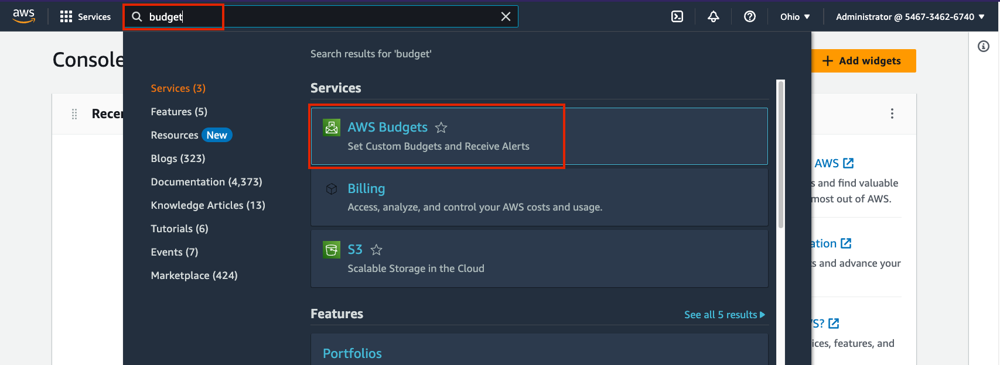
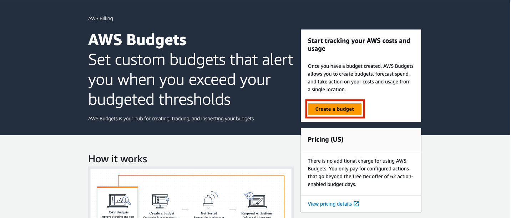
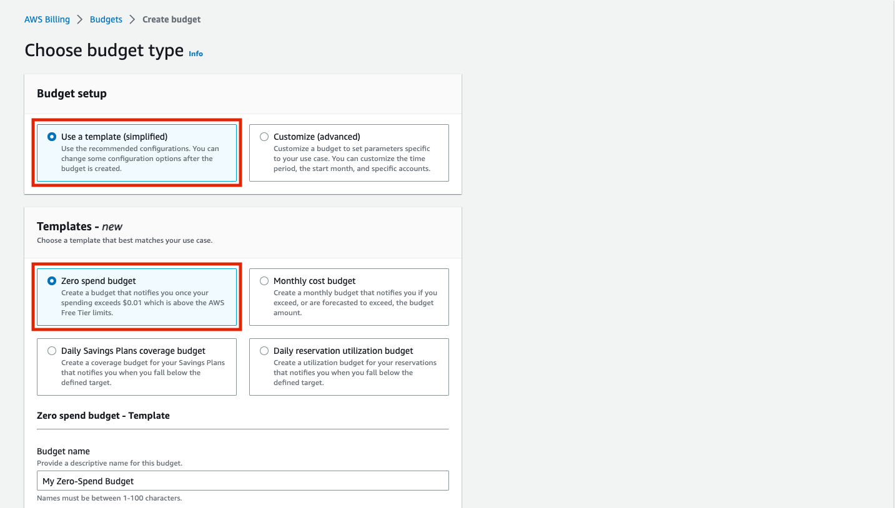
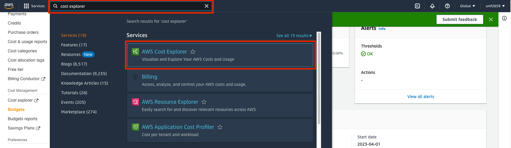
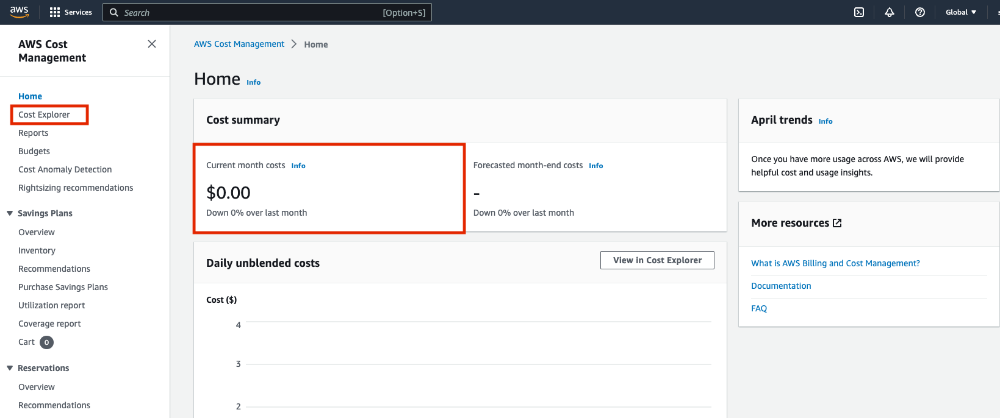
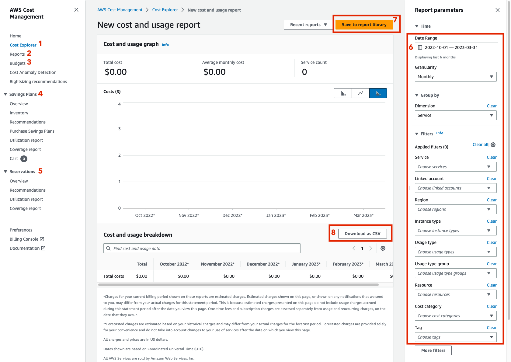
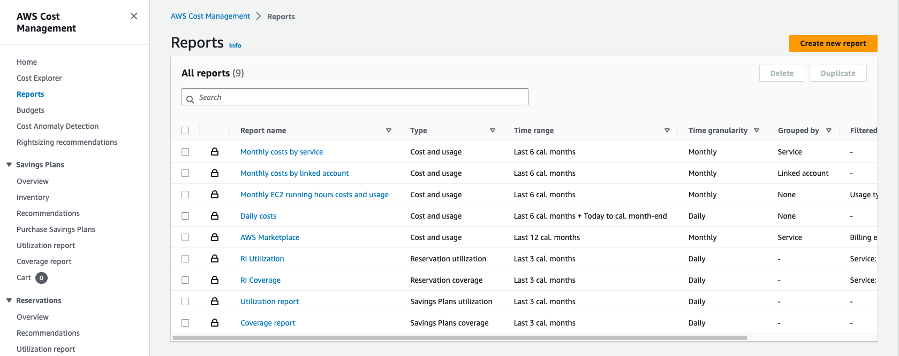

# AWS Cost Management

## Overview

AWS has several tools for monitoring and managing costs within an account. Because all services charge on a per-usage basis, it can be easy to rack up charges without realizing. It is really important to be sure you understand the pricing model for a service before starting to use it and that you properly configure the resource to fit your cost model.

In this course, we will be leveraging the "free-tier" for basic AWS services such as EC2, RDS, Lambda, and S3. This will allow us to experiment with services without incurring charges. However, it is still possible to misconfigure free-tier-eligible services in a way to incur costs.

For an up-to-date summary of free-tier-eligible services, see the following:

[AWS Free Tier Services](https://aws.amazon.com/free/?all-free-tier.sort-by=item.additionalFields.SortRank&all-free-tier.sort-order=asc&awsf.Free%20Tier%20Types=*all&awsf.Free%20Tier%20Categories=*all)

## Learning Outcomes

- Free-tier services
- How to view costs
- How to set budgets

## Goals

- Set up a simple budget
- Bookmark a cost report dashboard

## Setting a Budget

Sign in to the AWS Console with your Root user email.

[AWS Console](https://console.aws.amazon.com/console/home?nc2=h_ct&src=header-signin)

---

Search for the "budget" service in the services search bar.

---

From the AWS Budgets landing page, click on "Create a budget".

---

Choose the "Zero spend budget" from the selection of Templates.

Enter and email address that you will check often (will receive alerts for any spend over free-tier in your account).

---

You can set up additional budgets for actual monthly-spend amounts if you plan on spending any money on non-free-tier eligible services.

---

## Creating a Dashboard

Search for the Cost Explorer Service.

---

View your monthly spend at-a-glance, or click on "Cost Explorer" for more detail.

---

There are many features in Cost Explorer.

1. Cost Explorer: this page allows you to filter and aggregate costs by various dimensions.
2. Reports: this has a collection of saved Cost Explorer "dashboards" that can be viewed, shared, and reported on automatically.
3. Budgets: this is what we covered previously and allows you to set alerts based on various spending budgets.
4. Savings Plans: these allow you to save over a long period by committing up-front to some fixed amount of spending on various compute services. You normally pay the "on-demand" cost, but can save up to 70% on some compute services (usually more like 30%) by purchasing a Savings Plan. When you do this, you can choose to commit to one or three years of compute and can choose to pay all, half, or none of the cost up-front (remainder paid monthly).
5. Reservations: these are similar to Savings Plans but are limited to EC2 instances. Savings Plans are the newer, more flexible option and should be used over Reserved Instances in most cases.
6. Filter and Aggregation settings for Cost Explorer.
7. Save as Report: this allows you to save a particular set of filters/aggregations from the Cost Explorer to easily view certain dashboards in the future.
8. Download as CSV: you can also download the itemized cost report as a CSV for reporting.

---

There are some pre-made reports in place already that have commonly useful dashboards. Any custom-made dashboards saved from Cost Explorer (see [`7`] above) would also show up here.

