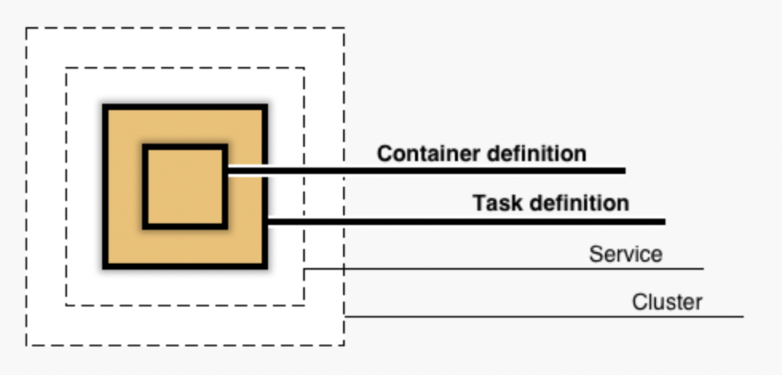

# AWS ECS

AWS ECS (Elastic Container Service) is a flexible platform for deploying and serving containers at scale.

Traditional deployment services would require you to provision and set up an application server (EC2), install required software, pull and run your container, and then log back into the server to update or restart or monitor the running container. ECS simplifies this process by allowing the definition of "Services" and "Tasks" which will then run your containers without requiring you to manage any server resources.

## Concepts

- **image**: An image is what is produced by `docker build`. It is a blueprint for Docker **containers**.
- **container**: A container is the running instance of a Docker image - this runs in an isolated environment as defined by your `Dockerfile`.
- **container registry**: An image/container registry is a place to store and organize your built images and access them from other places.
- **AWS ECR**: AWS Elastic Container Registry is a service from AWS that stores your build Docker images to be used by other container services like ECS.
- **cluster**: An ECS Cluster is an organizational construct for running containers within the ECS service. (If you use the EC2 base instead of the "Fargate" platform, your cluster will actually be a collection of servers to run your containers)
- **service**: A service is defined to run tasks based on a particular task definition on a cluster.
- **task definition**: A task definition is a blueprint for running tasks in ECS; a task is defined by an image, networking settings, environment variables and other runtime configuration.
- **task**: A task is a single instance of a task definition (could be a single container, or multiple, related containers).
- **image URI**: An image URI is the string that absolutely identifies a particular Docker image; it's format is: `location/repo:tag`, e.g. `1234567890.dkr.ecr.us-east-1.amazonaws.com/my-cool-image:v1.2.3`. Tags help you identify a particular image which has been pushed to a repo.
- **Fargate**: A platform on AWS ECS that allows you to deploy containers on managed compute resources without having to manage any servers yourself.
- **Application Load Balancer**: A resource which listens to http requests at a given URL and directs that traffic to the appropriate application/service for response.

---

## Overview

In this tutorial, we will be taking the following basic steps in order to make your web application accessible to the world!

0. (Develop Web App and Containerize)
1. Build Docker Image
2. Create AWS ECR Repository for Docker Images
3. Push Docker Image to ECR
4. Create ECS Task Definition for web application
5. Create ECS Task Definition for model pipeline
6. Create ECS Cluster to run services
7. Deploy a Service in that cluster based on the Task Definition from step 4
8. Deploy an Application Load Balancer for your service
9. Modify the RDS Access Security Group to allow connections from your new ECS Service

---

## Tutorials

There are many ways to provision an ECS Service, several of which are presented here.

**NOTE**: We will be using the AWS Console for this course (2023-MLDS423) to simplify proper resource creation. Other methods are provided only for reference/resource.

1. [ECR Tutorial](./ecr-repo.md)
2. [ECS Console Tutorial](./ecs-console.md)

If you are interested in other options, you can refer to [deploy with AWS Copilot](./copilot-tutorial.md) or [deploy with CloudFormation](./ecs-cloudformation.md).
