# Cleaning Up

There are a few resources that get created on your behalf when you deploy an ECS Service. If you are ready to tear down your service, or need to clean up in preparation of a fresh deployment, be sure to delete the following resources as well.

## Application Load Balancer

If you want to really start from scratch, you can delete the entire load balancer.

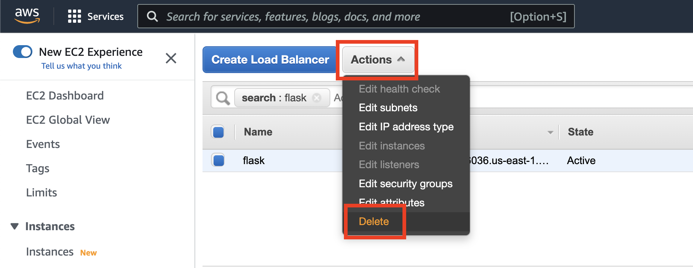

### Listener

If you plan to re-use this ALB for a new deployment, you can just delete the existing listener. This way, you can select "Use an existing load balancer" when you go to deploy a new service.

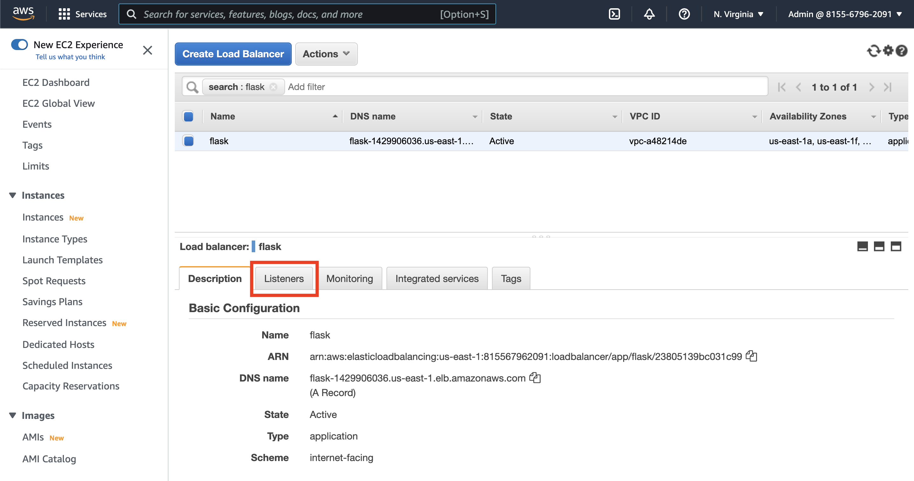
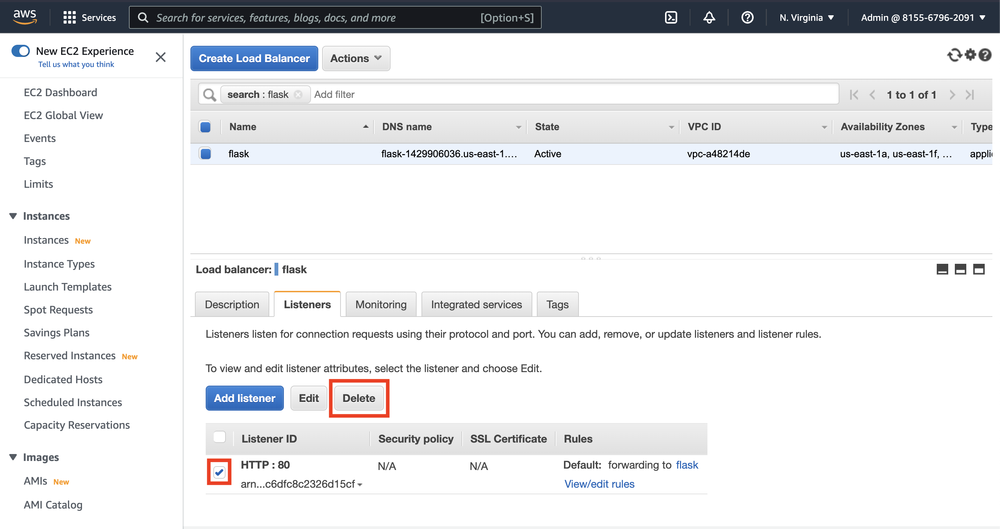

## Security Group

The security group can be re-used for new deployments by selecting "Use an existing security group", or you can delete it entirely to restart; however, since it is now referenced in the mlds-rds-access sg's inbound rules, you'll have to go delete that rule first.

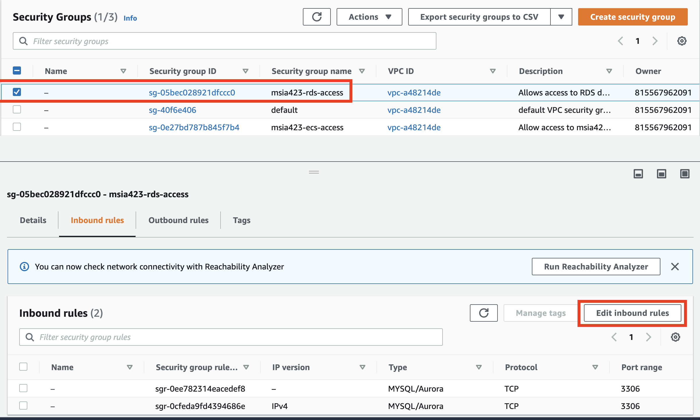
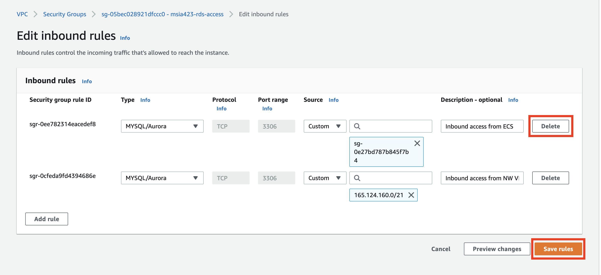
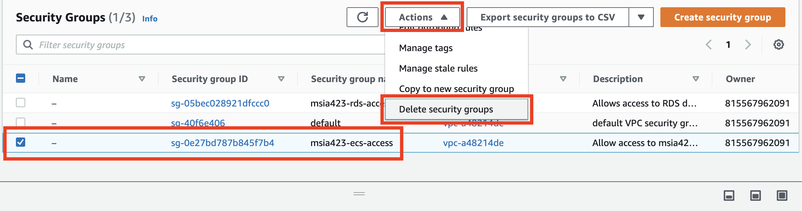

## Service

If a service has tasks running or scheduled to run, you'll have to "force delete it"

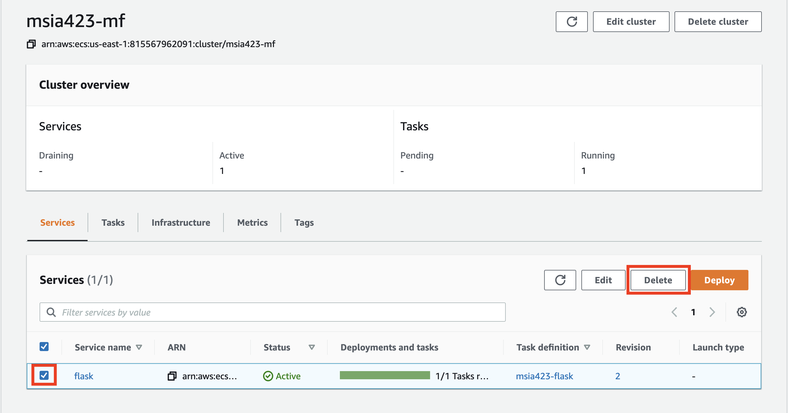
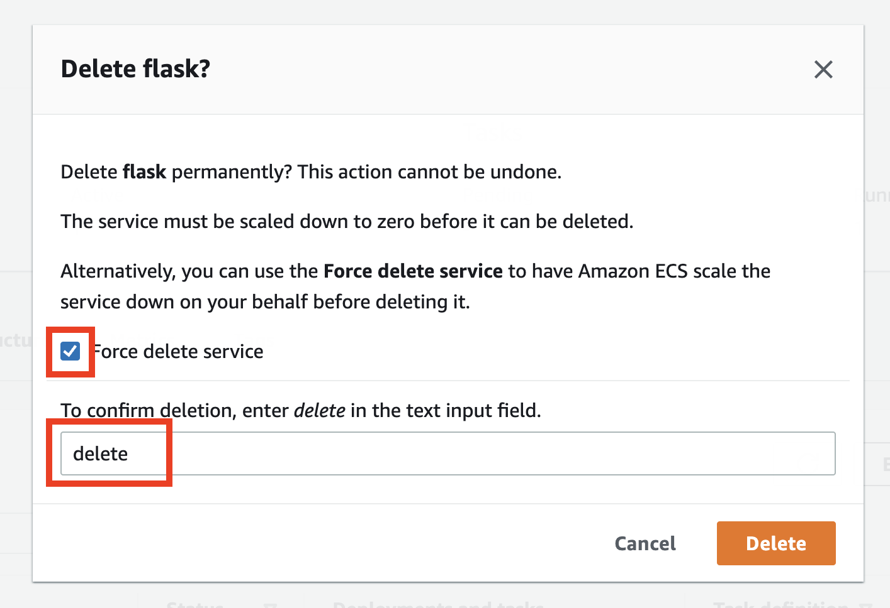

## Task Definition

Task Definitions can't actually be deleted, but you can deactivate them. They don't rack up any charge in your account either way however and you can always continue adding new revisions onto existing Task Definitions.

## Cloudformation

Turns out, the ECS Console actually uses "Cloudformation Stacks" in the background to deploy your resources. We won't get into any details around Cloudformation, but if you are encountering "already exists" errors despite having deleted resources in the console, you can try deleting these "Cloudformation Stacks" from your account

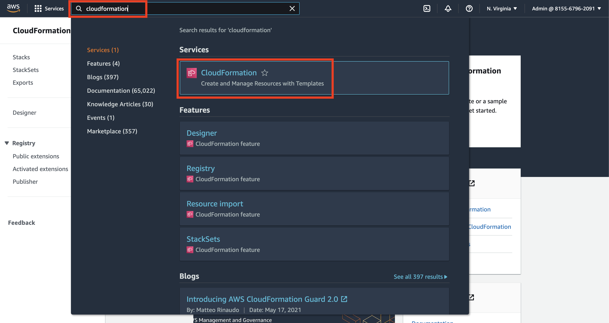

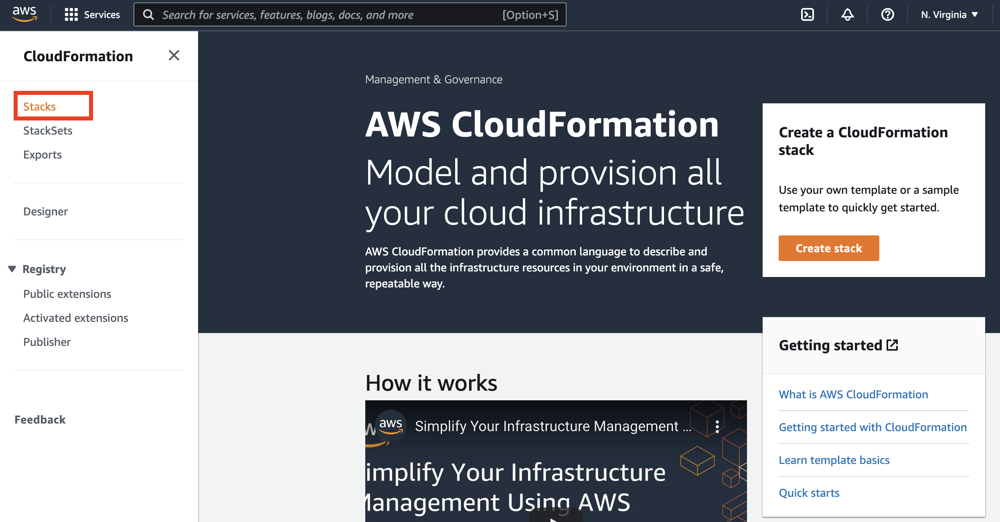

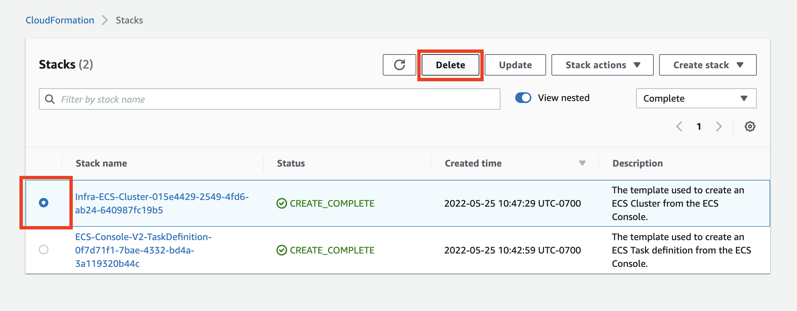

Confirm the deletion and delete each of the cloudformation stack related to "ECS-Console"
