# AWS Copilot CLI

[AWS Copilot](https://aws.github.io/copilot-cli/) is a newer tool from AWS that simplifies the deployment and management of applications on ECS. It is meant to offer a streamlines, developer-friendly experience for provisioning all the resources you would need to deploy your containerized application to AWS.

## Copilot Getting Started

Copilot provides [their own getting started guide](https://aws.github.io/copilot-cli/docs/getting-started/first-app-tutorial/), but we'll take a more stepwise approach here.

## Core concepts

- Application (`app`): A high-level construct representing your project or product. An application may have many environments, each with their own set of services or jobs.
- Environment (`env`): An environment is an isolated set of resources to run your code. This allows you to keep a set of resources for "production" (serving active users) and another set for "development" where you can try test and break things without interrupting service to users. Each environment is typically isolated within its own VPC.
- Service (`svc`): A service is a long-running task that serves your code. There are several types of services depending on how users would interact with your code. A service is defined by a Dockerfile (or built Image), as well as some settings.
- Job (`job`): A job is a temporary or ephemeral task that is triggered by some event and then shuts down after completing the code is finished running.
- Pipeline (`pipeline`): Pipelines help automate the incorporation and deployment of your code (this is called CI/CD - Continuous Integration / Continuous Delivery). This may be configured to automatically build and deploy a new Docker Image when you push code changes to GitHub.

For more info, see the [Copilot Concepts Guide](https://aws.github.io/copilot-cli/docs/concepts/overview/)


---

To relate this to our Pennylane example application:

Application: `pennylane`  
Environment: we could `dev` and `prod` (today, we'll just set up `dev`)  
Service: we have a single `app` that runs our Flask application  
Job: we could set up jobs for `ingest` and `train` to acquire new data and train our model (we won't use jobs today)  
Pipeline: we could also set up a pipeline to deploy new images for our `app` service or either of our jobs (we won't use pipelines today)

## Tutorial

### Summary of Steps

0. Install `copilot` CLI
1. AWS Profile (non-Root User)
2. Copilot App init
3. Get Default VPC information
4. Copilot Env init
5. Copilot Svc init
6. Copilot Svc deploy

### Install Copilot CLI

See the [Install Instructions](https://aws.github.io/copilot-cli/docs/getting-started/install/) on the copilot docs page.

Mac:

```bash
brew install aws/tap/copilot-cli
```

Windows Git-Bash (must run as administrator):

```git-bash
curl -L https://github.com/aws/copilot-cli/releases/latest/download/copilot-windows.exe --output /usr/bin/copilot.exe
```

**NOTE**: As with other interactive tools, `copilot` will not work properly on `git-bash` unless commands are prefaced with `winpty`.

### Configure AWS Profile

A non-Root IAM user must be used with the Copilot application (and should be used for security best practices). If you have yet to create a non-Root user, you can follow the [IAM Admin User tutorial](./iam-admin-user.md) in this repo. Be sure to configure your cli to use this new profile (`aws configure --profile admin`) after creating it.

You can make this your "active profile" by running

```bash
export AWS_PROFILE="admin"
```

You can also specify the AWS profile to use for individual commands by passing the `--profile` flag as we see in the examples below

### Initialize Application

From the root of your project, run:

```bash
copilot app init
```

[Docs](https://aws.github.io/copilot-cli/docs/commands/app-init)

Give your app a name (e.g. `pennylane`).

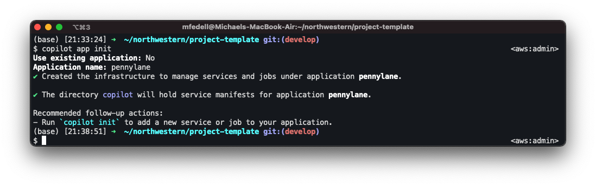

### Initialize an Environment

Copilot will by defualt create a new VPC and subnets for each new environment. In our case, we want to ensure our application is deployed to an existing VPC so that it can access our database which has already been provisioned in our default VPC. We can do this with the following:

**NOTE**, you will need to change `"vpc-id-from-above"` and `"comma,separated,list,of,ids"` before running the `export` commands in the block below.

```bash
aws ec2 describe-vpcs --filters "Name=isDefault, Values=true" | grep VpcId
export VPC_ID="vpc-id-from-above"
aws ec2 describe-subnets --filters "Name=vpc-id, Values=$VPC_ID" | grep SubnetId
export SUBNET_IDS="comma,separated,list,of,ids"

echo $VPC_ID; echo $SUBNET_IDS
```

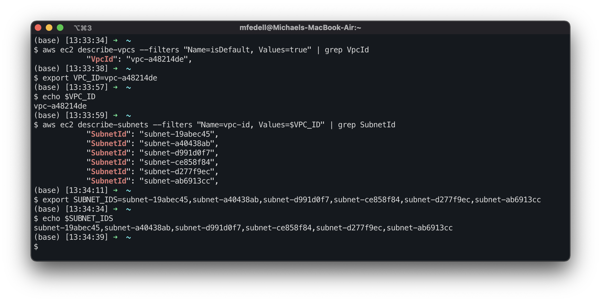

Once you have the VPC and Subnet IDs, you can initialize your environment with:

```bash
copilot env init \
    --import-vpc-id $VPC_ID \
    --import-private-subnets $SUBNET_IDS \
    --import-public-subnets $SUBNET_IDS \
    --name dev \
    --profile admin
```

[Docs](https://aws.github.io/copilot-cli/docs/commands/svc-init)

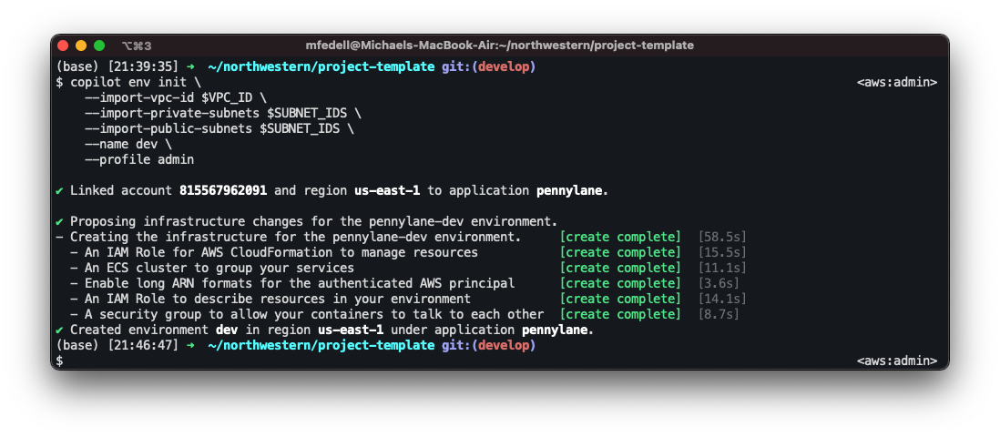

#### [Optional] Use jq for easy parsing

<details>
  <summary>Details</summary>

This can be simplified with `jq`, a json parsing command line tool (which can be installed [here](https://stedolan.github.io/jq/download/)), or with the following:

Mac:

```bash
brew install jq
```

Windows Git-Bash:

```git-bash
curl -L https://github.com/stedolan/jq/releases/download/jq-1.6/jq-win64.exe --output /usr/bin/jq.exe
```

Then:

```bash
VPC_ID=$(aws ec2 describe-vpcs --filters "Name=isDefault, Values=true" | jq -r '.Vpcs[0].VpcId')
SUBNET_IDS=$(aws ec2 describe-subnets --filters "Name=vpc-id, Values=$VPC_ID" | jq -r '[.Subnets[].SubnetId] | join(",")')
echo $VPC_ID; echo $SUBNET_IDS

copilot env init \
    --import-vpc-id $VPC_ID \
    --import-private-subnets $SUBNET_IDS \
    --import-public-subnets $SUBNET_IDS \
    --name dev \
    --profile admin
```

</details>

### Initialize a Service

**NOTE** You need to change the `path/to/Dockerfile` in the command below.

```bash
copilot svc init \
    --name app \
    --svc-type "Load Balanced Web Service" \
    --dockerfile path/to/Dockerfile
```

[Docs](https://aws.github.io/copilot-cli/docs/commands/svc-init)

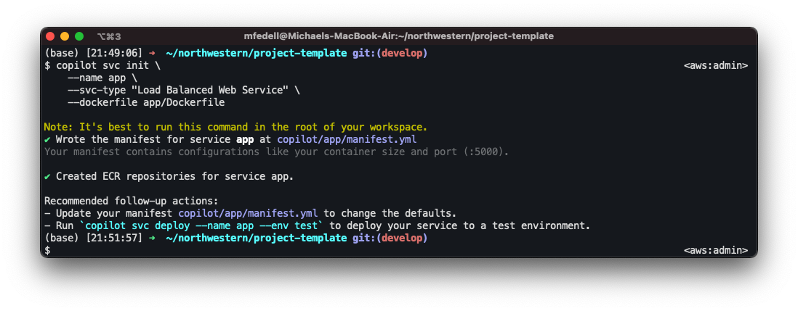

Validate the produced `manifest.yml` file for your service (found in `copilot/app/manifest.yml`).

See the [manifest section](#manifest-notes) for notes on sections that may need adjustment.

**NOTE** You will likely need to edit this Manifest file if you are following the template structure with your Dockerfile located at `app/Dockerfile` (Dockerfile location (`./app/`) and build context (`./`) are not the same). See the [build section](#manifestimagebuild) for detail.

### Deploy Your Service

**NOTE** The following section will attempt to build a Docker image and push it to ECR on your behalf in order to deploy a Service. If you are on an Apple M1 device (or any other device with ARM architecture), you'll need to build and push the image yourself so that you can force the `--platform` tag to build a compatible image. Detailed guide for this coming soon, in the meantime, let me know if this applies to you.

Now that you're configured and set up with an application, environment, and service definition, you can deploy it with:

```bash
copilot svc deploy --env dev --name app
```

[Docs](https://aws.github.io/copilot-cli/docs/commands/svc-deploy)

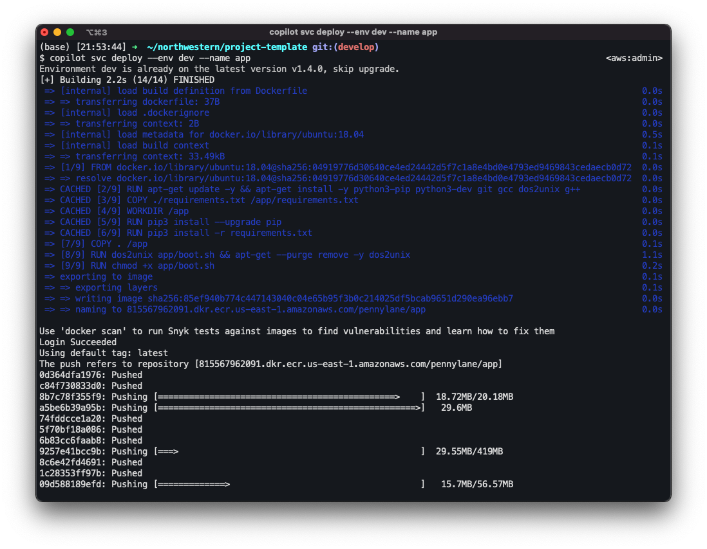

This may take some time, but eventually you will see:

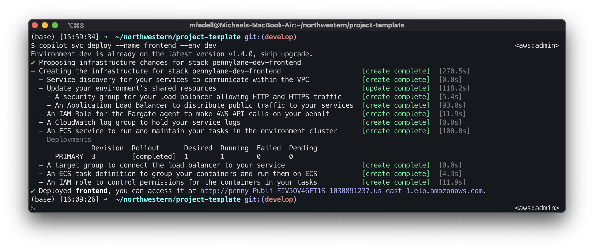

You can inspect it by running:

```bash
copilot svc show dev --name app
```

[Docs](https://aws.github.io/copilot-cli/docs/commands/svc-show)

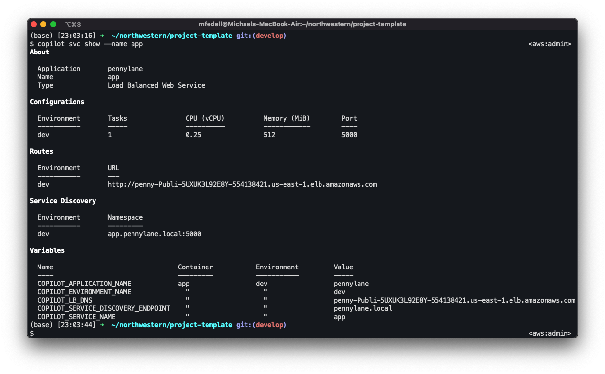

Check its status by running:

```bash
copilot svc status --env dev --name app
```

[Docs](https://aws.github.io/copilot-cli/docs/commands/svc-status)

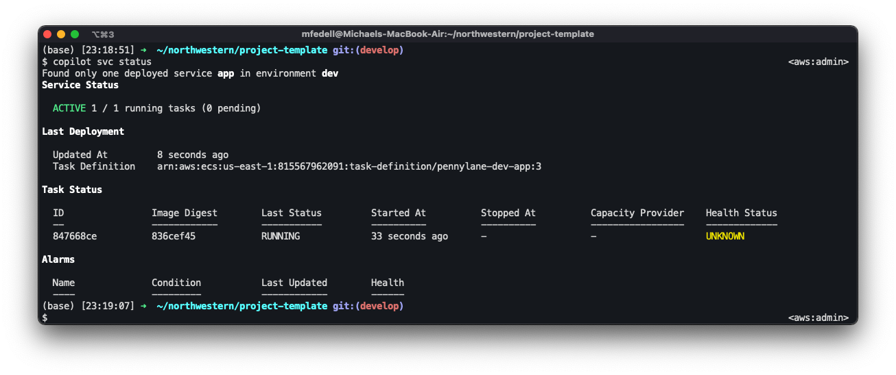

And check its logs by running:

```bash
copilot svc logs --env dev --name app
```

[Docs](https://aws.github.io/copilot-cli/docs/commands/svc-logs)

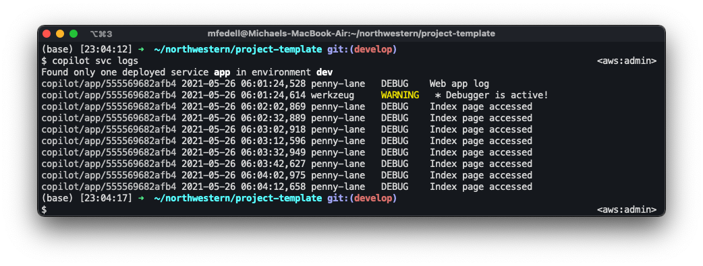


### Tear Down Your Service

You can clean up and delete your service with

```bash
copilot svc delete --env dev --name app
```

[Docs](https://aws.github.io/copilot-cli/docs/commands/svc-delete)

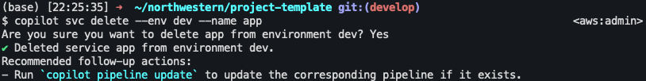

**NOTE** This process of delete/deploy takes quite some time. An alternative to temporarily stop your service would be to [tweak your manifest](#manifest-general) to set `count: 0`.

### Modify Security Group

If you need to connect to an RDS Database from your deployed ECS Service, you'll need to create a new Inbound Rule on your RDS Security Group to allow this connection. This can be done from the Console by following the steps below:

First you'll need to identify the security group used for your ECS Service. This is likely named something like `{app_name}-{env_name}-EnvironmentSecurityGroup-{hash}`. So in our case: `pennylane-dev-EnvironmentSecurityGroup-P61UZ4RLI3P4`. To be sure, you can view your service in the ECS Console:

1. Navigate to the ECS Console
2. Click on your created cluster
3. Click on the running service
4. Note the "Security Groups*" section under "Network Access"

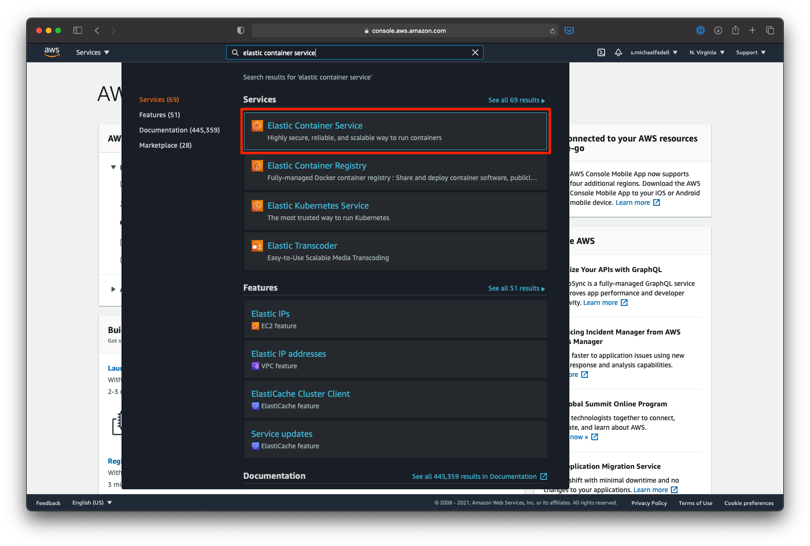
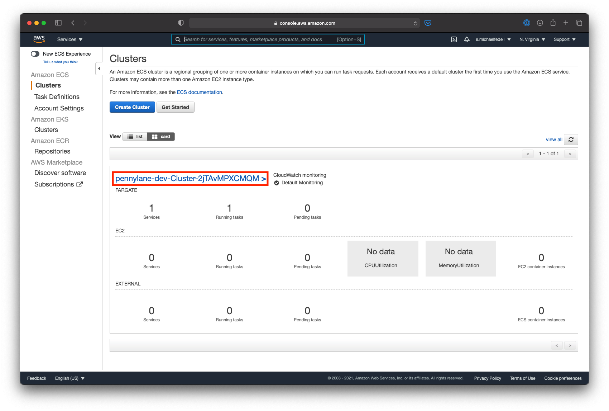
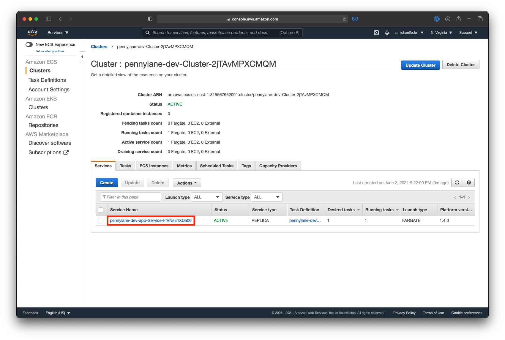
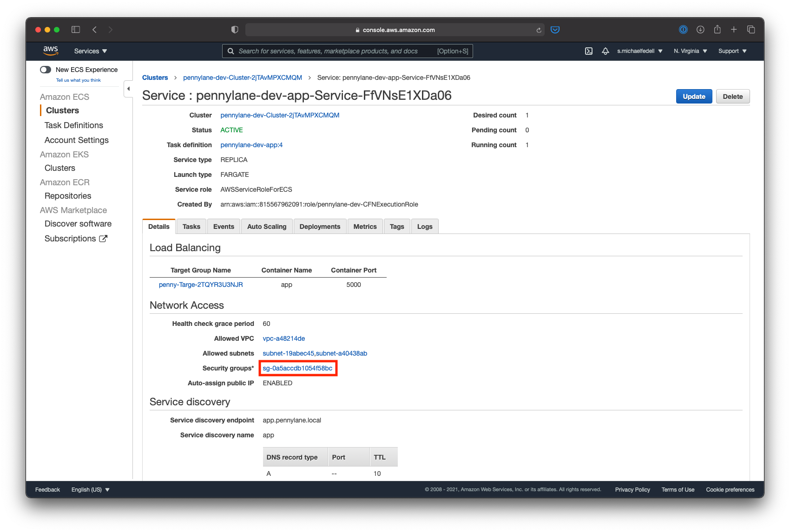
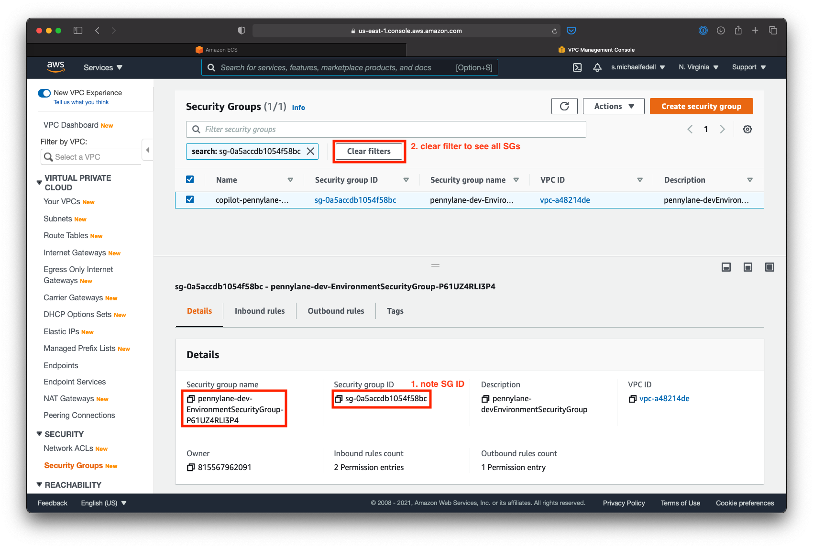

Now we can add a rule to our RDS security group:

1. Navigate to the EC2 Console
2. Click on "Security Groups" under the Networking section in left nav bar
3. Click on the mlds423-rds-access security group that you attached to your RDS instance
4. Click on "Inbound Rules" and then "Edit inbound rules"
5. Click "Add rule"
6. Set Type to MySQL/Aurora, Source to "Custom" and then in the search bar select the security group that is used for your ECS service.

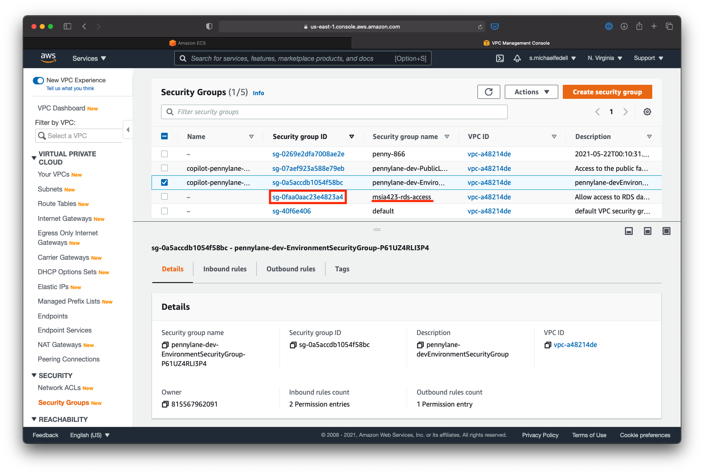
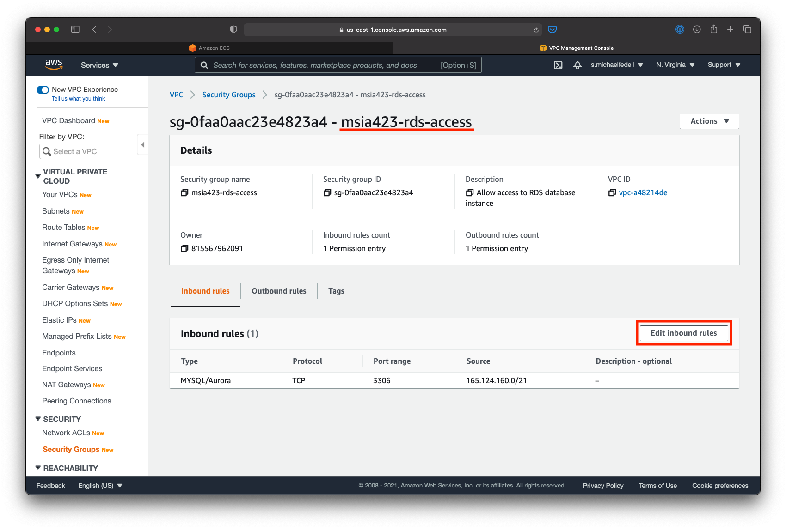
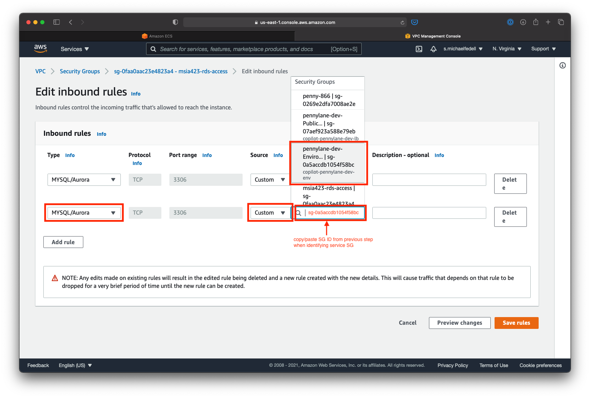
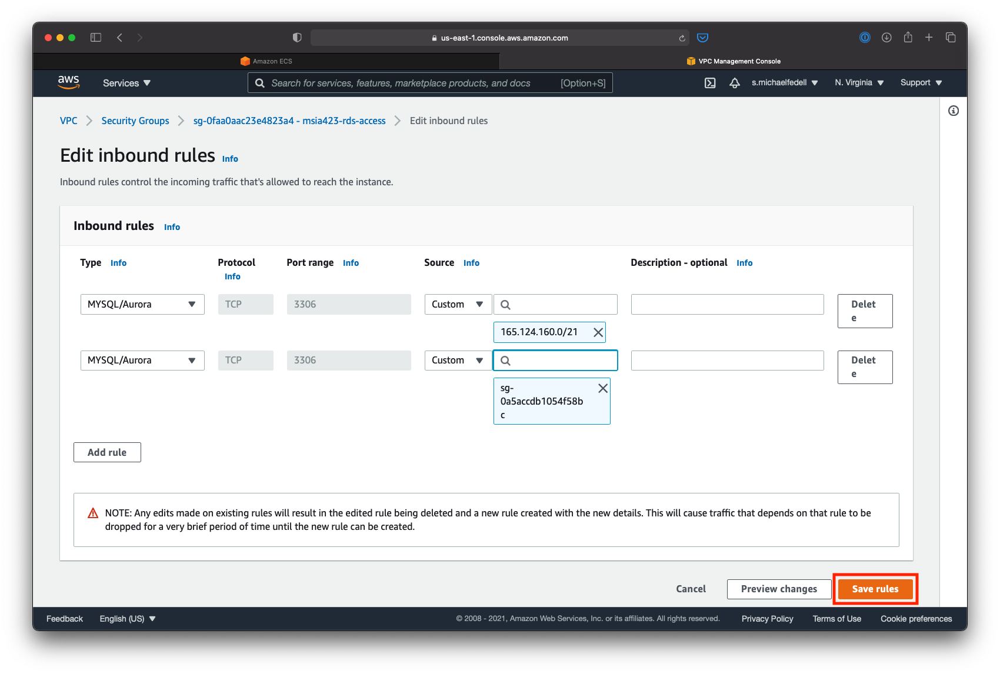
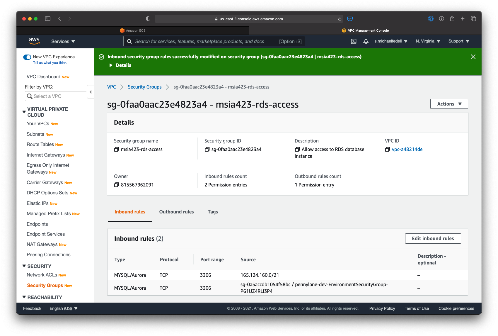

## Appendix

### Manifest Notes

More details on the manifest file can be found on the [copilot docs](https://aws.github.io/copilot-cli/docs/manifest/lb-web-service/); however, here are some common ones you may want to tweak.

#### manifest.http

Note: You may want to configure your application so that it can only be reached and discovered from the Northwestern VPN space.

```yaml
http:
  allowed_source_ips: ["165.124.160.0/21"]
```

#### manifest general

Note: You may need to change the `cpu` and `memory` sections of the manifest if your application requires a bit more power but **WARNING**, using more cpu or memory will incur more cost and may drain your free credits more quickly. (See [pricing details here](https://aws.amazon.com/fargate/pricing))

```yaml
cpu: 256       # Number of CPU units for the task. Valid values are 256 * 2^n (0≤n≤4)
memory: 512    # Amount of memory in MiB used by the task. Typically double the cpu value.
```

#### manifest.command/entrypoint

Note: If your Docker Image does not have a default command set to run your application (e.g. `docker run my-image` does not actually start your web app without appending some additional command such as `docker run my-image python app.py`, etc.), then you will need to inform ECS of that. This can be done via the `entrypoint` and/or `command` options in the manifest - set this up to match however you have designed you Dockerfile and typically run it from the command line.

```yaml
command: python app.py
```

#### manifest.variables

Note: If you need to pass environment variables to your application in the deployed environment, you can do so from the `variables` section of the manifest. (You do **not** need to include `AWS_` access or secret keys, the service will have its own identity available for use.)

```yaml
variables:                    # Pass environment variables as key value pairs.
  LOG_LEVEL: info
```

Note: You can also use the `secrets` section for sensitive values. However, this requires you to first _initialize_ the secrets (their plaintext value is encrypted and stored in **AWS::SSM::ParameterStore** as sensitive parameters). You are not required to use secrets for this project. You may place your database credentials in the `variables` section described above, just be sure to keep the `manifest.yml` file out of version control (e.g. include it in your `.gitignore` file).

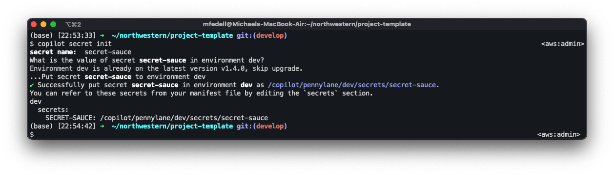

```yaml
secrets:                      # Pass secrets from AWS Systems Manager (SSM) Parameter Store.
  SECRET_SAUCE: secret-sauce  # The key is the name of the environment variable, the value is the name of the SSM parameter.
```

#### manifest.image.build

Note: If your Dockerfile is located in your `app/` folder but the `docker build` command should be executed from the project root, you'll need to change the `image.build.context` setting in `manifest.yml`. This section will end up looking like:

```yaml
# Configuration for your containers and service.
image:
  # Docker build arguments. For additional overrides: https://aws.github.io/copilot-cli/docs/manifest/lb-web-service/#image-build
  build:
    dockerfile: app/Dockerfile
    context: ./
  # Port exposed through your container to route traffic to it.
  port: 5000
```

#### manifest.image

Alternatively, you can direct copilot to use an existing Docker Image instead of building on your behalf. This requires the image to have been pushed to an ECR repository which can be done by following the steps in [this repo's ecs-getting-started tutorial](./ecs-getting-started.md#Publish-Images-to-ECR). Your `image` section of `manifest.yml` would then look like:

```yaml
# Configuration for your containers and service.
image:
  # Docker build arguments. For additional overrides: https://aws.github.io/copilot-cli/docs/manifest/lb-web-service/#image-build
  location: "1234567890.dkr.ecr.us-east-1.amazonaws.com/pennylane/app:latest"
  # Port exposed through your container to route traffic to it.
  port: 5000
```

(`location` should actually point to your image, obtained from the ECR console page)

<!-- ### FAQs & Common Errors

TODO: compile list

- Task fails to run (increasing "Failed" count): check task exit code / logs
- Browser cannot reach application at link: check SG rules, etc.
-  

### Inspecting Tasks in AWS Console

TODO: guide/screenshots -->

### Summary of Resources Created

The `copilot` commands we run are creating **CloudFormation** templates in the background, and deploying these to AWS. This in turn creates a set of resources that can be managed together, we won't get into CloudFormation here, but it's basically a way to define and manage resources with static template files instead of clicking through the management console.

> Note: `copilot` also uses **SSM Parameter Store** for managing its state and various resources.

We'll summarize the main resources that are created by each step of the `copilot` process

### `copilot app init`

**Stack**: `{app_name}-infrastructure`:

- `AWS::IAM::Role`: Execution Role for executing commands
- `AWS::IAM::Role`: Application Admin Role for managing infrastructure

**Local**:

- `copilot/`: Directory for manifest files and additional infrastructure

### `copilot env init`

**Stack**: `{app_name}-{env_name}`:

- `AWS::IAM::Role`: CFN Execution Role for managing Cloudformation Resources
- `AWS::ECS::Cluster`: ECS Cluster for running tasks
- `AWS::EC2::SecurityGroup`: Security Group to manage environment connections
- `AWS::IAM::Role`: Env Manager Role

**Stack**: `StackSet-{app_name}-infrastructure-{hash}` (shared across all of application):

- `AWS::KMS::Key`: Key for encrypting/decrypting sensitive data
- `AWS::S3::Bucket`: Artifact bucket for CodeBuild Pipelines

### `copilot svc init`

**Stack**: `StackSet-{app_name}-infrastructure-{hash}`:

- `AWS::ECR::Repository`: Repo to store `{app_name}/{svc_name}` images

**Local**:

- `copilot/{svc_name}/manifest.yml`: Manifest to configure svc task definition

### `copilot svc deploy`

**Stack** `{app_name}-{env_name}-{svc_name}`:

- `AWS::ECS::TaskDefinition`: Blueprint for running tasks in this service
- `AWS::ECS::Service`: Service to run some number of tasks
- `AWS::IAM::Role`: ECS Execution Role - grants ECS privilege to run containers
- `AWS::IAM::Role`: ECS Task Role - role assumed by your container runtime to call other AWS services
- `AWS::Logs::LogGroup`: Cloudwatch Logs group to monitor application

**Stack**: `{app_name}-{env_name}`:

- `AWS::ElasticLoadBalancingV2::LoadBalancer`: Application Load Balancer to direct traffic from web to container

### Apple M1 Addendum

Guide to deploying Docker images built on Apple M1 machines (newer laptops use custom Apple silicon with an ARM-based architecture as opposed to Intel chips with traditional x86_64 architecture).

In summary, we will:

0. create an ecr repo (if not already done)
1. build image manually with `--platform` option
2. tag our image according to ecr instructions
3. authenticate docker daemon to ecr
4. push docker image
5. modify copilot manifest file
6. deploy service with copilot

#### Create ECR Repo (if needed)

Copilot will create an ECR repository for you during the `copilot svc init` step. However, if this has failed or you can manually create an ECR repo by following the steps in the [ECR Tutorial](./ecr-repo.md) of this repository.

Once you have a repo, you should visit the ECR page in the AWS console and inspect it. You'll want to open the "View Push Commands" dialog and note the commands.

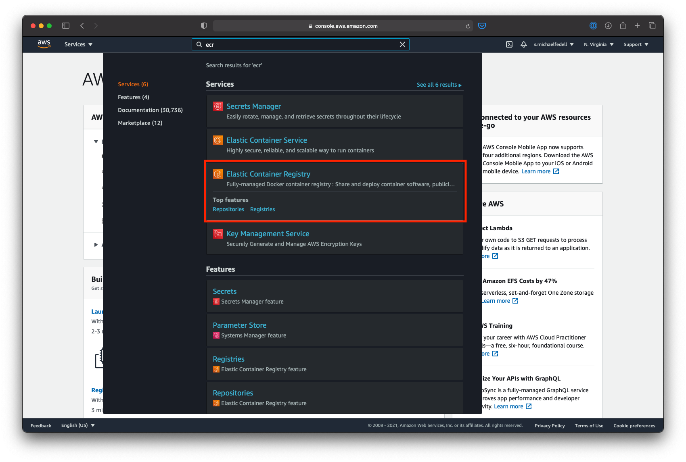
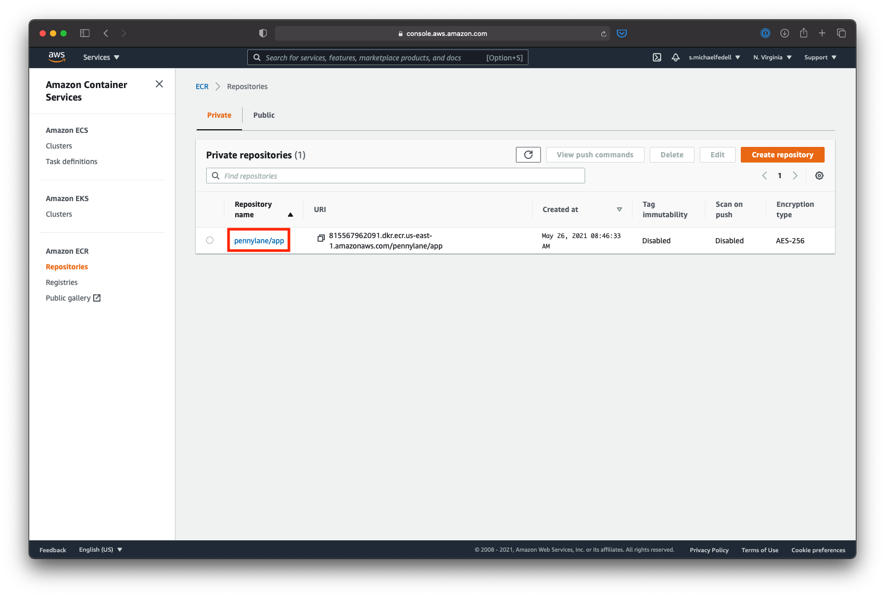
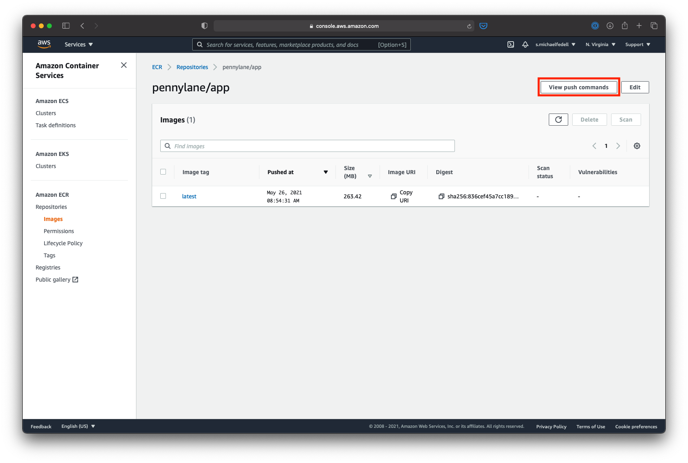
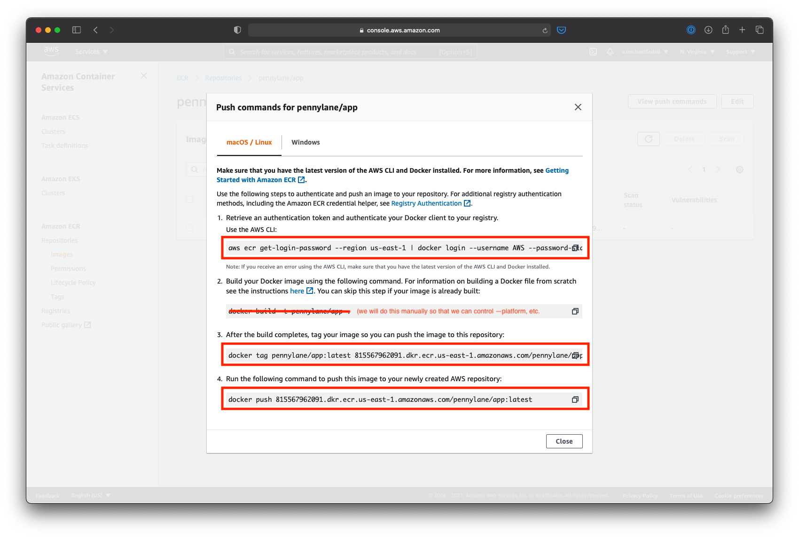

#### Build Image Manually

Instead of letting Copilot build the image, we will build it ourselves, allowing us to set the `--platform` option which is used to build compatible images. Specifically, we will build for the `linux/x86_64` architecture, a very compatible platform.

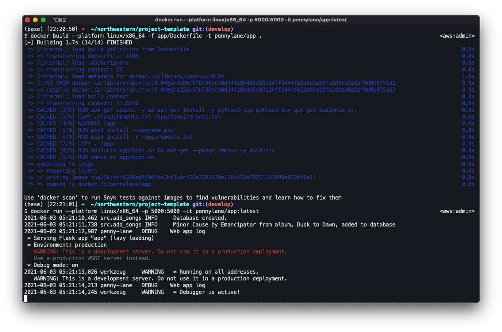

#### Tag and Push Image

After building our container and running it to ensure it is built correctly and runnable, we will push it to ECR, following **steps 1, 3, and 4** from the ECR Push Commands page. (these steps can be copied and pasted directly so long as you use the same image tag during build: e.g. `pennylane/app` in the case of this example)


#### Modify Copilot Manifest

Next, we will need to modify our manifest to tell copilot to skip the build process for our Docker image (since we're doing this ourselves). See the [manifest notes](#manifestimage) for more detail, but in short, replace `image.build` with `image.location` as shown below:

```yaml
image:
  #build: Dockerfile
  location: 815567962091.dkr.ecr.us-east-1.amazonaws.com/pennylane/app:latest
  port: 5000
```

The `location` value should be the same value used in your `docker push` command from [above](#tag-and-push-image).

#### Deploy

You can now deploy your service with copilot as described in the main section of this tutorial.

When you need to update your application, you'll need to repeat steps 1-4 of this section before running `copilot svc deploy` again.
