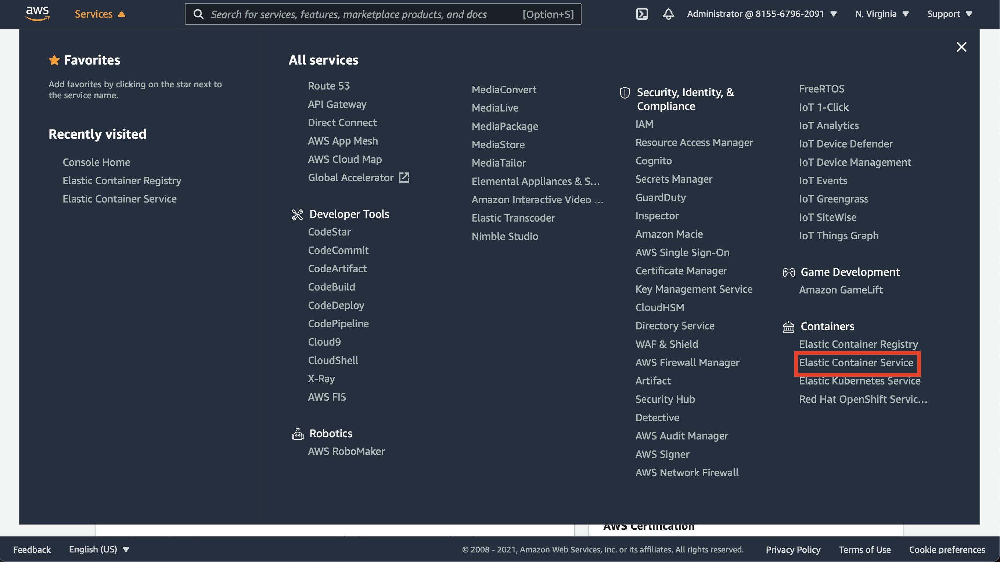
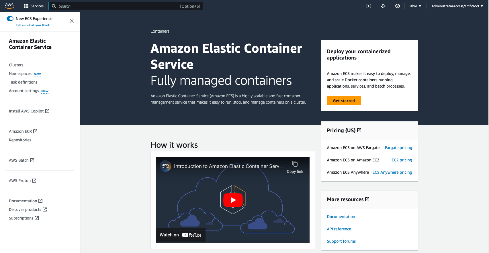
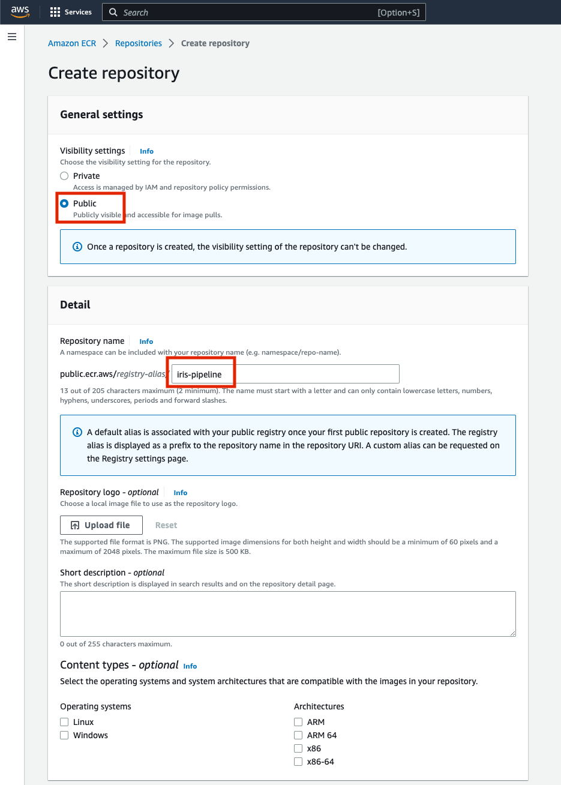
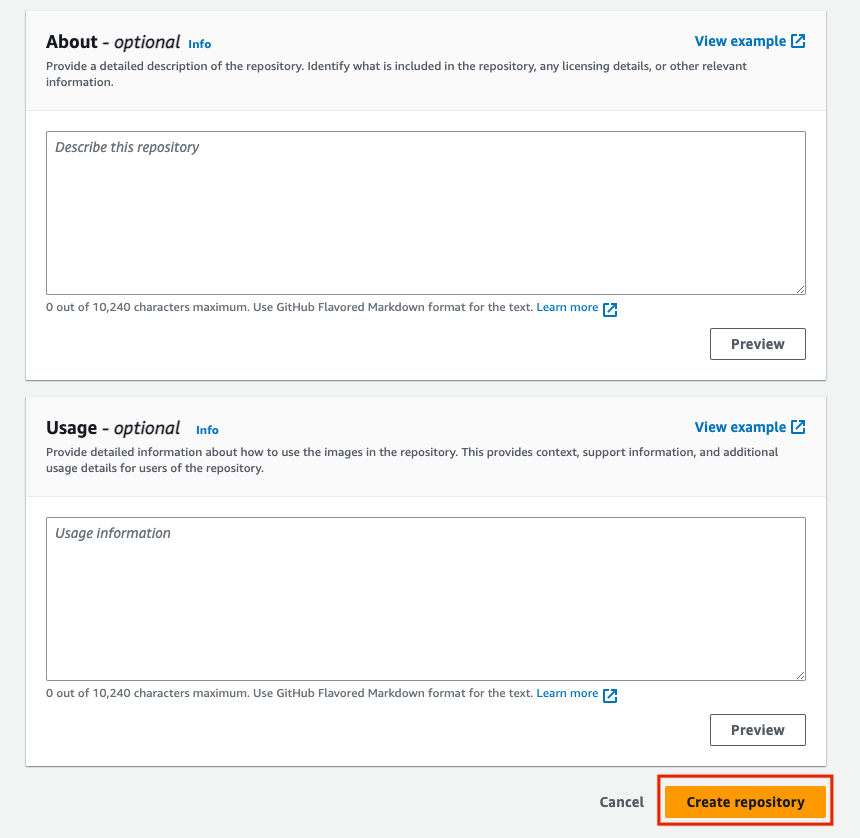
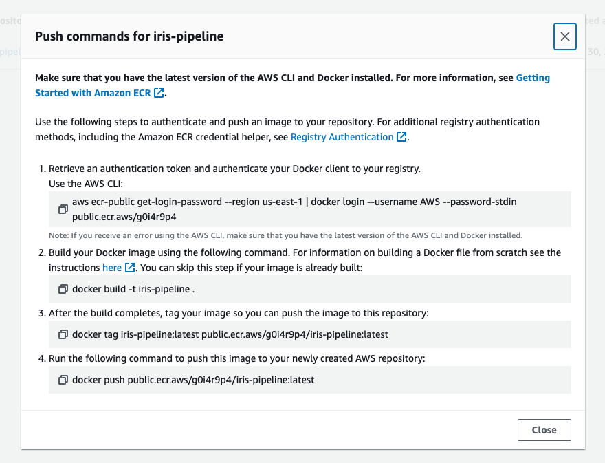

 # AWS ECR

AWS Elastic Container Repository is a managed docker image repository. You can build docker image and push them to this private repository for other resources in your account to make use of.

## Tutorial

Login to the AWS Console and navigate to the [ECR management console](https://us-east-1.console.aws.amazon.com/ecr/repositories?region=us-east-1). You can do this from the "Services" dropdown, or the search bar.

**NOTE**: Be sure to set your Region to `us-east-2` or whatever region you created your RDS instance in.




### Create ECR Repository



Click on the Elastic Container Repository service from the sidebar at left.


Create a public ECR Repository to store your built Docker images.

You can name this repository `iris-pipeline`, your account ID (or an alias) will become a part of the name so it only needs to be unique within your own account.

>NOTE: You only get `500 MB` per month of free storage in _private_ ECR repositories (see [pricing page](https://aws.amazon.com/ecr/pricing/#AWS_Free_Tier)). Since these images don't have anything private in them, we will create *public* ECR repositories for this workshop. You will likely want to use private repo's in most cases.





Confirm details and create the repository.


Click on "View Push Commands" to show commands needed to build, tag, and push new images to this repository



#### Copy ECR Image URI


Copy the image URI for your created repository and make note of it; we will need this later.

### Create ECR Repository (again)

Repeat the above steps for the `iris-inference` image repository (e.g. create another repository but name it `iris-inference`)

### Publish Images to ECR

Use the commands obtained above to build, tag, and push an image to your ECR Repository

> NOTE: The commands shown below are only for example; you should use the commands obtained from your AWS Management Console as they will have the proper Account ID (`1234567890` in the examples), region (`us-east-1` in the examples), repo name (`iris-pipeline` in the examples), etc. for you to push to.

#### Build Image

```shell
cd example/pipeline
docker build --platform linux/x86_64 -t iris-pipeline .
```

#### Authenticate to ECR

You will have to first authenticate your docker client to your AWS ECR Repo. This can be done with the first command shown in the "Push Commands" from the ECR Repo page.

```shell
aws ecr-public get-login-password --region us-east-1 | \
docker login \
  --username AWS \
  --password-stdin public.ecr.aws/a0b1c2d3
```

If you have not [installed the AWS CLI](https://docs.aws.amazon.com/cli/latest/userguide/getting-started-install.html), you can run `aws` commands via the [AWS-provided Docker image](https://docs.aws.amazon.com/cli/latest/userguide/install-cliv2-docker.html). The ecr login command specified above instead becomes:

```shell
docker run --rm -it -v ~/.aws:/root/.aws \
  amazon/aws-cli ecr-public get-login-password --region us-east-1 | \
docker login \
    --username AWS \
    --password-stdin public.ecr.aws/a0b1c2d3
```

if you have saved your aws credentials to the conventional location, or if you need to pass them in as environment variables:

```shell
docker run --rm -it -e AWS_ACCESS_KEY_ID -e AWS_SECRET_ACCESS_KEY \
  amazon/aws-cli ecr-public get-login-password --region us-east-1 | \
docker login \
    --username AWS \
    --password-stdin public.ecr.aws/a0b1c2d3
```

If you prefer to install the `aws` CLI natively (instead of using Docker), see the [aws-cli.md](./aws-cli.md) document included in this repo.

> NOTE: you don't have to authenticate every time, just when you're warned that your token has expired

#### Push Image to ECR

Once authenticated, you just need to tag the local image with an ECR tag, and push it to the associated repository.

```shell
docker tag iris-pipeline:latest public.ecr.aws/a0b1c2d3/iris-pipeline:latest
docker push public.ecr.aws/a0b1c2d3/iris-pipeline:latest
```

---

## Next Steps

Follow the tutorial for creating your ECS deployment:

**[ECS Console](./ecs-console.md)**
