# AWS ECS Getting Started

This tutorial will walk through the Getting Started Wizard provided by AWS ECS.

## Tutorial

### Summary of Steps

0. ECR Tutorial
1. Getting Started Wizard
2. Security Groups

### ECR

Be sure to complete the [ECR Tutorial](./ecr-repo.md) before continuing on.

### Create ECS Deployment

We will make use of the ECS Getting Started wizard to simplify deployment; however, each of these steps can be performed individually from the console in the order of: `cluster -> task definition -> service`

#### ECS Wizard

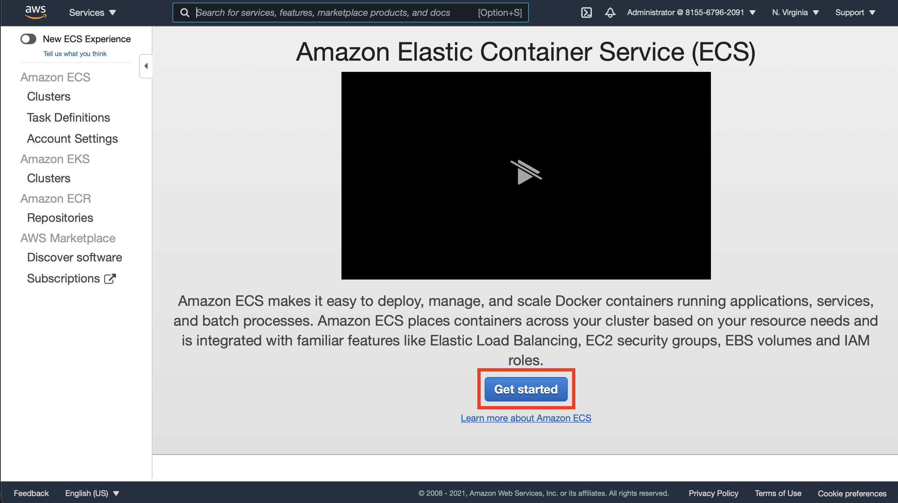

Navigate back to the [ECS Dashboard](https://us-east-1.console.aws.amazon.com/ecs/home?region=us-east-1#/getStarted) as done in [step 0](#tutorial). This time, click on the "Get Started" button (link).
<!-- TODO: Add link to Get Started Wizard -->

#### ECS Custom Container

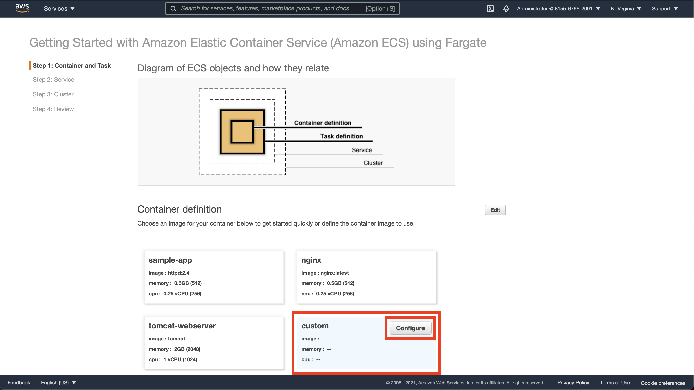

Click on "custom" for the Container definition, and then click "Configure" to define your custom container.

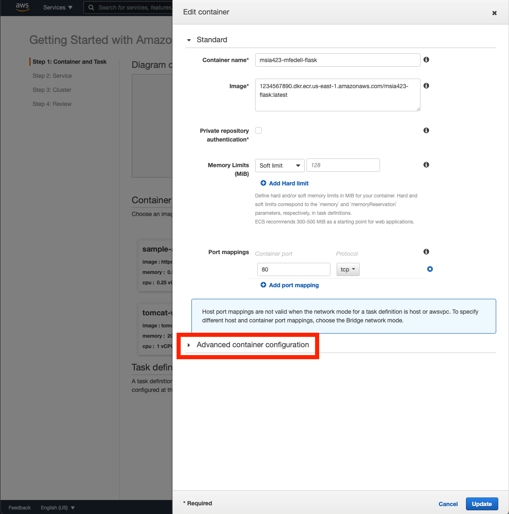

Name your container whatever you like, but input the "Image" uri as obtained from your ECR Repo in [step x](#copy-ecr-image-uri). **Be sure to append the image tag that you used when you pushed; this is likely "latest"**; your full Image URI should look like `1234567890.dkr.ecr.us-east-1.amazonaws.com/mlds423-flask:latest`

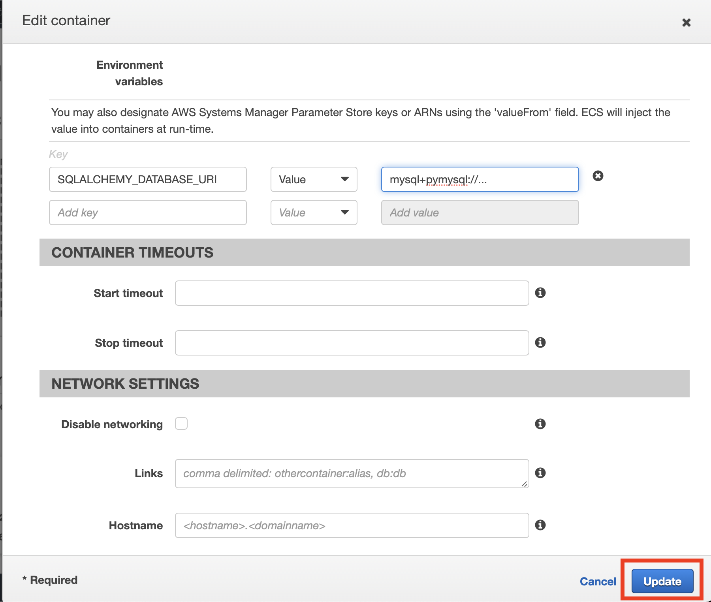

Under "Advanced", scroll down to "Environment", and add any environment variables that your application needs.

#### ECS Task Definition

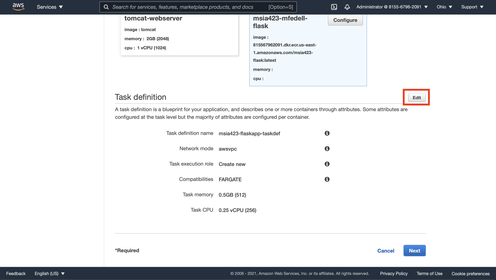

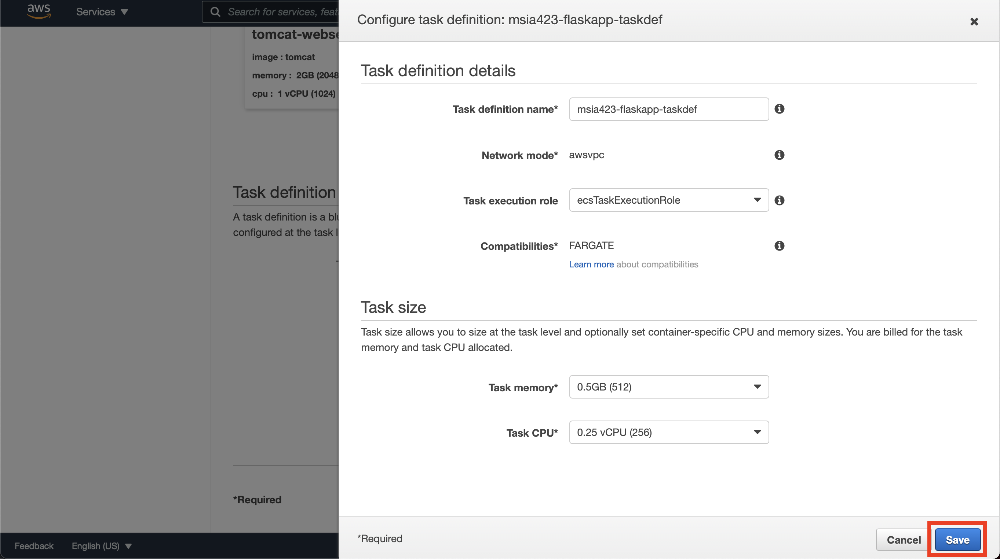

Edit your task definition and set the following basic details.

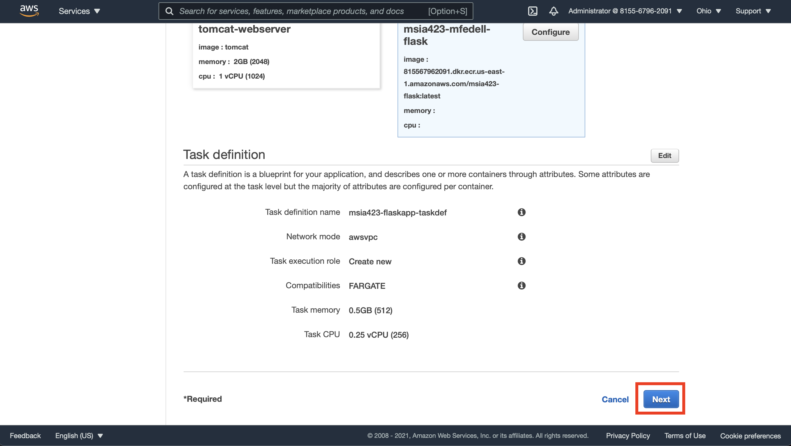

Confirm your details and create task definition.

#### ECS Service

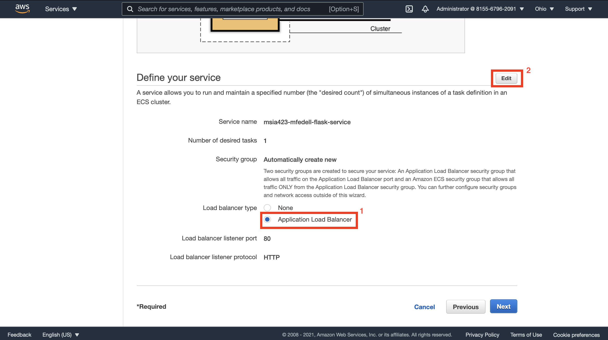

Select "Application Load Balancer" and then edit your service details.

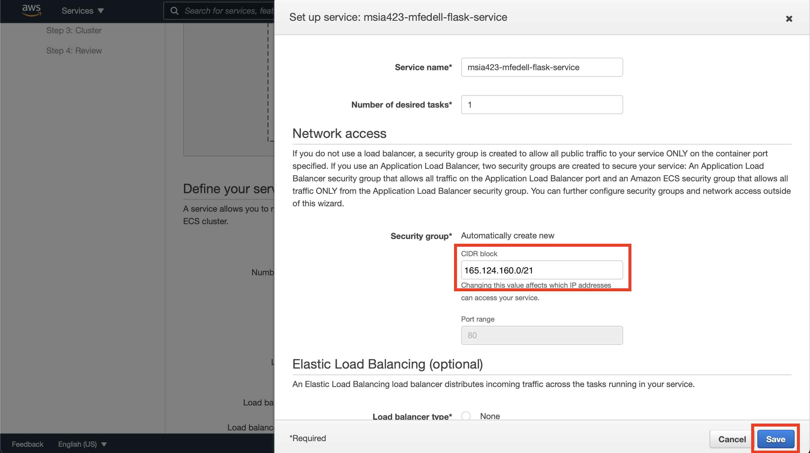

Edit your service's details and set the security group cidr block to `165.124.160.0/21`.

### ECS Cluster

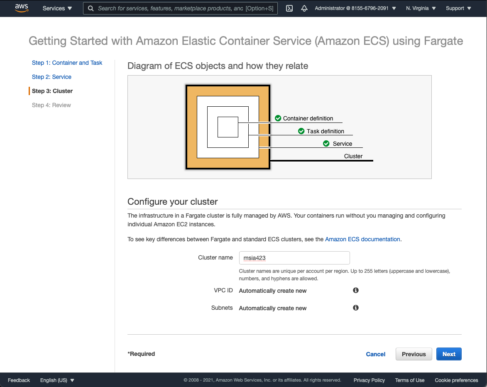

Name your cluster and click next to continue.

### Confirm and Create

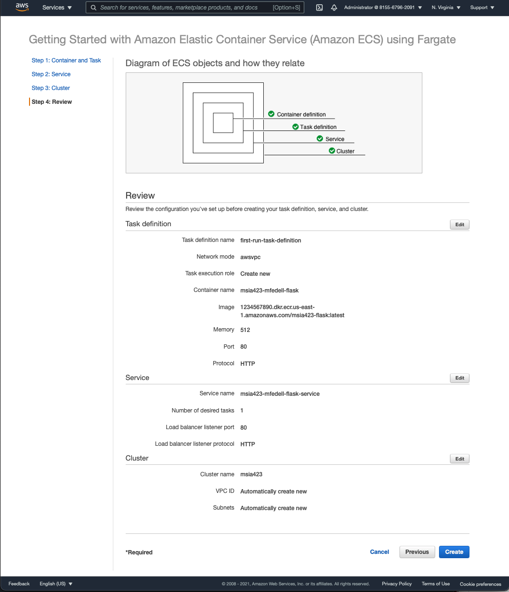

Validate the settings and confirm creation. This may take a few minutes.

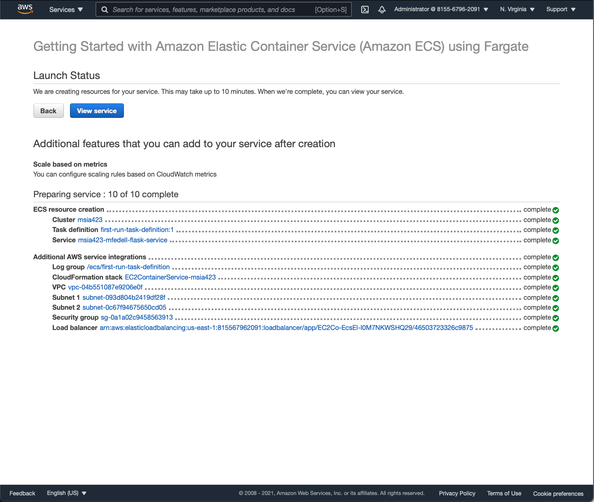

### Security Groups

Edit the Ingress Rules for your RDS Security Group (`DB-SG`) to allow MySQL traffic (port 3306) from the Application Security Group (`App-SG`).

<!-- TODO: Explicit Steps -->
