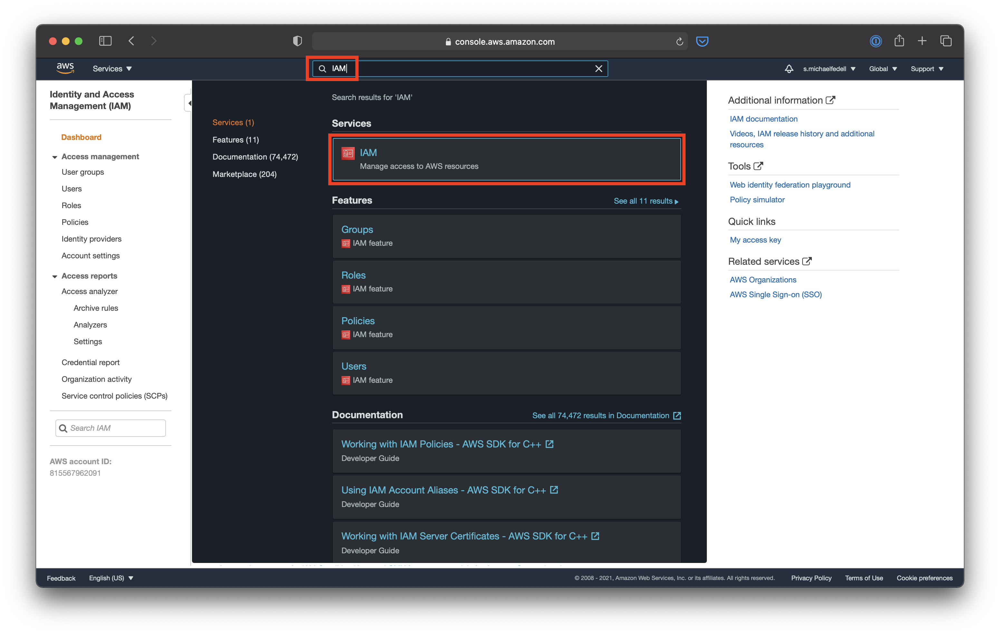
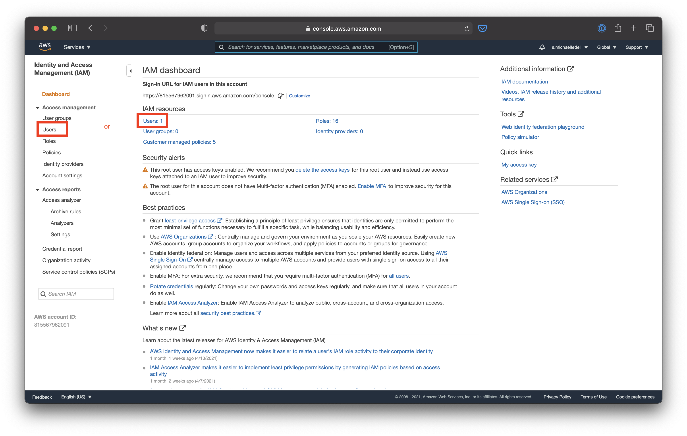
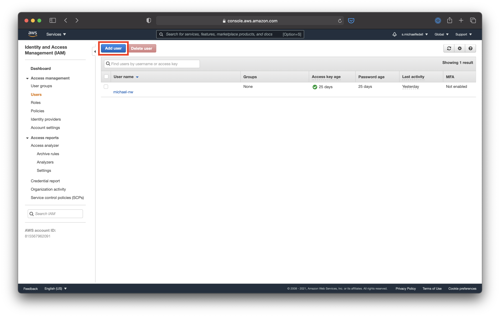
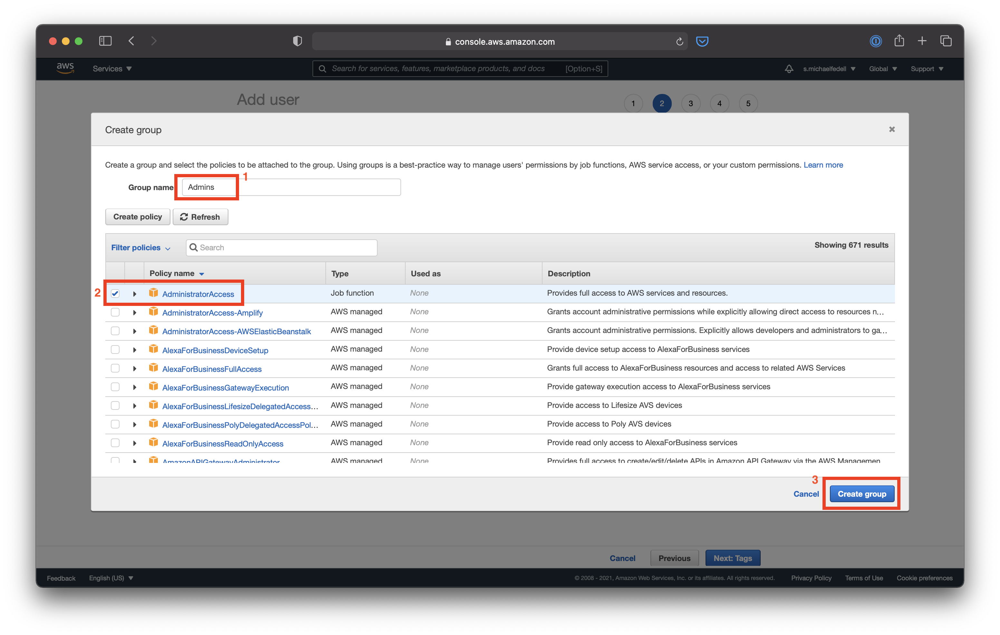
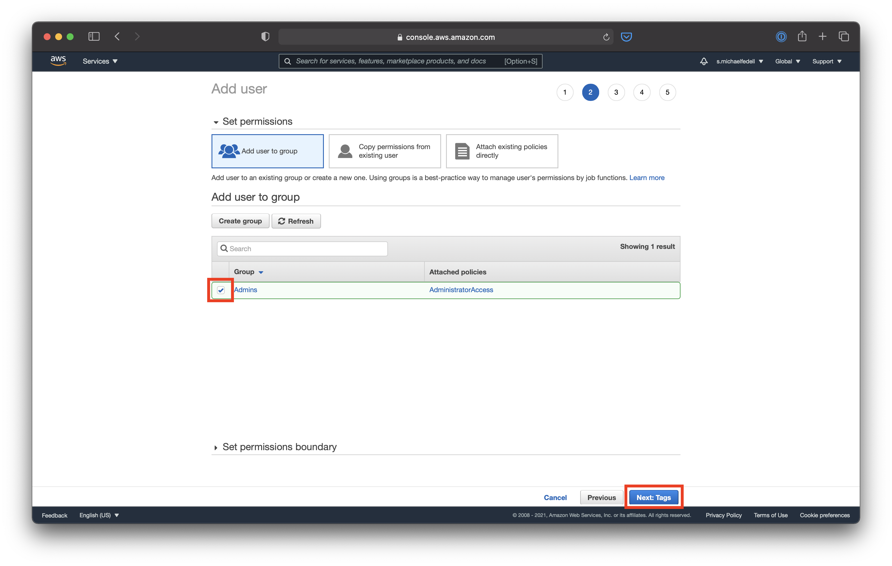
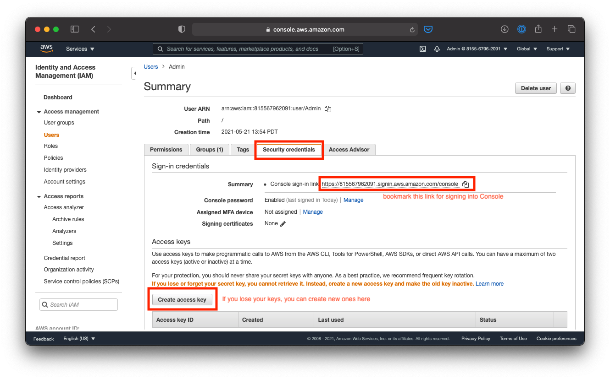

# Create an Admin User in AWS IAM

This tutorial is based on the [AWS IAM Getting Started Guide](https://docs.aws.amazon.com/IAM/latest/UserGuide/getting-started_create-admin-group.html)

## Tutorial

Navigate to the [AWS Management Console](https://console.aws.amazon.com/console/home).



Go to the [IAM Console page](https://console.aws.amazon.com/iam/home).



Click on the Users section.



Click on "Add user".


Give your user a name of "Admin", and enable both **Programmatic access** and **AWS Management Console access**.

You may optionally set your password here, since you are setting up the user for yourself, you can uncheck the "Require password reset" box.

Instructions will be available at the end for logging in as the new user if you use the auto-generated password.


Create a group to manage users.



Name the group **Admins** or something similar.

Click the checkbox next to `AdministratorAccess` to grant a full set of permissions to users in this group.



Ensure the new User is a part of our newly created **Admins** group, then move on.


You can leave the Tags section blank and continue.


Review the details and click **Create user** to continue.


**Be sure to download your credentials as you will not be able to access them after you close this page**. You can still log in as Root and create new credentials for this User, but that's a hassle... download them now and keep them safe (and secret).

### Manage New User

You should now use this new Admin user for logging into the Console (it will save you from answering captchas every time you log in), and for programmatic access via the CLI, `boto3`, or other sdk's.


You can manage and view the details for your new Admin user by clicking on the User from the IAM Management Console's Users page.



From the User detail page, you can bookmark the console login link, and manage your login credentials from the **Security credentials** tab.

### Configure CLI for Admin Profile

When you first set up your `aws` CLI, you probably used your Root credentials. You should now use this new `Admin` user as the default profile. This can be done by going through the `configure` command again and specifying the newly created/downloaded Access Key and Secret Access Key.

```bash
aws configure
```

Alternatively (_optional_), you can set up multiple **profiles** for your aws credentials. This can be done via the following:

```bash
aws configure --profile admin
# or
aws configure --profile root
```

[Learn more about named profiles here](https://docs.aws.amazon.com/cli/latest/userguide/cli-configure-profiles.html).

This will add sections to your config and credential files:

`~/.aws/config`:

```conf
[default]
region = us-east-1
output = json
[profile admin]
region = us-east-1
output = json
[profile root]
region = us-east-1
output = json
```

`~/.aws/credentials`:

```conf
[default]
aws_access_key_id = XXXXXXXXXXXXXXX
aws_secret_access_key = xxxxxxxxxxxxxxxxxxxxxxxxxxxx
[admin]
aws_access_key_id = XXXXXXXXXXXXXXX
aws_secret_access_key = xxxxxxxxxxxxxxxxxxxxxxxxxxxx
[root]
aws_access_key_id = XXXXXXXXXXXXXXX
aws_secret_access_key = xxxxxxxxxxxxxxxxxxxxxxxxxxxx
```
