# AWS Identity and Access Management (IAM)

## Learning Outcomes

- User vs Role
- Access Keys
- "Least Privilege"
- Resource vs Identity Permissions

## Overview

IAM (Identity and Access Management) is a foundational service in AWS that allows the management of user identities, roles, and permissions in a secure and scalable way. AWS IAM is a key component of a secure cloud infrastructure that grants access to AWS resources and ensures that only authorized entities can perform certain actions.

You may not have to configure Centralized Login, Role Federation, or User policies for large accounts, but you **will** have to be familiar with IAM concepts so that you can properly configure your services with access to the resources they need. For instance, a Lambda function cannot run at all without a properly configured IAM Role, and you will not be able to connect to an S3 bucket from EC2 without explicitly assigned permissions.

### Key Topics

- **Users**: Users are individuals or applications that have an AWS account and can perform actions on resources. Users are assigned credentials such as access keys, which are used to access AWS services through APIs or the AWS Management Console. Typically a "User" is created for a person that will be using AWS interactively; they are also used for long-running applications that need to run *outside* of AWS (CI/CD pipeline, on-prem application, etc.).

- **Roles**: Roles are entities that provide a set of permissions to users or applications. Roles can be assumed by different entities, such as EC2 instances, Lambda functions, or users. Roles can also be used to grant permissions to cross-account access or federation scenarios. Typically Roles are created for services that run *within* an AWS account.

- **Permissions**: Permissions define what actions are allowed or denied on AWS resources. Permissions can be granted to users, groups, or roles. IAM provides a rich set of permissions, including resource-based policies, identity-based policies, and permission boundaries. You can define permissions in an IAM "Policy" which can then be assigned to various identities. A Policy is made up of the following components:
  - Effect: `Allow` or `Deny` permissions defined in the policy
  - Principal (only on resource-based policies): account, user, or role to which the policy applies
  - Action: list of granular actions that are allowed; these are specific to each service and can be found in documentation (e.g. [`s3:GetObject`](https://docs.aws.amazon.com/service-authorization/latest/reference/list_amazons3.html), [`sqs:DeleteMessage`](https://docs.aws.amazon.com/service-authorization/latest/reference/list_amazonsqs.html), etc.; can be found by searching "<service> iam actions")
  - Resource: list of resources to which the permissions apply (e.g. specific files in an S3 Bucket, a particular SQS Queue, etc.)
  - Condition (optional): circumstances under which permission is granted

- **Least Privilege**: The principle of least privilege is a security concept that requires granting the minimum set of permissions necessary for an entity to perform its intended function. IAM policies should be designed to enforce this principle, reducing the risk of accidental or intentional misuse of AWS resources. This is especially important when defining `Role`s; if you create a Role for an EC2 Instance that needs to download data from S3 and send notifications via SNS, it should only have permissions `s3:GetObject`, and `sns:Publish` to the specific Bucket/Topic that is to be used. If someone else gains access to this EC2 Instance, they will only be able to perform the above actions (and not, say, deploy 1000 EC2's to mine crypto).

### Resource vs Identity Policies

Some services allow you to define resource-based policies which are attached directly to the resource you are trying to protect (e.g. "configure S3 Bucket to allow uploads by Alice"). This is flipped from the more standard identity-based approach (e.g. "give Bob permission to download from some S3 Bucket"). Each method has its own advantages.

Identity-based policies are attached to IAM users, groups, or roles and define what actions are allowed or denied on AWS resources. Identity-based policies are evaluated based on the identity of the entity that is making the request. For example, an IAM user policy can be used to grant read-only access to an S3 bucket.

Resource-based policies, on the other hand, are attached directly to AWS resources, such as S3 buckets or SQS queues, and define what actions are allowed or denied on the resource. Resource-based policies are evaluated based on the resource being accessed, regardless of the identity of the requester. For example, an S3 bucket policy can be used to grant read-only access to a specific set of IP addresses.

## Goals

- Create an Admin User instead of using Root
- Configure command line with Admin User
- Create a Role for EC2 with read/write permissions to S3

## Create an Admin User

We will be following AWS Best Practice to create an Admin User for our account. This allows us to use most of our AWS Account without risking access to the default Root user which has access to billing information and could allow someone to take full control of your account. If your Admin user is compromised, you can still regain access to the account via the Root user.

AWS has recently introduced AWS Identity Center as the recommended way to manage account access. This is a bit more involved than legacy IAM Users, but will likely be how you will manage access to accounts in a job setting. I have included instructions for [legacy IAM User access setup](./iam-admin-user.md), but will be covering the new Identity Center login in this workshop.

This guide will follow the [Getting Started Guide](https://docs.aws.amazon.com/singlesignon/latest/userguide/getting-started.html) for AWS Identity Center.

First, login to your AWS Account as Root User.

### Navigate to the [IAM Identity Center Console](https://us-east-1.console.aws.amazon.com/singlesignon/)

and enable IAM Identity Center (and AWS Organizations).

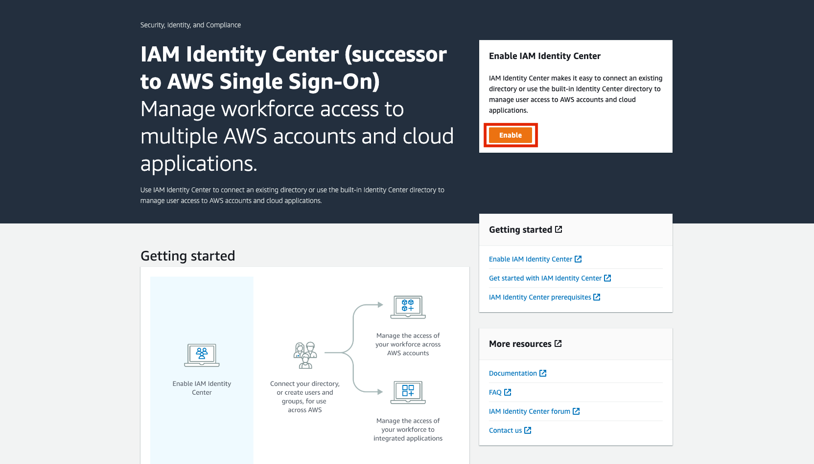


NOTE: You will receive a confirmation email to your root user email address which you should promptly confirm/verify.

---

### Create an AdministrativeAccess `PermissionSet`

Navigate to Permission sets


Create a Permission Set

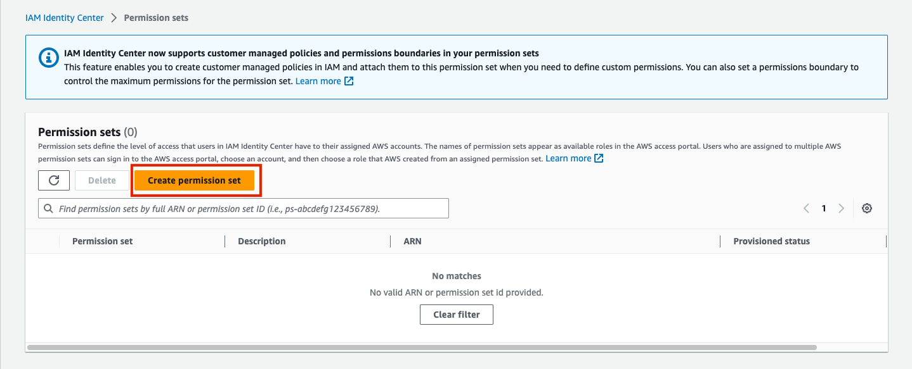

Select **AdministratorAccess** as permission set type

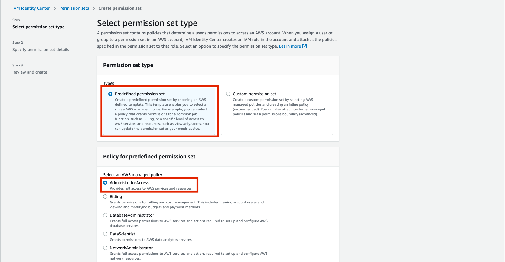

Give Permission set name and description

You may optionally configure a longer default session if you wish.

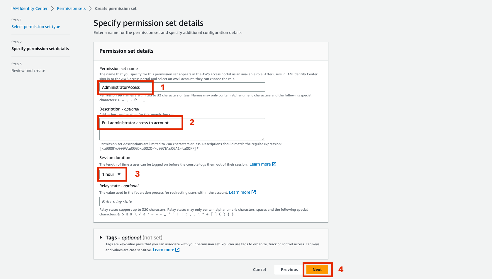

Review and click "create"

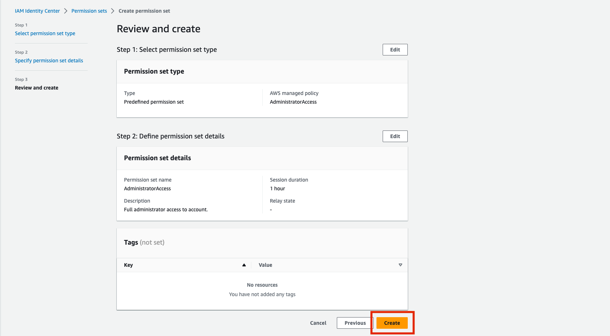

Confirm creation before navigating to Users tab


---

### Create a User for yourself

Click "Add user"

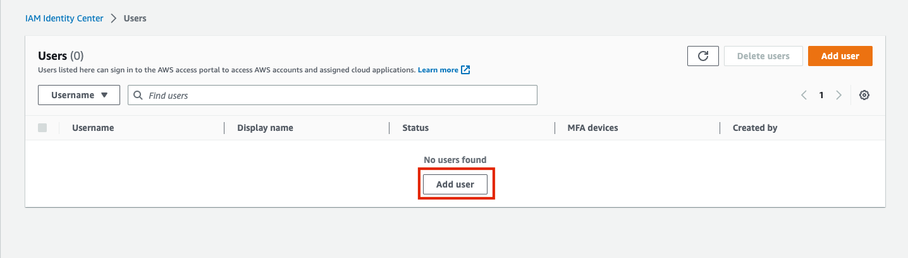

Specify user information for yourself

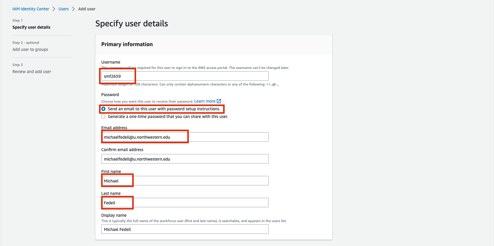

Click "Create group"

Note: this will open in a new tab where we can create a Group without losing our Create User progress

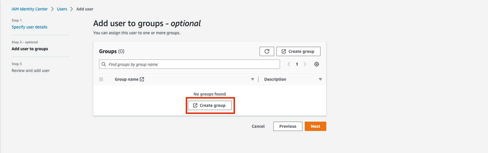

Create a group for "Administrators"

Once confirmed complete, you can close this tab to go back to the Create Users step

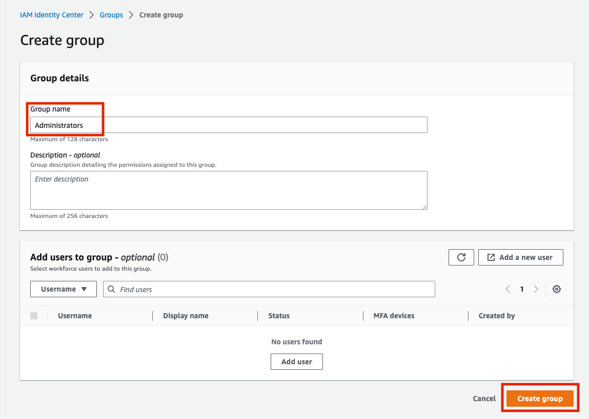

1. Refresh the list of Groups
2. Add the Administrators group to the user
3. Click "Next"


Confirm creation and navigate to the "AWS accounts tab"

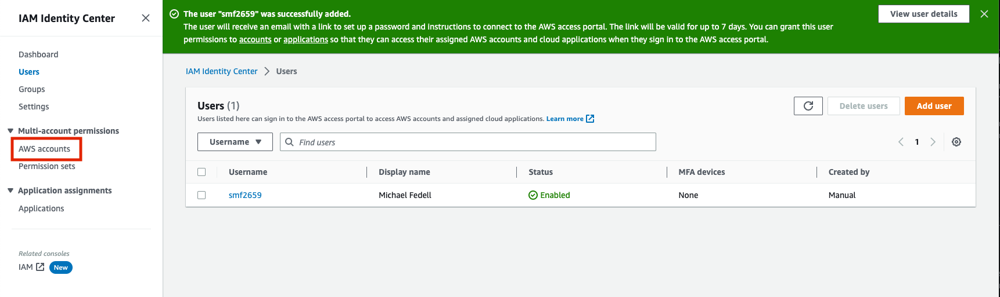

---

### Add the Group to your Account

We now need to add the newly created user/group to our account to grant it access.

Click "AWS accounts" under "Multi-account permissions" in the left sidebar, then click on the name of your account.

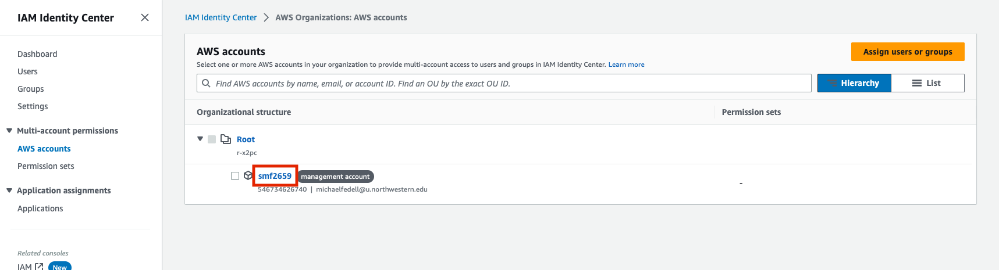

Under "Assigned users and groups", click "Assign users or groups"

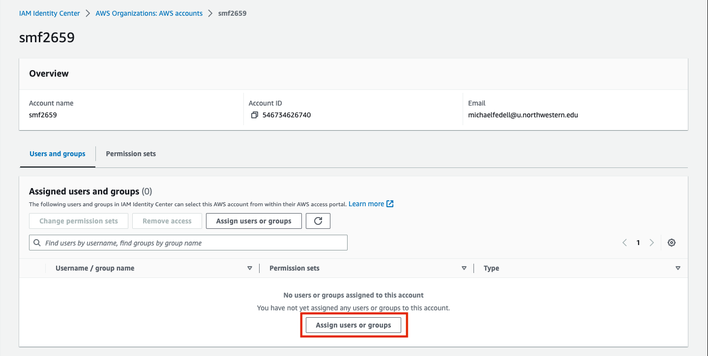

Select the Administrators group from the Groups tag, then click "Next"

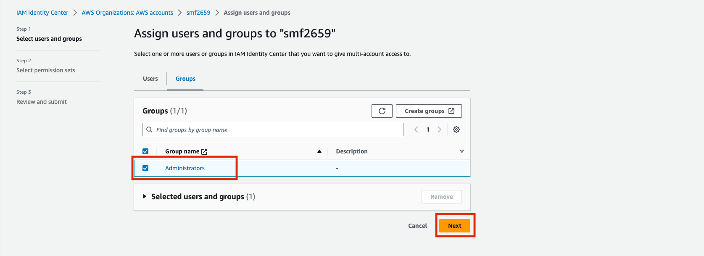

Select the AdministratorAccess permission set we created earlier, then click "Next"

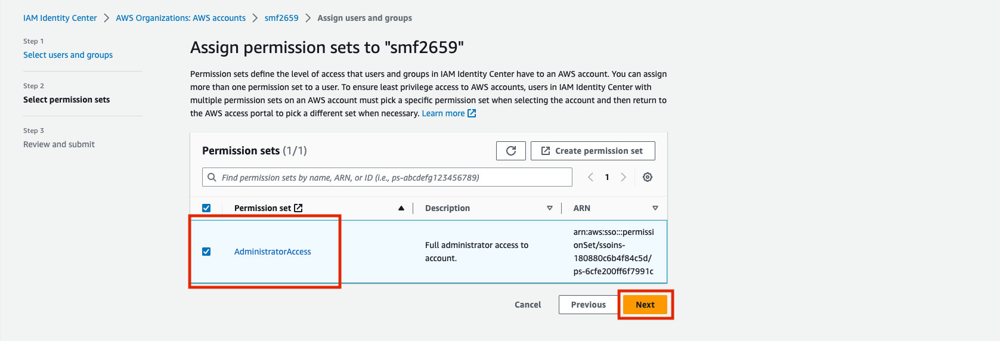

Review and submit

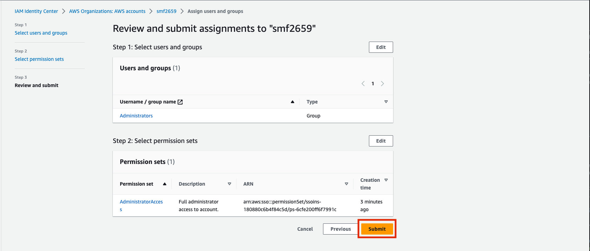

Once confirmed complete, navigate back to the Dashboard by clicking "IAM Identity Center"

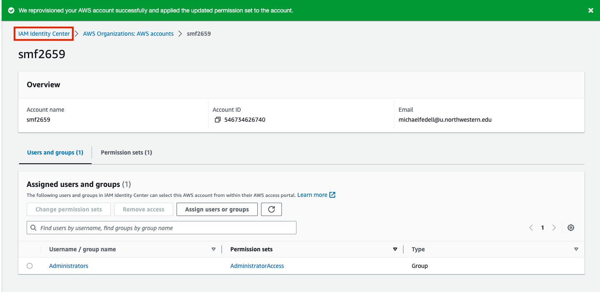

---

### Login using your new User

Navigate to the IAM Identity Center Dashboard and open the AWS Access Portal URL

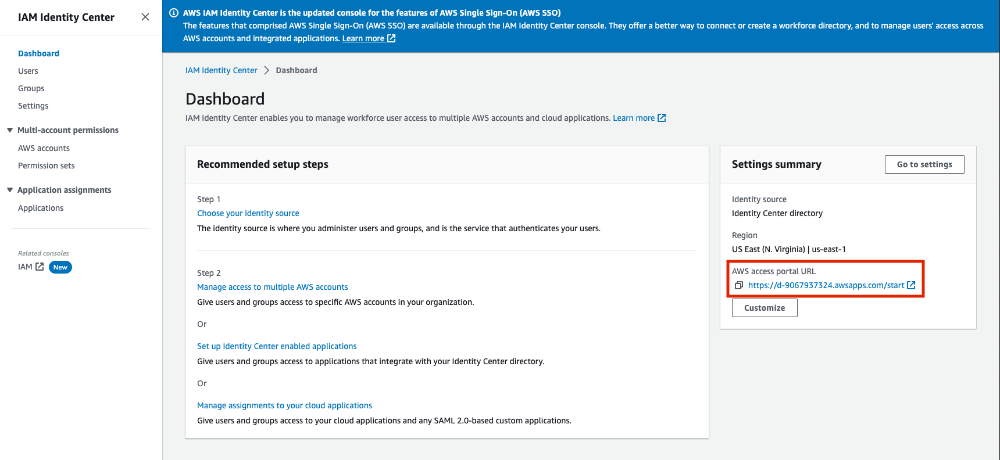

Login using your newly created username/password and access the Management Console or Command Line Access

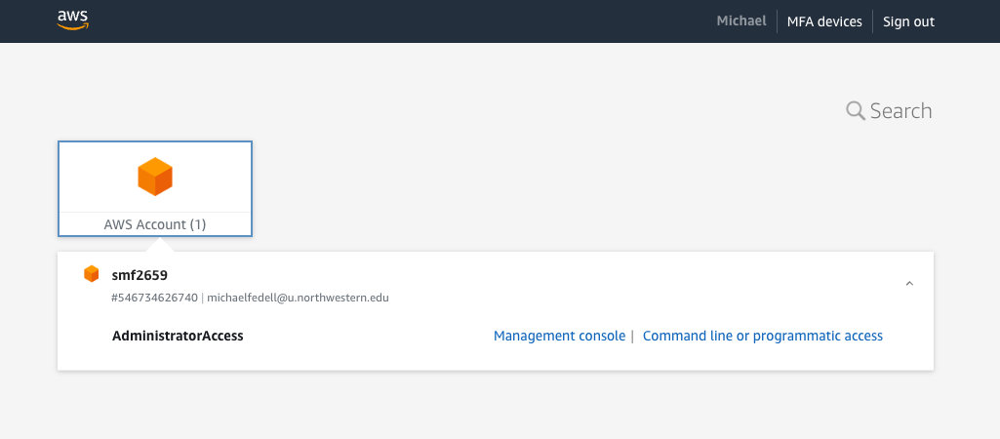

**NOTE**: It is important to login to the email address you specified in the above and accept your invitation to the Organization/Account.

---

## Configure Command Line with Profile

Now that we have created a new identity with controlled access to our account, we will configure the AWS CLI on our local machine (laptop) to connect to AWS using this new identity.

AWS Identity Center makes it very simple to do this. We will be following the steps detailed in [the AWS SSO Configure Profile docs](https://docs.aws.amazon.com/cli/latest/userguide/sso-configure-profile-token.html#sso-configure-profile-token-auto-sso).

To get started, open a terminal and verify that you have the AWS CLI installed

```shell
aws --version
```

This command should print out information about the version of the AWS CLI that you have installed. If it produces an error, ensure that you have [installed the AWS CLI](https://docs.aws.amazon.com/cli/latest/userguide/getting-started-install.html).

Now, we will run a simple command to interactively configure our AWS CLI:

```shell
aws configure sso
```

This will prompt you for an "SSO Start URL" which can be obtained from the IAM Identity Center dashboard or Access Portal we visited above:

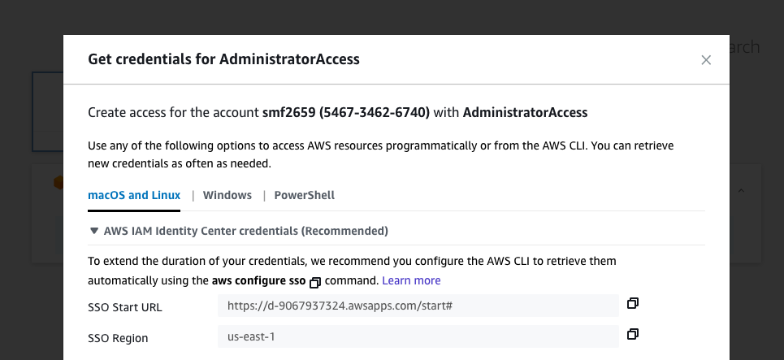

After you submit the SSO Start URL and the SSO Region to the interactive CLI Login Wizard, you will be redirected to a webpage asking you to login to your new account.

After approving the login from your browser, the login wizard will show something like the following

```shell
SSO session name (Recommended): mfedell-mba
SSO start URL [None]: https://d-1234567890.awsapps.com/start
SSO region [None]: us-east-1
SSO registration scopes [sso:account:access]:
Attempting to automatically open the SSO authorization page in your default browser.
If the browser does not open or you wish to use a different device to authorize this request, open the following URL:

https://device.sso.us-east-1.amazonaws.com/

Then enter the code:

XXXX-XXXX

The only AWS account available to you is: 1234567890
Using the account ID 1234567890

The only role available to you is: AdministratorAccess
Using the role name "AdministratorAccess"

CLI default client Region [us-east-1]: us-east-2
CLI default output format [json]:
CLI profile name [AdministratorAccess-1234567890]: personal-sso-admin

To use this profile, specify the profile name using --profile, as shown:

aws s3 ls --profile personal-sso-admin
```

NOTE the following fields should be set:

- `SSO session name`: something identifying the current client (e.g. `<name>-<device>`)
- `SSO start url`: referenced from your Identity Center Dashboard
- `SSO region`: referenced from your Identity Center Dashboard or the Access Portal as seen in screenshot above; NOTE: this is the region in which **Identity Center** is deployed (default us-east-1) and is not something you can easily change (not tied to your CLI default region set below)
- `CLI default client Region`: This is the region in which you will most commonly be deploying services (it can be changed at any time and also set on a per-command basis)
- `CLI default output format`: leave as default json is fine
- `CLI profile name`: this is how you will identify the set of config/credentials for these sessions; it should likely indicate the account and permission level in the name.

This command has configured your AWS CLI with a named "Profile" set up to use credentials obtained via SSO with AWS Identity Center for all commands.

To verify these credentials are set properly, you can run the following:

```shell
aws --profile personal-sso-admin sts get-caller-identity
```

which should output some information about your current identity.

**NOTE**: you must specify the `--profile` everytime you run an AWS CLI command to direct it to use the `personal-sso-admin` credentials. For more information about named profiles, see: [AWS Named Profile](https://docs.aws.amazon.com/cli/latest/userguide/sso-using-profile.html). If you want to set this profile for the remainder of your shell session, you can run the following:

```shell
export AWS_PROFILE=personal-sso-admin
```

If you need to expire your credentials for whatever reason, you can run the following:

```shell
aws --profile personal-sso-admin sso logout
```

Once your credentials are expired (timed out or logged out), you can log back in with the following:

```shell
aws --profile personal-sso-admin sso login
```
