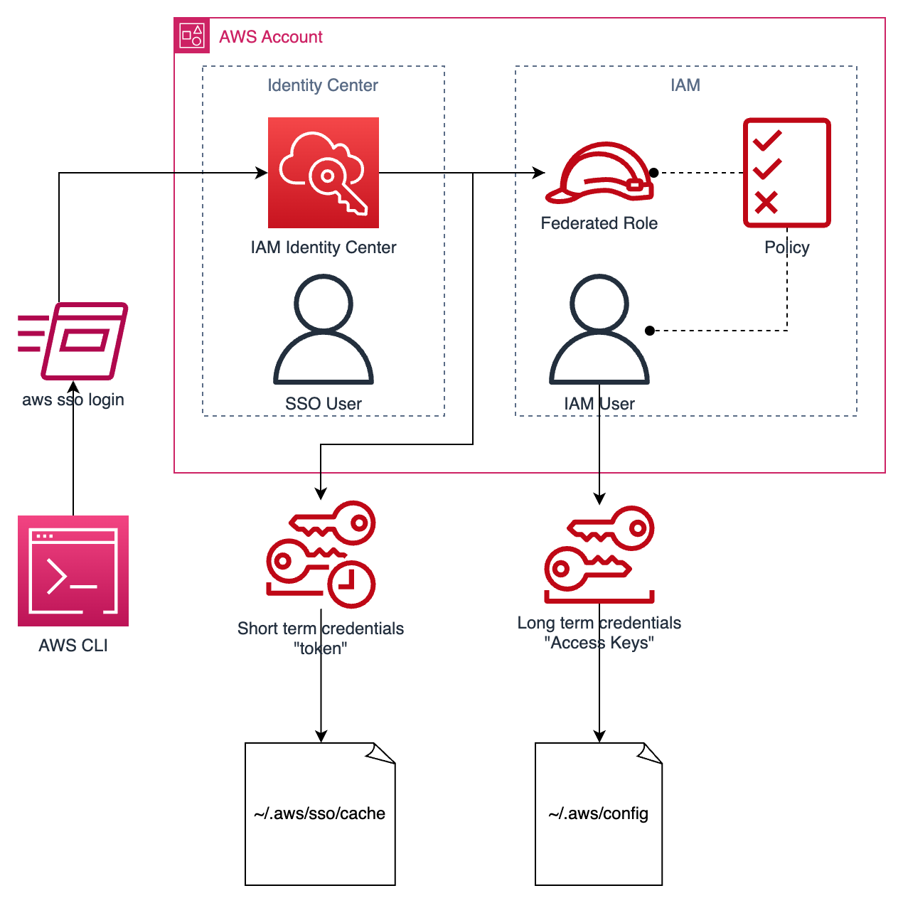

# IAM Basics

Let's start with the basics. IAM (Identity and Access Management) is AWS's system for managing **authentication** and **authorization**.

**Authentication** deals with _who_ you are. This involves verifying your identity and mapping your session/activity to a known identity in the system. This is what happens when you enter a username and password. It also happens when you present an "Access Key" or other token-based credential. More on that later.

**Authorization** deals with _what_ you are allowed to do. This involves assigning specific permissions to your identity and then verifying that all of your attempted actions fall within that set of permissions. This is what happens when a Google Doc prevents you from editing it and directs you to request access.

This diagram shows an overly simplified view of some core IAM concepts, it may not make sense now, but hopefully it will become more clear as you continue reading.



Now, let's map this to AWS and explore the ways it is managed in an AWS account as well as the CLI and various SDK's used to interact with AWS.

## Identity (Authentication)

Before we get into SSO (IAM Identity Center; aka "IIC"), there are two basic types of identities in AWS, **Users** and **Roles**.

### Users

IAM Users are meant to be mapped 1:1 with a physical entity such as a person, workstation, or a service outside of AWS like a CI/CD pipeline. IAM Users must be created for each of these identities and they can be tedious to manage. One feature to help with this is IAM "Groups". A Group is not technically an identity in AWS; you cannot refer to it in policy statements, it's only purpose is to manage large sets of users in a unified way.

Users can be given a username and password to facilitate human logins in the AWS Console. However, this is not required. They can also be set up with "Access Keys" which allow the entity to authenticate to AWS programmatically. These access keys come in pairs (Access Key ID, and Secret Access Key, analogous to username and password) and must be stored somewhere securely as they together can be used to access anything for which the user has permission.

### Roles

IAM Roles are a bit less intuitive, but are much more flexible. A Role is simply a portable set of permissions which can be passed on to various entities known by AWS. You can think of an IAM Role like a "hat" that other things (people, machines, services, etc.) can put on for a bit to do their job.

There is no password or access key for a role as it is not meant to be used by entities which need a password or key. Instead, an IAM Role is created with a "_Trust Policy_". This Trust Policy lists other already-known identities which should be permitted to _Assume_ the Role. These identities might be a particular AWS Service (e.g. an EC2 instance), a User, another Role, or an entire account. In order to assume a Role, an identity must be Trusted, **and** it must have permission to perform the "AssumeRole" action.

## Access (Authorization)

Access Management is controlled by IAM **Policies**. A Policy Document is a collection of statements which can be attached to any User or Role. Once attached, the identity is able to perform all actions defined by the Policy. Users and Roles can both have inline policies which define allowed actions for _just that entity_. This is a simple way to give permissions to an identity, but a more flexible way is to create a standalone, "managed" IAM Policy which can be attached to many Users and Roles.

An IAM Policy Statement is made up of the following components:

- **Effect**: `Allow` or `Deny` permissions defined in the policy
- **Principal** (only on resource-based policies): account, user, or role to which the policy applies
- **Action**: list of granular actions that are allowed; these are specific to each service and can be found in documentation (e.g. [`s3:GetObject`](https://docs.aws.amazon.com/service-authorization/latest/reference/list_amazons3.html), [`sqs:DeleteMessage`](https://docs.aws.amazon.com/service-authorization/latest/reference/list_amazonsqs.html), etc.; can be found by searching "<service> iam actions")
- **Resource**: list of resources to which the permissions apply (e.g. specific files in an S3 Bucket, a particular SQS Queue, etc.)
- **Condition** (optional): circumstances under which permission is granted

A Policy Document may look like the following:

```json
{
   "Version":"2012-10-17",
   "Statement":[
      {
         "Effect":"Allow",
         "Action":[
            "s3:GetObject",
         ],
         "Resource":"arn:aws:s3:::my-cool-bucket/free-objects/*"
      }
   ]
}
```

This allows the identity to perform the `GetObject` action (of the S3 service) on any object in the `my-cool-bucket` S3 Bucket so long as the key starts with `/free-objects/*`. This set of objects is targeted by what's called an "ARN" or "Amazon Resource Name" which provides a full, unique identifier to every resource in your account. (S3 is a "global" resource, but typically you would see a "region" and "account-id" in the ARN in between the `:::`)

## Identity Center / SSO

We're going to leave the complexities of SSO and Federated Identities mostly alone. For now, we can think of IIC as simply a way to verify a person's identity before allowing them to assume a Role. Some of the big advantages of IIC are only apparent when you work in a larger organization; this includes:

- centralized access to many accounts
- simple to manage access permissions across organization
- enforceable session duration with easy refresh
- tie-in with existing identity stores (company's user directory, etc.)

To be honest, for a single person using a single account, it's actually a lot of overhead without much added value. So, why in the world have we gone through the trouble of setting it up? Well, pretty much any place you work will be using IIC and enforcing sso-based logins. It is worth getting comfortable with the associated workflows now and starting off right. Additionally, it helps demonstrate topics like role assumption, credential settings, etc. If you hate it and want to stick with simple IAM Users, I won't stop ya! (no, really, I have instructions in [here](iam-admin-user.md)) However, I'd be short-changing you if I didn't try and get you some exposure to how things typically work in a more realistic job scenario.

## Configuration

Now for the good stuff. There's just a little bit of context to go through, and then a very simple set of instructions/examples to demonstrate how credentials can be configured and used in your day-to-day workflow.

There are lots of ways to perform an action in AWS: click a button in the AWS Console (browser), make a call to the REST API, execute a CLI command, or write a script with one of the many supported language SDKs (Software Development Kit). Every time you take an action, you must supply credentials to _authenticate_ the action. The action is checked against your attached policies, and if _authorized_, you will be able to perform the action.

In the browser, authentication is handled via username/password and credentials kept in a session cookie. You don't have to worry about this much.

Nobody really makes raw http requests to the AWS API's so we'll skip that too.

With the CLI, you have a few options for authentication! We'll go in the same order that the AWS CLI will check for these credentials.

1. `ACCESS_KEY_ID` and `SECRET_ACCESS_KEY` in your environment variables. You should pretty much never set these manually in your environment unless you're troubleshooting or doing something niche. These always take precedence.
2. `~/.aws/credentials` file may contain explicit credentials to be used. Again, you should probably not ever manipulate this file manually.
3. `~/.aws/config` file will define your named "profiles", each of which may define it's own method of sourcing credentials

The important takeaway here is that you should always check your environment variables when running `aws` CLI commands:

```shell
env | grep AWS
```

You may find that you need to:

```shell
unset AWS_ACCESS_KEY_ID AWS_SECRET_ACCESS_KEY
```

As discussed previously, you can set up your IAM Identity Center login via `aws configure sso`. Similarly, you can set up a static IAM User via `aws configure`. Both of these commands will prompt you for the required information to create a new entry in the `~/.aws/config` file corresponding to your named profile.

To make use of one of these named profiles, you can specify `--profile` with each command, or more preferable, set the `AWS_PROFILE` environment variable. Note, when you set your profile with `export AWS_PROFILE=...`, it will only remain active for the duration of your shell session; all set environment variables are lost when you open a new shell. To get around this, you can either set up a `"default"` profile, or add set the environment variable in your shells ".rc" file (e.g. `~/.zshrc` etc.).

Now that you have a bit more context, hopefully the above diagram makes more sense to you. If not, you are not alone! IAM is hard even for those who have done AWS for many years. Happy to help if you have more questions!

### Cookbook

Configure a new sso profile

```shell
aws configure sso --profile <my-profile-name>
```

Use that new profile in a single command

```shell
aws --profile <my-profile-name> sts get-caller-identity
```

Use that profile for all subsequent commands

```shell
export AWS_PROFILE=<my-profile-name>
aws sts get-caller-identity
```

Login to an sso profile (because: `Error when retrieving token from sso: Token has expired and refresh failed`)

```shell
aws sso login --profile <my-profile-name>
```

Logout from your sso session (if you want to immediately invalidate the short-term credentials)

```shell
aws sso logout
```

Set up a profile using traditional IAM User

```shell
aws configure --profile user-foobar
```

Check your current configuration and see how it is being set

```shell
aws configure list
```

See all your available profiles

```shell
aws configure list-profiles
```
