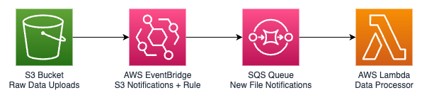

# Lambda Activity

We will set up a couple lambda functions during this tutorial. We may do more during the live workshop than is presented here in the document.

- Simple lambda function with manual invocation
- Lambda function triggered on SQS Queue to process new files in S3
- Lambda function with dependencies packaged as a zip file
- Lambda function with Docker image
- Lambda function exposed with Internet Endpoint
- Lambda function with API Gateway

## Hello World

To illustrate the basics of Lambda, we will set up a simple hello world type application that just prints some output and exits.

First, navigate to the Lambda dashboard and then click **Create Function**

Steps:

1. Create Function from template: **Hello World (python3.10)**
2. Create and execute test event
3. Modify code to print `os.environ`
4. Deploy changes
5. Run test again
6. Add environment variable under **Configuration** tab
7. Run test again
8. Check invocation metrics and view logs from **Monitoring** tab

## S3 => EB => SQS => Lambda

Next we will create a more complex function which showcases some of the real benefit of Lambda.

We will configure a function to run in response to new files that are uploaded to S3, utilizing the Event Notifications and SQS Queue we created previously during the [SQS Tutorial](../SQS/README.md) and [S3 Notifications Tutorial](../S3/notifications/README.md).



Steps:

1. Create Function and **Author from scratch**
2. Change the default execution role to use AWS Policy template; give function SQS poller permissions
3. Copy and paste code from [s3-eb-sqs/main.py](./examples/s3-eb-sqs/main.py) example into Lambda Code Editor
4. Deploy changes
5. Add a **Trigger** to the function of type: **SQS** and use the queue you created in the [SQS Tutorial](../SQS/README.md)
6. Now, upload a file to the S3 bucket you created during [S3 Notifications Tutorial](../S3/notifications/README.md). (ensure that you still have a valid event notification rule configured that targets the same queue)
7. Check the **Monitoring** tab of your function and view its logs in CloudWatch
8. You should see logs indicating the processed message with bucket/object details


## Zip Package

Now, let's try a Lambda function that queries another service using the `requests` library.

The Lambda Runtime environment does not have any third-party packages installed; if we want to use them in our code, we must include them in our deployment package. We can do this by creating a `.zip` file with both our source code and the installed packages (install with `pip install --target <package-dir>`, or include contents of `site-packages` from your virtual environment's directory).

Steps:

1. Create Function and **Author from scratch** (leave default execution role this time)
2. Copy and paste the code from [requests/main.py](./examples/requests/main.py)
3. Deploy changes
4. Create a test event with the following structure:

    ```json
    {
      "user": "tiangolo"
    }
    ```

5. Execute test

Our code fails with an error message that the `requests` module could not be imported. Any third-party libraries our code needs will have to be packaged and deployed together. We will now create a zipped deployment package:

Steps:

1. Use the included [Makefile](./examples/s3-ebs-sqs/Makefile) to create a `package.zip` file
2. Upload the `.zip` to your Lambda Function and Deploy Changes
3. Execute the test once more

This time, we get an error message that the `lambda_handler` module could not be found... this seems strange, but when we created our function, it uses a python file named `lambda_handler.py` by default with a single function called `lambda_handler()`. The Lambda Function itself is configured to use this `lambda_handler.lambda_handler` as the "**Handler**" for the function. The handler is just the entrypoint for the function execution and can be any file/function that is present in your deployment package. This can be viewed and changed from the bottom of the Lambda page under the **Runtime settings** section.

1. Change the Handler to `main.handler` as is available in our deployment package
2. Execute the test event once more
3. This time, you should see success as well as a list of repositories for user `tiangolo` (parsed from test event) as returned by the GitHub API. You can change the user in the Test event to whatever you like.

## Container Image

It's a bit cumbersome to create the package.zip file as seen above and it can also cause issues when we are on machines with different architectures than Lambda (because `pip` will install built packages suitable for *your* machine, which may not work in Lambda's environment). If only there were a better way to package our code for easy deployment and wide environment compatibility... enter Container Lambdas!

You can follow this guide: [Lambda Developer Guide - Python Image](https://docs.aws.amazon.com/lambda/latest/dg/python-image.html) as well as: [Lambda Developer Guide - Create Image from Base](https://docs.aws.amazon.com/lambda/latest/dg/images-create.html#images-create-from-base)

The tricky part not mentioned in any of these guides (as far as I can tell) is that Lambda can only use *private* ECR Repositories in your account. In the [ECR Tutorial], we created public repositories, to continue, we'll need to create a private one as well.

Steps:

1. Head over to the ECR Console and create a *PRIVATE* repository.
2. Give it a name like `simple-api`, all other settings can remain default.
3. Use the **Push commands** from the ECR Repo's page to `login`, as well as build/tag/push your image

    > Note: you can see the required commands in the included [Makefile](./examples/simple-api/Makefile)
    > You may see the following error:

      ```shell
      ERROR: failed to solve: public.ecr.aws/lambda/python:3.12: unexpected status from
      HEAD request to https://public.ecr.aws/v2/lambda/python/manifests/3.12: 403 Forbidden
      ```

    > This happens because you have previously authenticated to the public.ecr.aws registry when you created a public repo during the ECS workshop. You can resolve this issue by simply logging out (and thus making an anonymous pull), or by re-authenticating

    ```shell
    # Log out
    docker logout public.ecr.aws

    # Or... re-authenticate
    aws ecr get-login-password --region us-east-2 | docker login --username AWS --password-stdin $YOUR_ACCOUNT_ID.dkr.ecr.us-east-2.amazonaws.com
    ```

4. Now go back to the Lambda console and create a new function
5. Choose "**Container Image Lambda**" and select the ECR Image you just pushed
6. Create a test event with name `http-root`; copy and paste the event from [examples/simple-api/test-event.json](./examples/simple-api/test-event.json)
7. Execute the test event
8. You should see a success with a json response that includes `"body": "{\"hello\": \"world\"}"`

> Note: our API application uses a new library called `Mangum` (see [docs](https://github.com/jordaneremieff/mangum)) to wrap our FastAPI app with a `handler`. This, in my opinion, is the easiest way to deploy API's to Lambda as it requires basically zero modification to your code. You can read more about how Mangum passes Lambda invocation events to the functions defined in your FastAPI app, or you can just marvel at its "magic" simplicity :)

## Simple API (Internet Endpoint)

Now, what if we want to expose our API to others for use in an application? Traditionally, we would do this through API Gateway, but AWS has introduced another way to expose your Lambda function that requires much less configuration (but is also much less flexible/feature-rich). See this blog post from AWS [Introducing Lambda Function URLs](https://aws.amazon.com/blogs/aws/announcing-aws-lambda-function-urls-built-in-https-endpoints-for-single-function-microservices/), or the documentation: [Lambda Developer Guide - Function URLs](https://docs.aws.amazon.com/lambda/latest/dg/lambda-urls.html)

Steps:

1. We will use the same `simple-api` function we created previously
2. Go to the **Configuration** tab and visit the **Function URL** section.
3. Click **Create function URL** and choose auth type.
   > NOTE: we will use `NONE` for simplicity in this showcase, but you should immediately disable this URL after you are done testing it. Alternatively, you can use `AWS_IAM` and then use tools like [Postman](https://www.postman.com/downloads/) or [`awscurl`](https://github.com/okigan/awscurl) to send authorized requests to the endpoint.
4. Test the function via the generated endpoint in your browser. If you chose auth type `NONE`, you should see a json response in your browser for `{"hello": "world"}`; you should also be able to visit the `/docs` page to see the FastAPI interactive docs.
5. Now, go back to the Lambda Function's Configuration tab and delete the Function URL.

## Simple API (API Gateway)

We will walk through this in the workshop; there are lots of guides online about how to configure API Gateway for your Lambda Function backend. Also, in practice, nobody really sets up Lambda+APIGateway from the AWS Console, but more likely uses a helper tool like [AWS SAM](https://aws.amazon.com/serverless/sam/), the [Serverless Framework](https://www.serverless.com/framework/docs), etc.

This blog post also has a nice, succinct comparison on Function URLs vs API Gateway:
https://www.serverlessguru.com/blog/aws-lambda-function-urls-vs-amazon-api-gateway