# AWS Relational Database Service (RDS)

In this tutorial, you will do the following:

- Create a new AWS VPC Security Group to allow inbound requests from your local environment to your database
- Create and launch a PostgreSQL database server using the AWS RDS service
- Connect to your PostgreSQL database using the `psql` client running in a Docker container
- Use SQLAlchemy to work with your PostgreSQL database

---

## Terminology

`AWS Region` - AWS Services are backed by physical servers located somewhere in the world. In order to improve connections, these are localized to "Regions" with names like `us-east-1` (Virginia) or `us-west-2` (Oregon).

`AWS VPC` - Virtual Private Cloud. It's the basic networking construct in AWS. This is the private network where you can launch servers, databases, etc. You get your own VPC with your AWS account.

`VPC Security Group` - This is a named set of rules that define the allowed connections between servers (and databases). It is useful to have these rules stored together in a VPC security group, since a group can be flexibly attached or removed from any number of servers or databases. Rather than having to repeatedly define the same rules for each individual server/database in your VPC, you can just reuse the same Security Group.

`AWS RDS` - Relational Database Service. This is the AWS offering for launching and hosting relational databases like MySQL, Postgres, Oracle, and Aurora (AWS's homegrown MySQL and Postgres compatible database).

`AWS EC2` - AWS IaaS offering for launching and hosting your own servers. We won't be using it here but the Security Groups are created under the EC2 section of the AWS console.

---

## 0. Sign in to the AWS Console

Visit <https://aws.amazon.com/console/> and sign in using your root credentials or as [an Admin IAM user](https://docs.aws.amazon.com/IAM/latest/UserGuide/getting-started_create-admin-group.html) (Recommended).

In the top of the console, you'll see the current **"Region"** (`N. Virginia` or `Ohio` for example) as a drop-down next to "Support". Please select "**US East (Ohio)** us-east-2" for your region and use this for all related AWS work in this course.

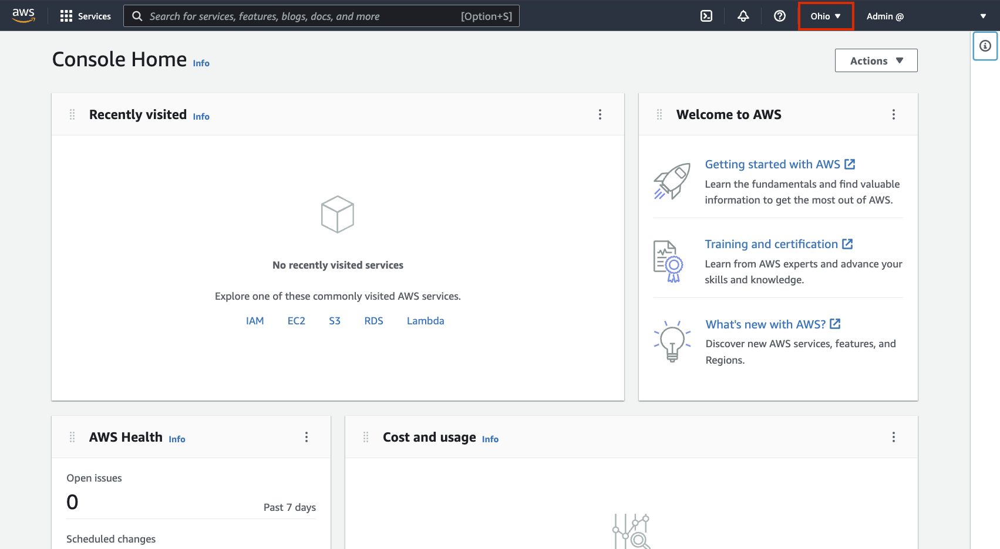

## 1. Create a security group

We will create a security group to enable your application to connect to your RDS database

_Note: This might feel a little backwards but we will create a security group first, then the database (so we can attach the security group to the database upon creation)._

- Under Services -> Compute/EC2:
  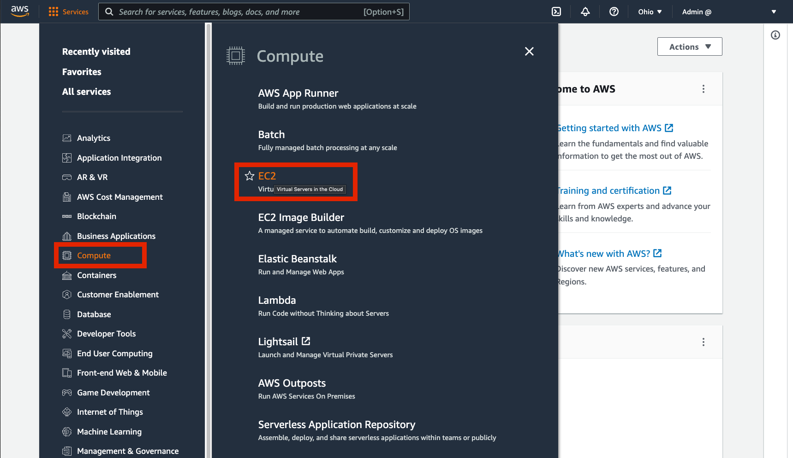

  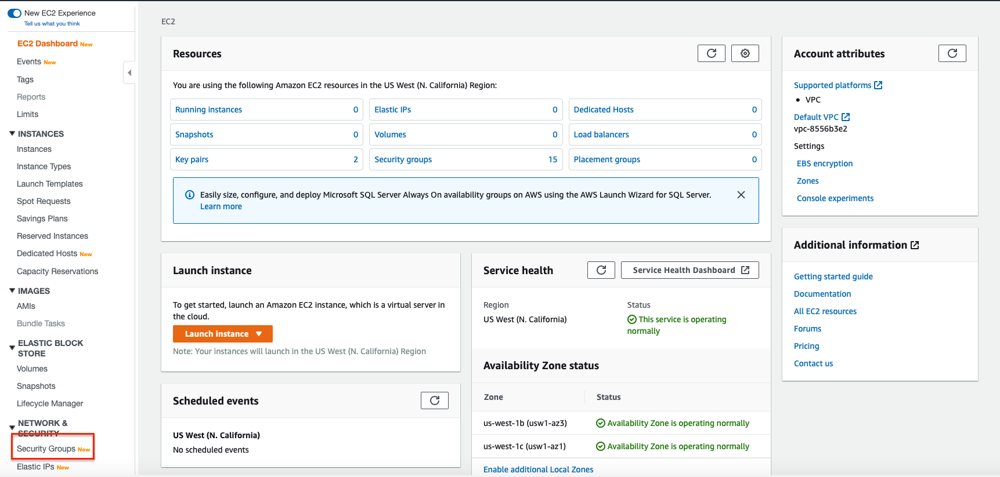

  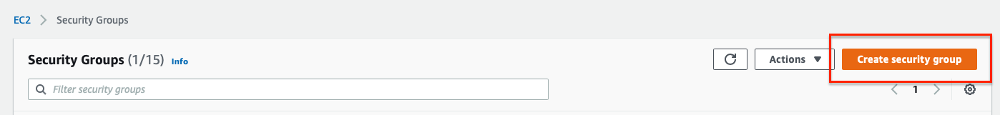

### Security group details

- Add a name and description. For example `mlds-rds-access`.
- Leave default VPC

  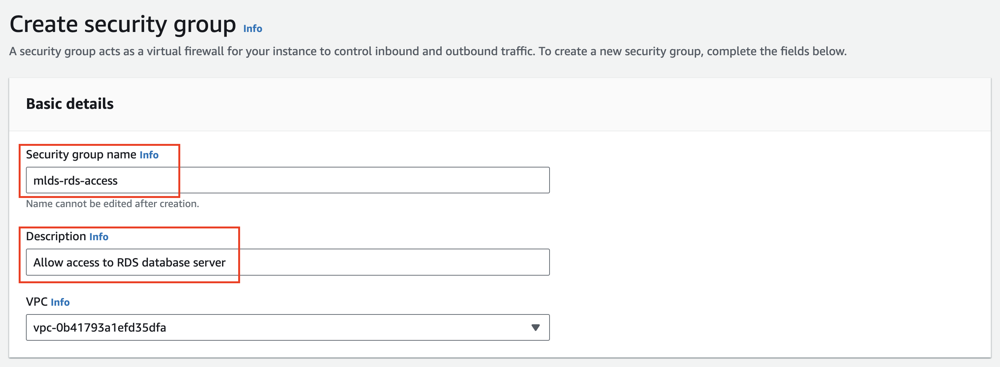

### Security group rules

- Create a new _inbound rule_ to allow inbound access from the NW VPN.
  - Click on "Add rule" to add a rule
  - Set Type as "**PostgreSQL**" or set the port range to be `5432`
  - Set the CIDR block to be `165.124.160.0/21` - This is the [IP range for the Northwestern VPN](https://services.northwestern.edu/TDClient/30/Portal/KB/ArticleDet?ID=1920)
- NOTE: For this to also work for on-campus WiFi (eduroam), you will need to add an additional rule (not shown in screenshot):
  - Click on "Add rule" to add a rule
  - Set Type as "**PostgreSQL**" or set the port range to be `5432`
  - Set the CIDR block to be `165.124.84.0/22` - This is the [IP range for the Northwestern Wireless/eduroam](https://services.northwestern.edu/TDClient/30/Portal/KB/ArticleDet?ID=1920)
- Leave the default _outbound rule_
- Click "Create security group" to complete group creation

  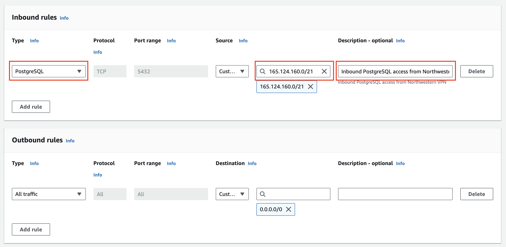

---

## 2. Create an RDS instance through the AWS console

_Note: Unless explicitly stated by the tutorial instructions, please use the defaults in the PostgreSQL instance creation process._

- Go to Services -> Database/RDS to create a new database.

  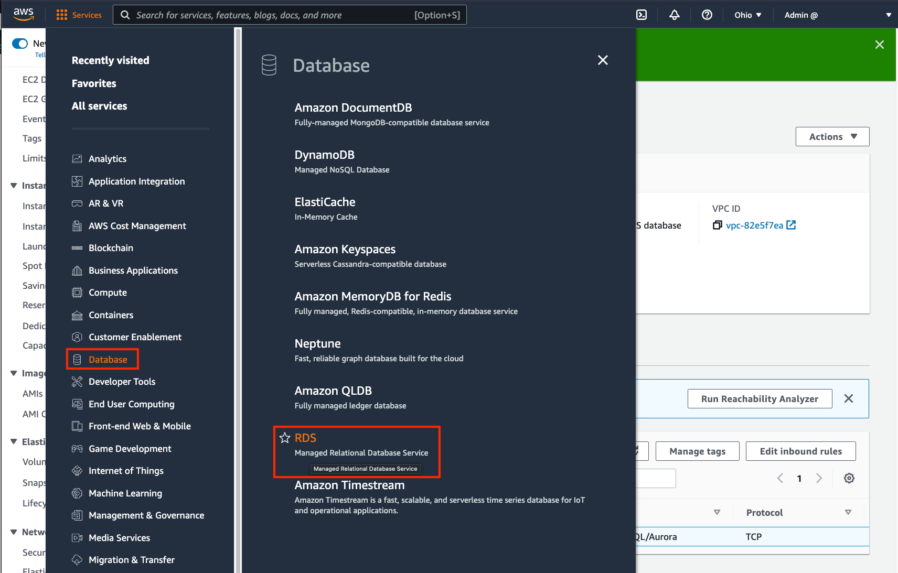

  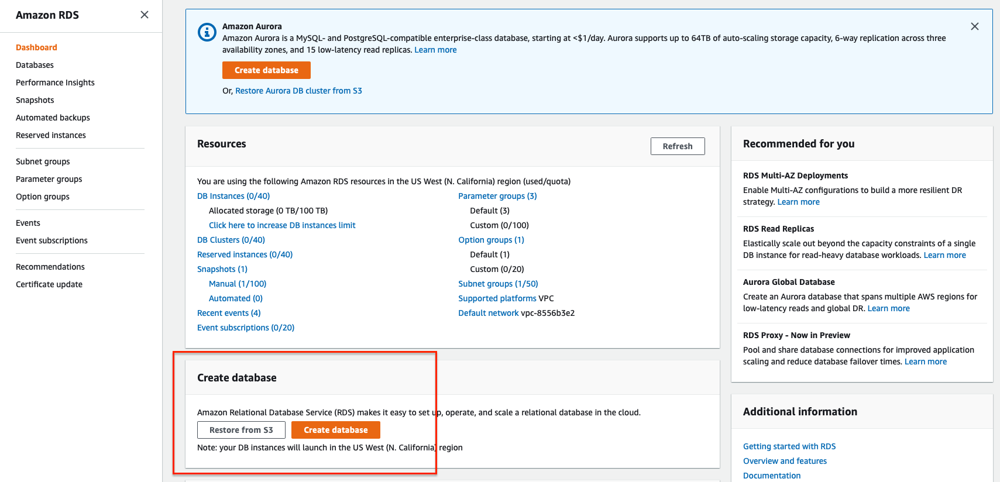

### Database details

- Choose "Standard Create"
- Choose "PostgreSQL"

#### Basic Config

  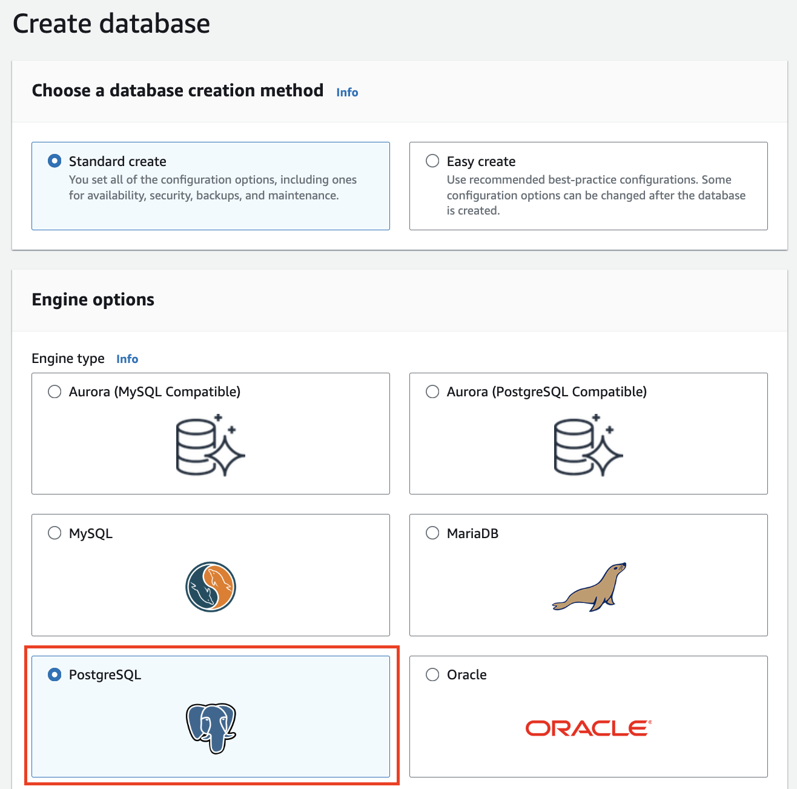

- In this tutorial, we'll use version `15.4-RC3`
- !!! ***Choose "Free tier"*** !!!

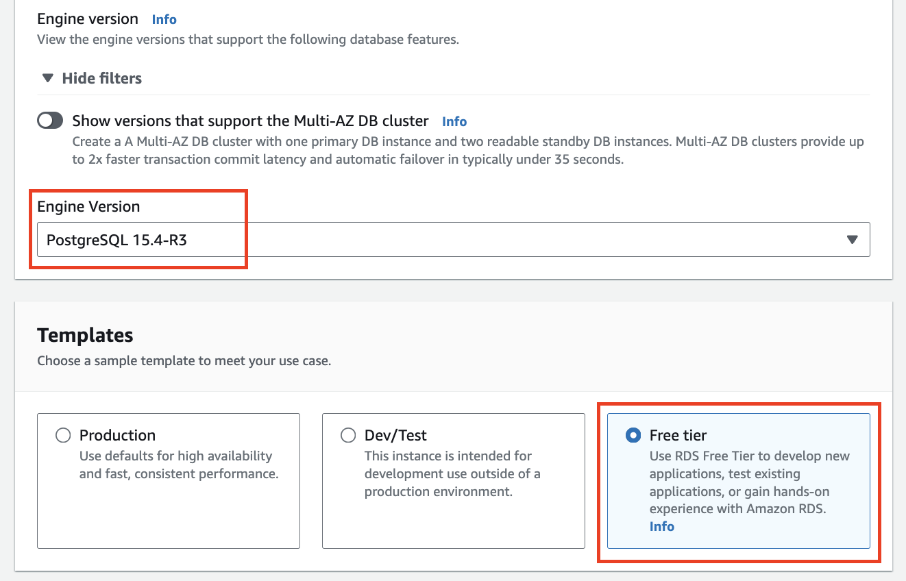

- Database Settings

  - Set a "DB instance identifier". This is the name of the database server.
  - Set a "Master username"
  - Set a "Master password" and remember it!

  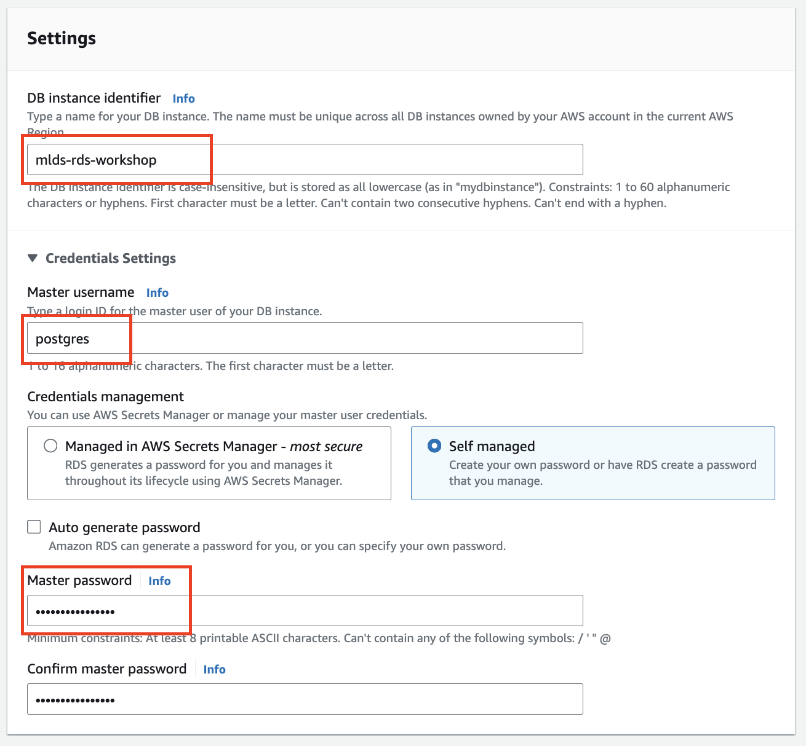

- Leave Instance Configuration as is. This should be set to `db.t3.micro` as part of the free-tier template you selected earlier.
- In "Storage" change **Allocated storage** to `20` and uncheck the "**Enable storage autoscaling**". This will keep your RDS database within the free-tier. (In general, the storage autoscaling is a nice feature and can help you start small and grow as you need).

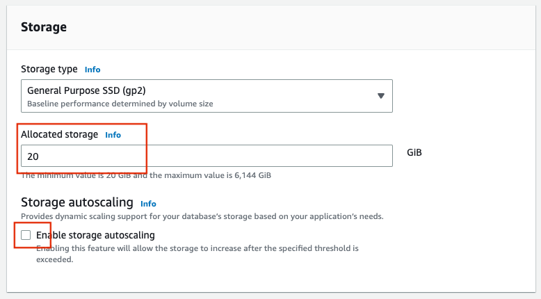

---

#### Connectivity

> **!!NOTE!!**  
> The following will result **in a cost of approximately $3.50/month due to recent changes in the AWS Pricing model**. The TLDR is that all resources with a **Public** IPv4 address incur a charge of $0.005/hr; the AWS Free Tier includes 750 hr/month of IPv4 address, but only applies to EC2 instances directly. If you would like to ensure a true 0-spend setup (and accept the added complexity), you will need to create the database **without** a public IP Address and connect to it from an EC2 instance in the same VPC. You may follow the instructions in [free-tier.md](./free-tier.md) to set up your database this way.

- In "Connectivity":
  - Choose "Public access": "**Yes**"
  - In "VPC security group" set "Choose existing" and in the dropdown choose the security group you created in the first section of the tutorial.
  - Ensure that the "default" security group is unchecked
  - Leave all other settings as default.

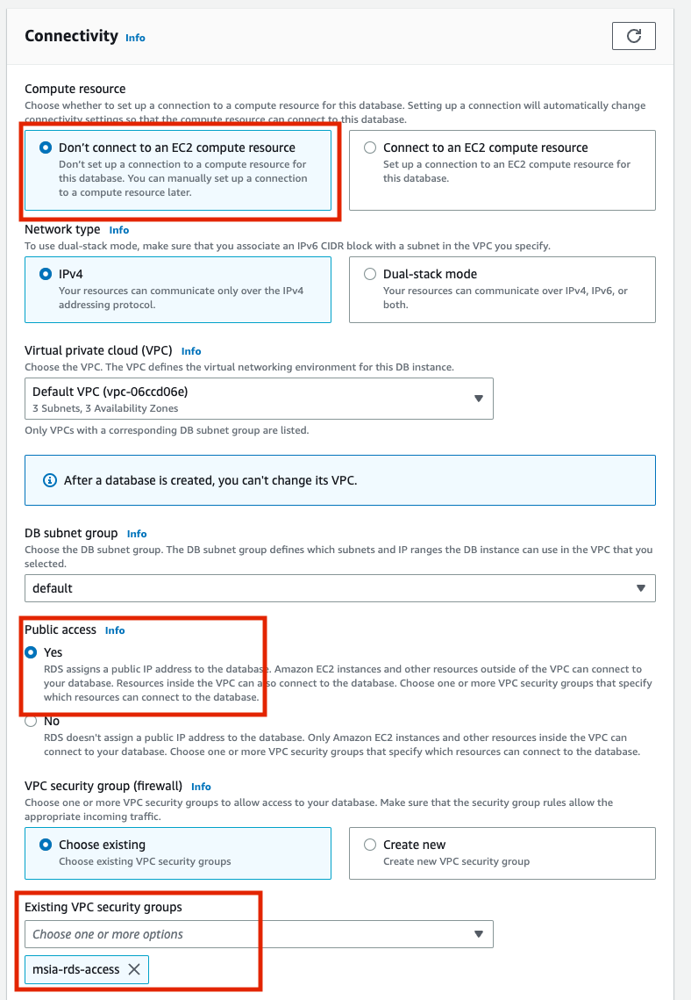

- Verify that the port is `5432`
- Click into the sub-menu "Additional configuration"

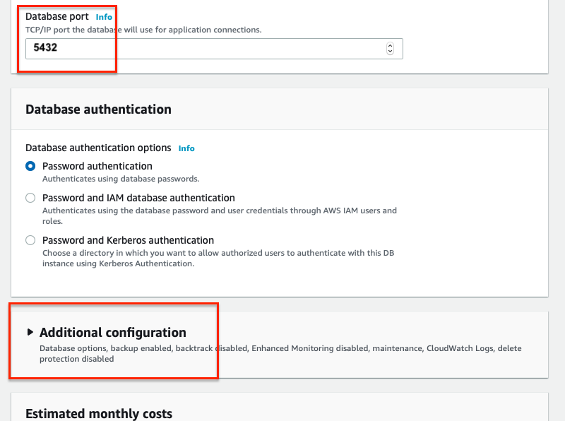

#### Additional Config

- Under Database options, set "initial database name" to `mlds` (or something else if you prefer). This is the name of the default database that will be created for you in the database server.

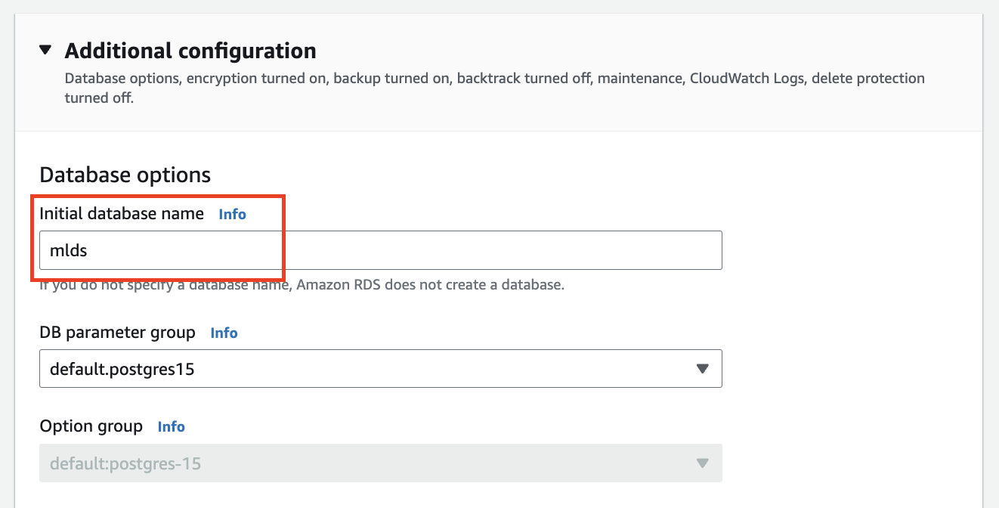

- Click create database at the bottom of the page and wait for a few minutes until the RDS dashboard shows that your database instance is ready.

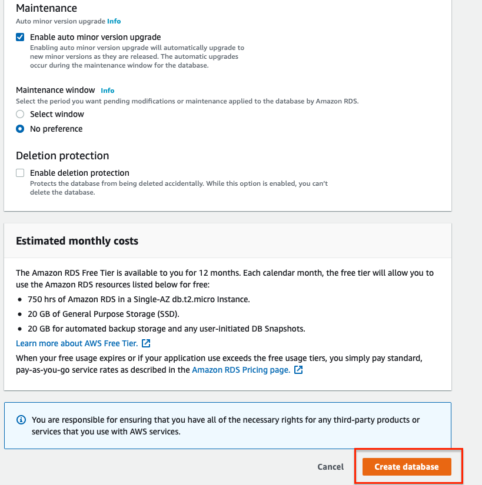

- Your RDS instance endpoint can be found from the RDS dashboard. You will use this to connect to the database server from your application. (i.e. `PGHOST` environment variable)

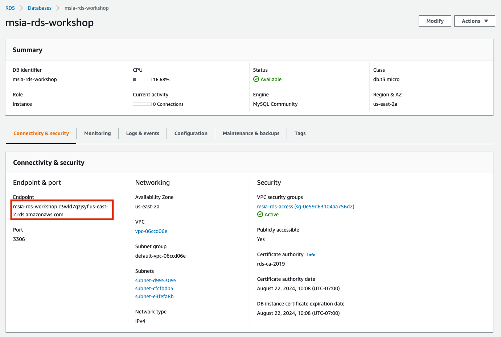

---

## 3. Connecting from your computer

> Note: You will need to be on the Northwestern VPN for the remaining portions of the tutorial. If you do not yet have the VPN client installed and configured, you can follow the instructions at [NU IT - Setting up and using GlobalProtect VPN](https://services.northwestern.edu/TDClient/30/Portal/KB/ArticleDet?ID=1818)

Set the environment variables in your active session

```bash
export PGHOST="YOUR_HOST_URL"  # this is the connection url given in the RDS console
export PGUSER="YOUR_USERNAME"  # master username you set when creating the database; default: "postgres"
export PGPASSWORD="YOUR_PASSWORD"  # master password you set when creating the database
```

<details>

<summary>Conveniently set env vars from a file</summary>

If you wish, you can store your database connection details in a local file **that is ignored from git**. You can name this `.db.env`

```bash
cd interactive
cat << EOF > .db.env
export PGUSER="YOUR_USERNAME"
export PGPASSWORD="YOUR_PASSWORD"
export PGHOST="localhost"
export PGPORT="5432"
export PGDATABASE="YOUR_DATABASE_NAME"
EOF
```

- Set `PGHOST` to be the RDS instance endpoint from the console
- Set `PGUSER` to the "master username" that you used to create the database server.
- Set `PGPASSWORD` to the "master password" that you used to create the database server.

> Note: If you are working in a git repository, BE SURE TO ADD THIS FILE `.gitignore` SO YOU DON'T ACCIDENTALLY COMMIT YOUR PASSWORDS!

```bash
source .db.env
```

</details>
<br>

**IMPORTANT**: VERIFY THAT YOU ARE ON THE NORTHWESTERN VPN BEFORE YOU CONTINUE ON

(this can be done by googling "what's my ip address" and ensuring you see an IPV4 address that matches the block we set earlier in the [Security Group Setup](#security-group-rules))

Use the PostgreSQL Docker image to start a `psql` client and connect to your database. (More information on the PostgreSQL Docker image can be found [here](https://hub.docker.com/_/postgres))

```bash
docker run \
  -it # `docker run` option - interactive session, attach to the container after it starts \
  --rm # `docker run` option - remove the container after it exits \
  -e PGPASSWORD  # "pass through" the environment variable for "PGPASSWORD"
  postgres:15.4 # Docker image and version \
  psql # command we are passing to entrypoint of container \
  -h ${PGHOST} # host used by command `psql` \
  -U ${PGUSER} # username used by command `psql`
```

Presented below without comments to facilitate copy/paste :)

```bash
docker run -it --rm -e PGPASSWORD \
  postgres:15.4 psql \
  -h ${PGHOST} -U ${PGUSER}
```

> Note: You should use a version of the `postgres` docker image which matches the version of PostgreSQL running in RDS. In this tutorial, we set both to `15.4`.

Submit SQL commands!

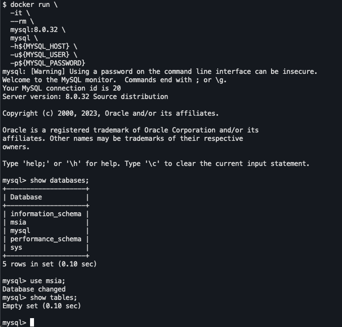

---

## 4. Using your database with SQLAlchemy

Build the provided Docker image

```bash
docker build -t penny_psql .
```

Set your database name and run the Docker container (you must first set `$PGUSER`, `$PGPASSWORD`, and `$PGHOST` with the values specific to your database as we did above)

```bash
export SQLALCHEMY_DATABASE_URI="postgresql://${PGUSER}:${PGPASSWORD}@${PGHOST}:5432/mlds"
docker run -it \
    --env SQLALCHEMY_DATABASE_URI \
    penny_psql
```

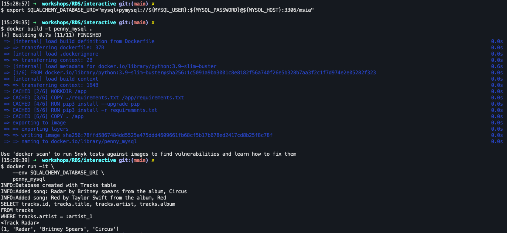

You can use the `psql` client again to see that a table has been added and data generated.

```bash
docker run -it --rm \
    -e PGPASSWORD
    postgres:15.4 \
    psql \
    -h${PGHOST} \
    -U${PGUSER} \
```

```sql
\l
\c mlds
\dt;
SELECT * FROM tracks;
```


