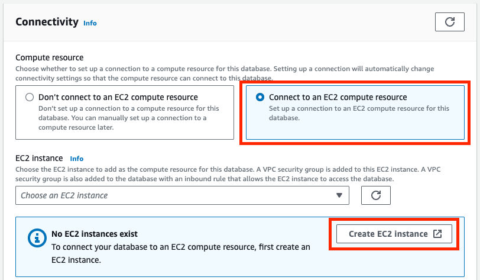
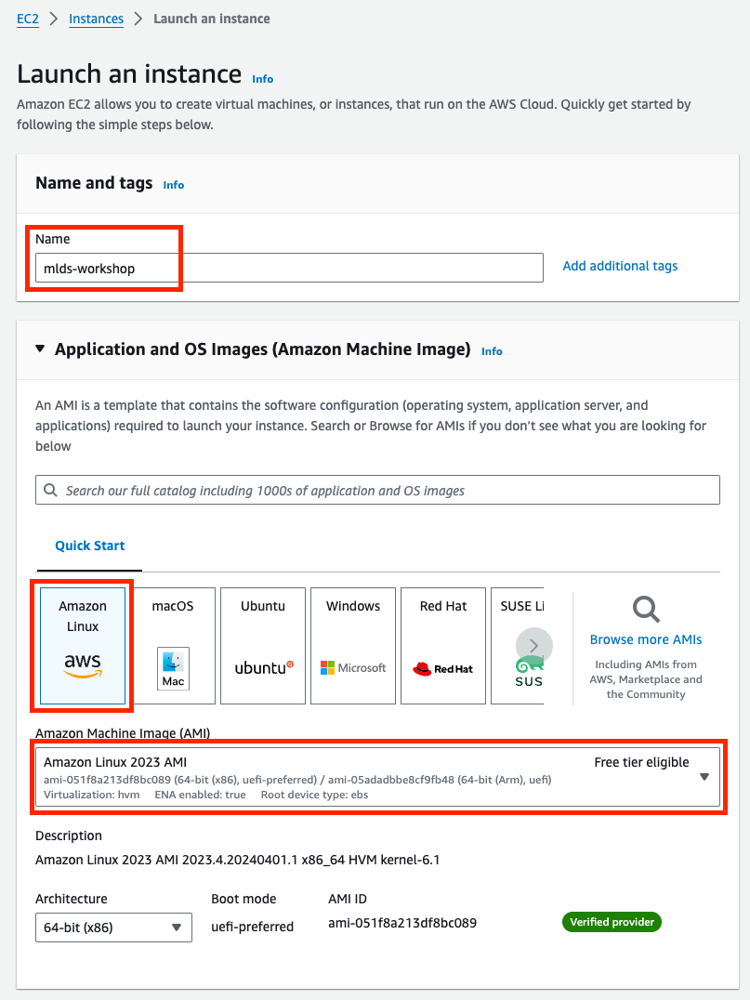
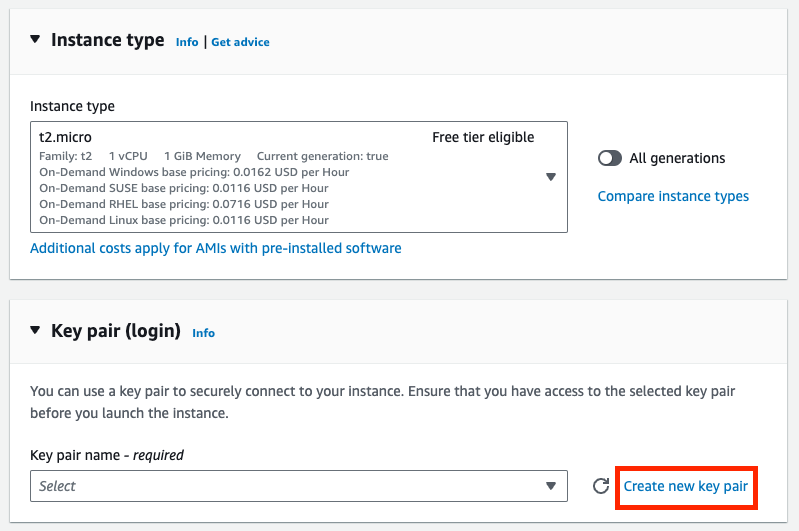
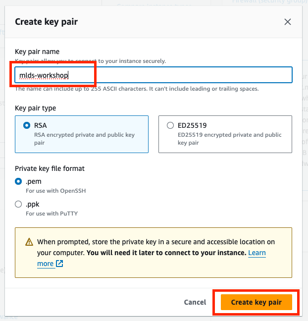
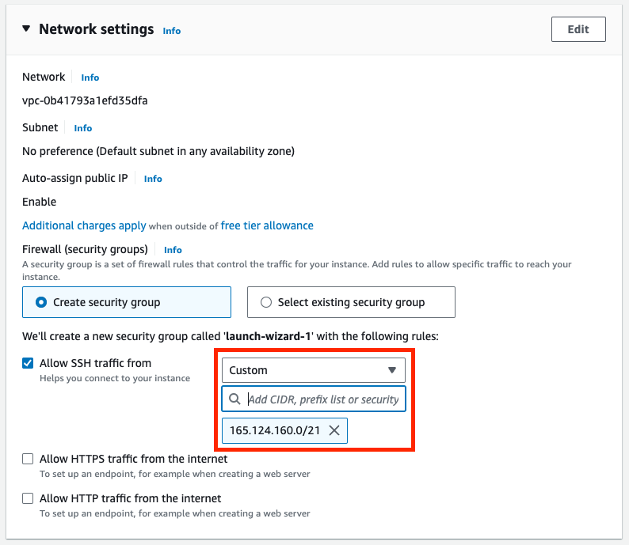
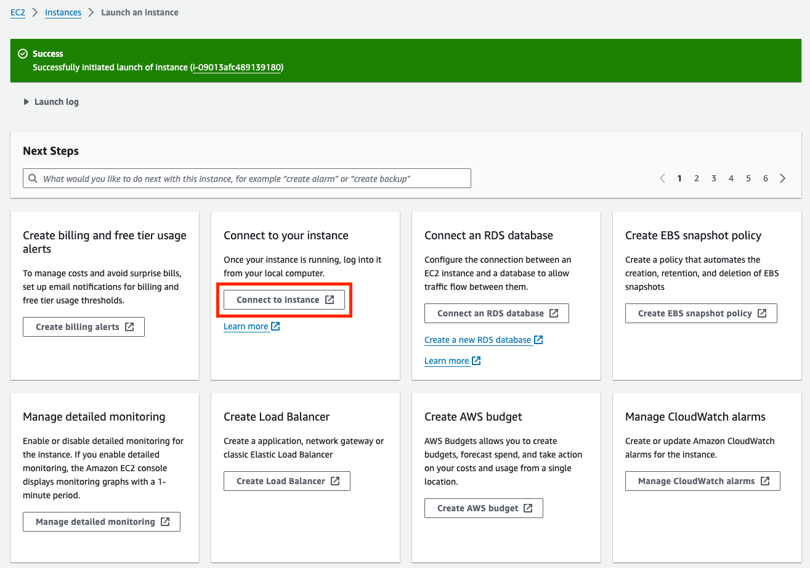
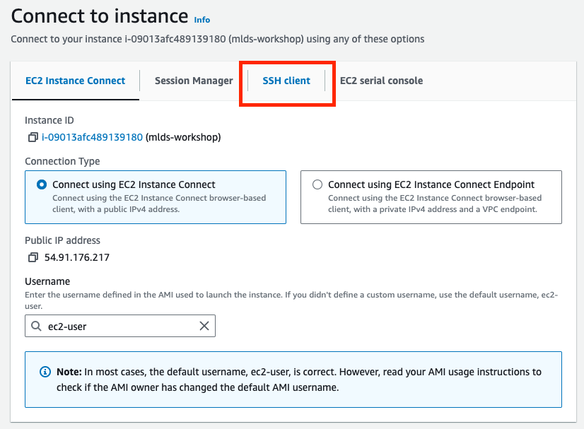
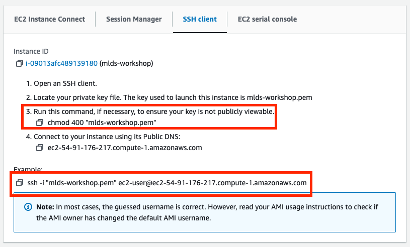
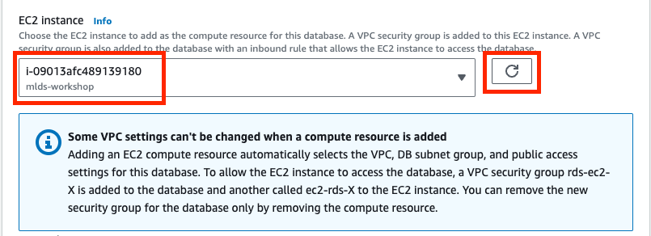
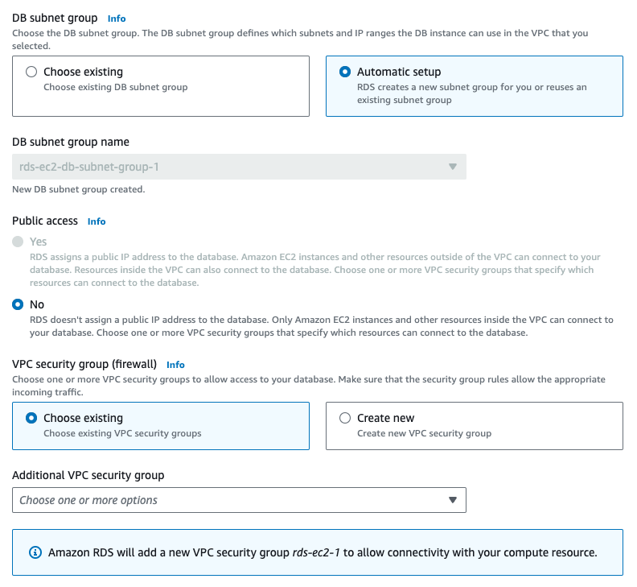

# IPv4 Cost Workaround

For very brief context, IPv4 addresses on the internet are in short supply and AWS is running out of them. To alleviate this pressure, they have begun charging for _all_ public IPv4 addresses. When something does not have a public IPv4 address, it can only be reached from resources running in the same network. This is inconvenient for us because you will no longer be able to connect to the database from your own laptop, but must instead connect through an EC2 instance first.

## Creating RDS Instance

Continued from [README.md: Database Details - Connectivity](./README.md#connectivity)...



- In "Connectivity"
  - Choose "Connect to an EC2 compute resource
  - Click "Create EC2 Instance" since none exist yet

Now, we will step through the EC2 Instance creation process in another tab. Then we will return to our RDS creation once the instance is available.

---

### EC2 Creation



- Give a name to your instance such as "mlds-workshop"
- Make sure that "Amazon Linux 2023 AMI" is selected



- Ensure that instance type is `t2.micro` or whatever is "Free tier eligible"
- Click "Create new key pair" to create an SSH key that will be used to connect to your instance



- Give your key pair a name like "mlds-workshop"
- Click "Create key pair" which should download your key file. It would be wise to save this to `~/.ssh/keys/mlds-workshop.pem`, or another location that you will not lose track of.



- In Network settings, leave "Create security group" checked
- Allow SSH traffic from **CUSTOM** source and use the Northwestern VPN IP range: `165.124.160.0/21` (this sets up a firewall which only allows ssh requests if coming from the Northwestern network; e.g. on-campus or vpn)


- Go ahead and bump up your storage to 30 GiB, the max under free tier



- Congrats! Your instance is provisioning. You may click "Connect to instance" now



- The "Connect to instance" page has several connection options
- We will use "SSH client" as the other steps require different setup



- You will want to run the `chmod 400 mlds-workshop.pem` command to fix the permissions on the key file
- Then, use the generated `ssh ...` command to connect to your instance.
  - Note: this relies on the keyfile being in the current working directory. If it is not, you will need to replace "mlds-workshop.pem" with the full path to your key file.

---

### RDS Continuation

Back in your browser, you may return to the tab in which you were creating the RDS database.



- Use the refresh icon to update the list of EC2 Instances available for selection
- Select the EC2 instance you just created



- The rest of the settings can remain default

## Bootstrap EC2 Instance

Now, we will need to set up things on the EC2 instance to connect to our database.

Connect to the EC2 instance as described above above: navigate to instance page in the console and then use the "connect to instance" for connection details. Note: ensure you are on the VPN and that your public IP address is in the expected range (e.g. `curl --ipv4 https://ifconfig.me`).

### Install Docker

We will use Docker to run scripts and tools so that we don't have to install everything from scratch. First, we need to install it on this EC2 instance.

```shell
sudo yum update
sudo yum install docker
sudo usermod -a -G docker ec2-user
newgrp docker
```

Now, we need to "start" the docker service and also "enable" the service so that it will be started every time the instance restarts.

```shell
sudo systemctl start docker.service
sudo systemctl enable docker.service
```

Now, we are ready to run our connection commands, same as we do in [the main tutorial](./README.md#3-connecting-from-your-computer) (ignoring the comments about VPN status).

```shell
export PGHOST="YOUR_HOST_URL"  # this is the connection url given in the RDS console
export PGUSER="YOUR_USERNAME"  # master username you set when creating the database; default: "postgres"
export PGPASSWORD="YOUR_PASSWORD"  # master password you set when creating the database
```

```shell
docker run -it --rm -e PGPASSWORD \
  postgres:15.4 psql \
  -h ${PGHOST} -U ${PGUSER}
```
