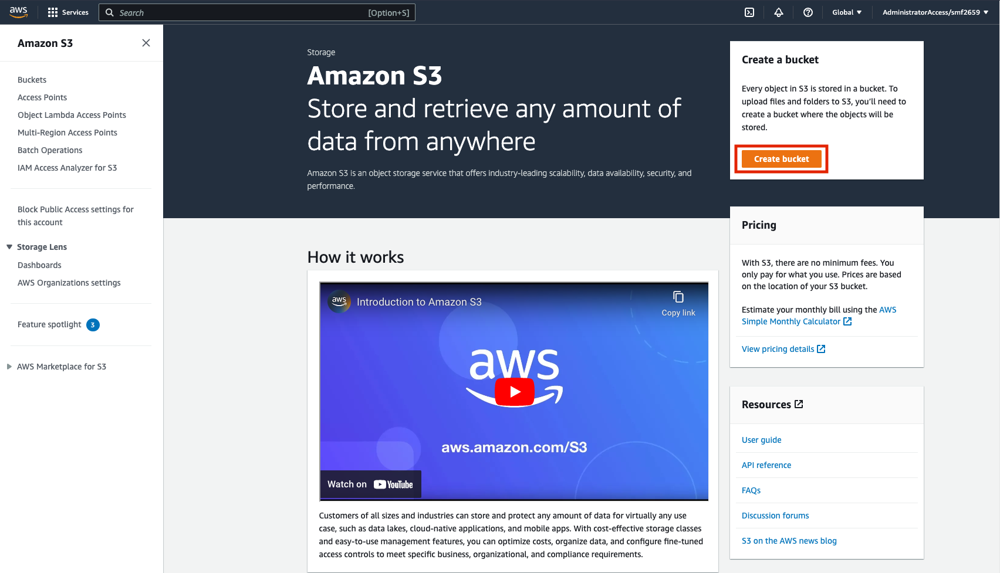
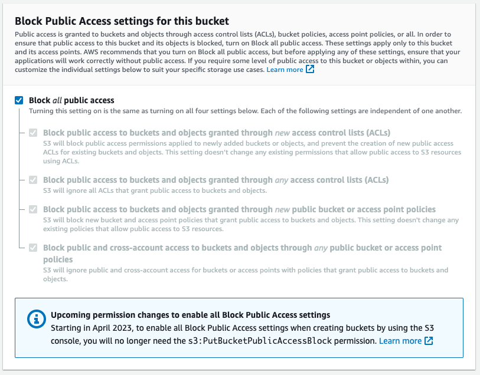
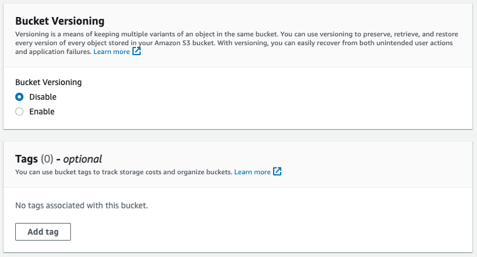
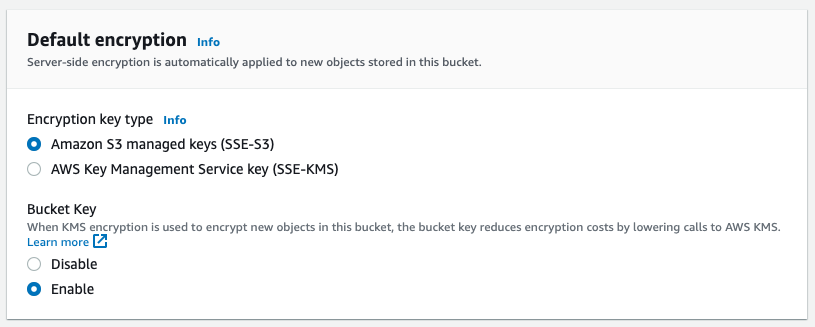
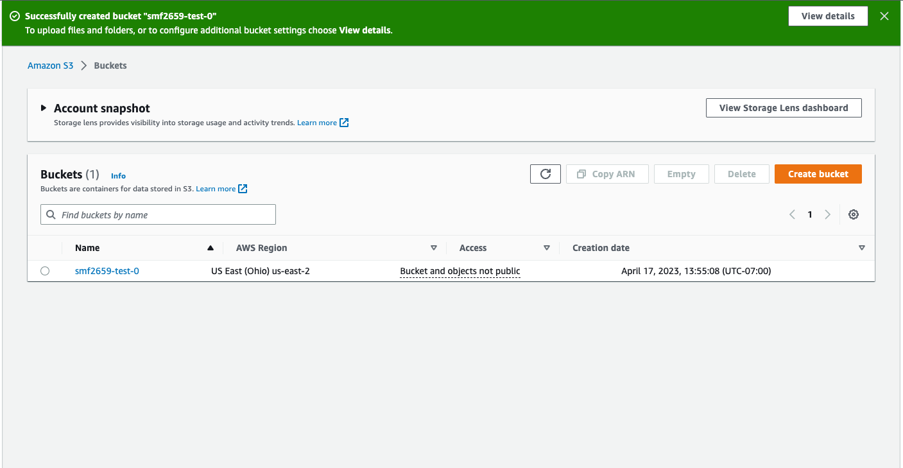
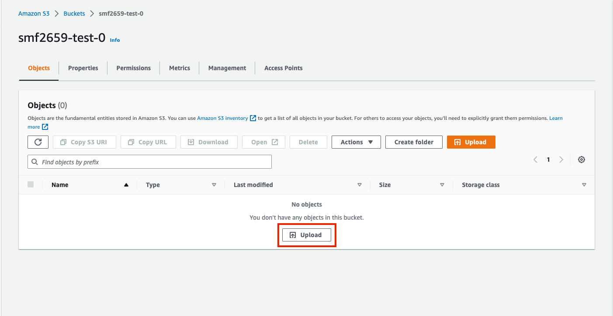

# AWS Simple Storage Service (S3)

## Learning Outcomes

- Object Store vs File System vs Database
- S3 Access Tiers
- S3 Configuration Options

## Overview

AWS S3 is a foundational service for storing any type of data in the cloud in scalable and elastic manner. S3 comes with some pretty serious guarantees around durability and availability, but its still up to you as the user to properly configure and use it to safely store data.

Important Concepts:

- S3 buckets are accessible on the internet; it is up to you to configure proper access controls (new AWS buckets block public access by default)
- S3 bucket names must be globally unique
- Objects in S3 are given unique "Keys" which can include `/`s which help to organize objects (these are known as "prefixes" or "paths" but do not technically comprise any sort of folder/directory structure)
- S3 URI's can be used to identify objects and are of the format `s3://<bucket-name>/<key>`
- You can set resource policies on S3 buckets to allow access to identities outside of your account
- Access Tiers allow you to more cheaply store objects that are not accessed frequently (backups, archives, etc.)

AWS S3 has many additional features which we will not cover in depth, but may be useful to you in the future:

- Versioning: allows you to track/maintain multiple versions of an object
- Lifecycle Policies: allows you to automatically expire (delete) objects after a set time
- Replication: can replicate all new objects to a duplicate bucket location
- Event Notification: triggers a notification for every event in a bucket (new/updated/deleted file, etc.); useful for event-driven processing
- Intelligent Tiering: allows you to set a policy which moves object between the various S3 tiers
- Metadata: you can add metadata to individual objects in S3 to track things like object origin, etc.
- CloudFront: you can serve web content directly out of S3 to a global audience using AWS CloudFront

## Goals

- Create a simple bucket
- Upload data via the command line
- Write a script to upload data with `boto3`

## Create a Bucket

Navigate to the [S3 Console](https://s3.console.aws.amazon.com/s3/get-started?region=us-east-2) and click "Create bucket"



Give the bucket a unique name (you may want to use your NetID as a prefix; e.g. `smf2659-test-0`)


Keep Block Public Access enabled as default



Keep all other default settings





Once the bucket is created, you can click on it and upload files from the console.



## Upload to Bucket from CLI

Ensure that the AWS CLI is installed and available

```shell
aws --version
```

Be sure that you have logged in to your account using the methods described in the [IAM Tutorial](../IAM/README.md)

```shell
aws --profile personal-sso-admin sso login
```

Set your default AWS profile for the remainder of your shell session:

```shell
export AWS_DEFAULT_PROFILE=personal-sso-admin
```

Confirm that you are authenticated as the proper identity:

```shell
aws sts get-caller-identity
```

List the S3 buckets in your account:

```shell
aws s3 ls
```

List any files that may exist in your bucket:

```shell
aws s3 ls s3://smf2659-test-0/
```

Upload a file to your S3 bucket:

```shell
aws s3 cp README.md s3://smf2659-test-0/
```

Check that the new file exits:

```shell
aws s3 ls s3://smf2659-test-0/README.md
```

Download the file to your filesystem under a different name

```shell
aws s3 cp s3://smf2659-test-0/README.md README-copy.md
head README-copy.md
```

## Upload to Bucket from Python Script

See the code included in the [interactive folder](./interactive/) for examples on how to work with S3 using the Python SDK: `boto3`.
