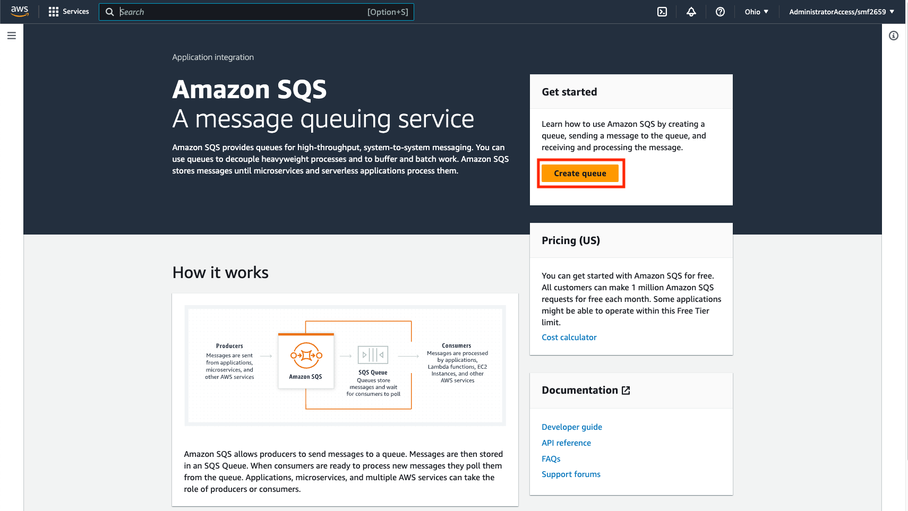
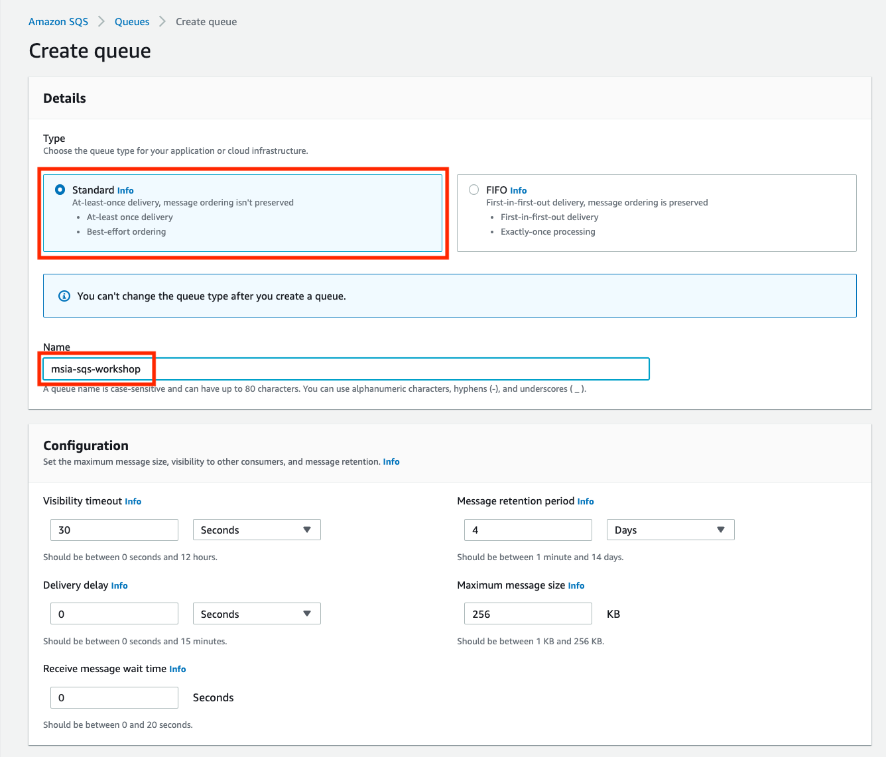
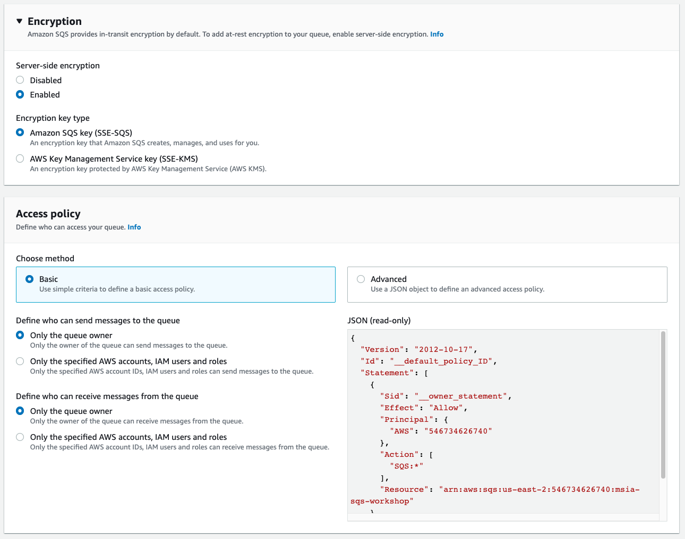
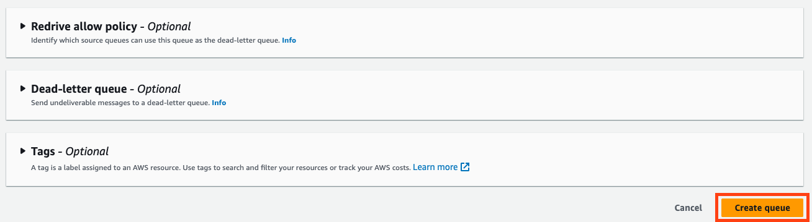
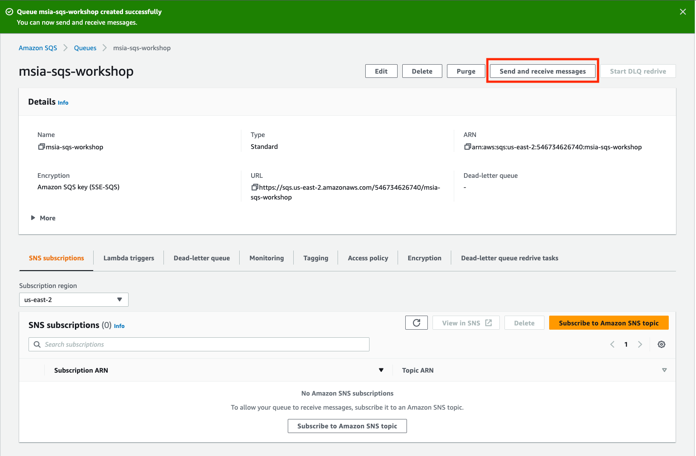
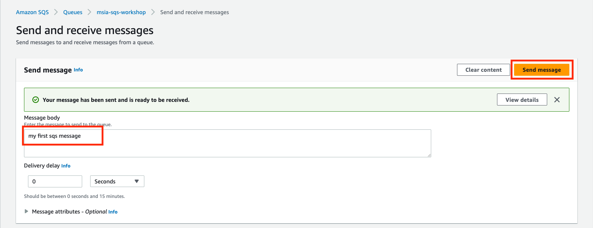
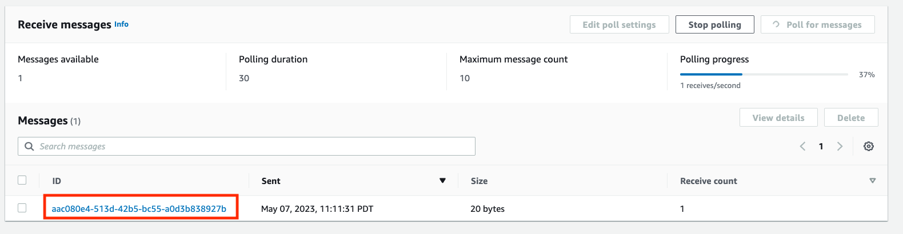
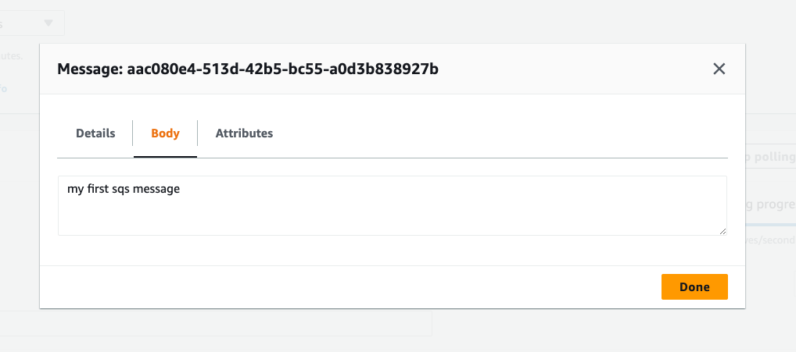

# Simple Queue Service (SQS)

SQS provides a simple, managed queuing service for the delivery of messages in a reliable and scalable way. Common use cases for SQS include the following:

- service decoupling: allow services to interact in a distributed system without any direct communication between them
- asynchronous processing: allow requests to terminate before a complete response is processed; e.g. requestor creates a job and moves on
- event driven architectures: events are stored as messages in a queue where they can trigger other consumer processes
- batch processing: jobs can batched in a queue until a certain threshold is reached at which point they are processed in batch

## Important Concepts

- Producer: A producer is an entity which generates messages and sends them to a queue.
- Consumer: A consumer reads messages from the queue, processes them, and then deletes them from the queue, marking the message as complete.
- Queue: A buffer of stored messages that can be polled for messages by various consumers.
- Message: A record with some metadata and a body to be processed by a consumer. Messages are meant to be consumed once and once only.
- Visibility Timeout: The amount of time a message is "reserved" once read from the queue. If the message is not deleted in this window, it will be returned to the queue for another consumer to pick up later.
- Message Retention: Messages will eventually expire from the queue after some specified amount of time.
- Long Polling: A technique used by consumers to reduce the number of empty queries to the queue. Instead of continuously asking for messages when none may be available, the consumer can open a long poll which waits a period of time for messages to become available.
- Dead Letter Queue: A separate queue that receives any messages which fail to be processed. Typically a DLQ is configured to receive any messages which have been read N times without being deleted (N usually 2-4ish).
- FIFO Queue: First-In-First-Out queues **guarantee** ordered processing of messages. Standard queues generally keep messages in order, but without strict guarantees. FIFO achieves this by preventing the next message from being read until the current message has been deleted.

## Overview

A producer will explicitly send a message to the queue by calling the AWS API for `sqs:SendMessage`. At this point the message will be created in the queue with metadata about the producer, the context, and the queue's default properties like visibility timeout, message retention, etc. SQS provides standard metrics like number of visible messages, age of oldest message, etc. to monitor a queue's activity. Consumers may be continuously polling the queue, configured based off of these metrics, or set up with direct triggers in some cases such as with Lambda. A consumer reads the message as the result of an `sqs:ReceiveMessage` API call, parses the relevant attributes, and performs some processing usually driven by the data in message body. Once complete, the consumer is responsible for deleting the message by using its message ID and delete handle in an `sqs:DeleteMessage` API call.

## Activity

SQS is a fairly simple service on its own, but we will demonstrate how messages can be sent to and received from an SQS Queue that we create via the console. We will also show how these messages can be sent and received from a python script.

### Create a Queue

Navigate to the SQS Dashboard to get started and click "**Create queue**"

---

Make sure you create a "Standard" queue and give it a name like `mlds-sqs-workshop`. The rest of the "**Configuration**" can remain default.

---

You can leave the Encryption and Access Policy as default as well (we will revisit Access Policy later).

---

We will also leave Redrive policy, Dead-letter queue, and Tags unchanged. Create your queue.

---

Now that the queue has been created, we will try and send and receive some test messages.

---

### Send and Receive a Test Message

Type a message into the **Message body** text entry block and click **Send message**.

---

Now that your message has been sent, click on the **Poll for messages** button to begin receiving messages from the poll.

---

You should see a single message appear in the **Messages** box; click on its ID to view the message.

---

You should be able to see the body of your message as well as its attributes from this dialog. When you are done, you may close the pop-up and optionally delete the message from the queue.

---

### Set up SQS as Target for S3 Events

Although we will be using SQS as a target, this material is more related to S3 so we will cover it in the [S3 Notifications Tutorial](../S3/notifications/README.md).
