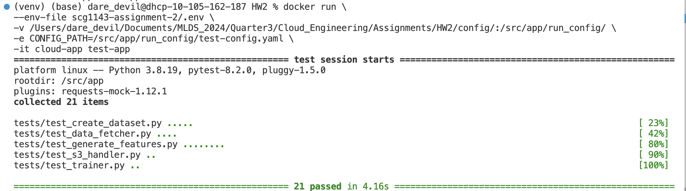
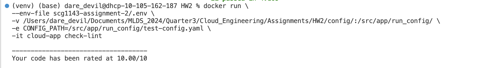
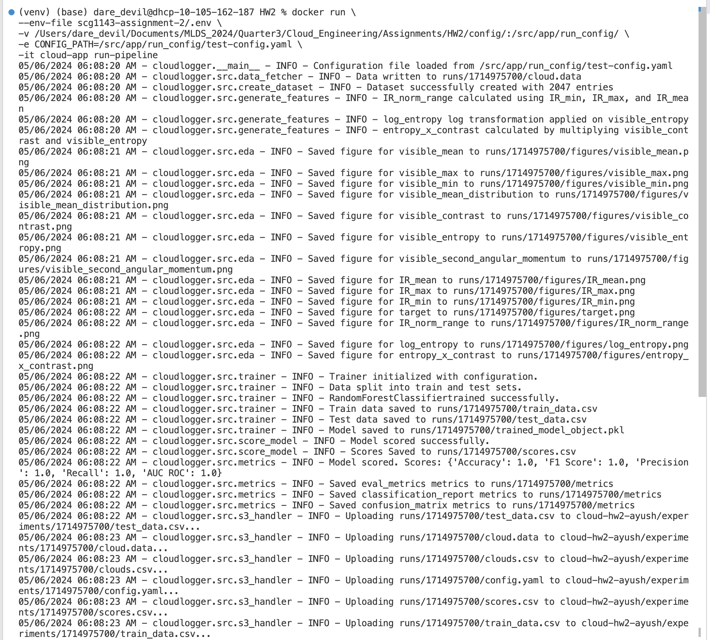
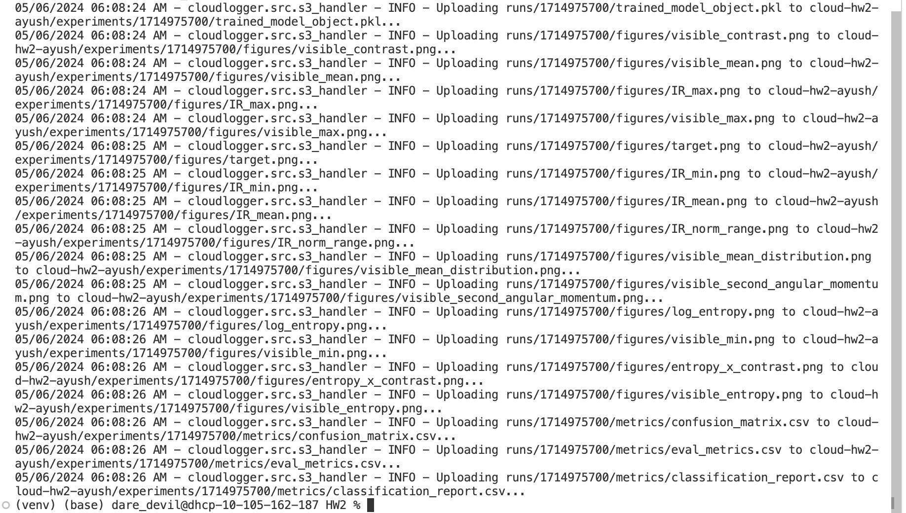

# Cloud Application README

This repository contains the codebase for a cloud application. Follow the instructions below to build and run the application using Docker.

## Building Docker Image

To build the Docker image for the application, run the following command:

```bash
docker build -f dockerfiles/Dockerfile -t cloud-app .
```

## Running the application

Create a .env file for configure AWS Credentials. Put the credentials in .env
```bash
touch .env 
cat env_sample > .env 
```

Create a test-config.yaml file by following config/default-config.yaml into the /path/to/config directory 

To execute the application pipeline, use the following command:

```bash
docker run \
  --env-file path/to/.env \
  -v /path/to/config/:/src/app/run_config/ \
  -e CONFIG_PATH=/src/app/run_config/test-config.yaml \
  -it cloud-app run-pipeline
```

To run the application test cases, execute the following command:

```bash
docker run \
  --env-file path/to/.env \
  -v /path/to/config/:/src/app/run_config/ \
  -e CONFIG_PATH=/src/app/run_config/test-config.yaml \
  -it cloud-app test-app

```

To check the Pylint score of the application, use the following command:

```bash
docker run \
  --env-file path/to/.env \
  -v /path/to/config/:/src/app/run_config/ \
  -e CONFIG_PATH=/src/app/run_config/test-config.yaml \
  -it cloud-app check-lint

```

Replace path/to/.env and /path/to/config/ with the actual paths to your .env file and configuration directory respectively.

## Results 

### TestCase Results


### Pylint Results


### Pipeline Results


