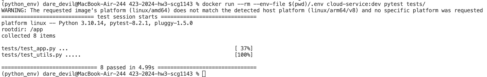
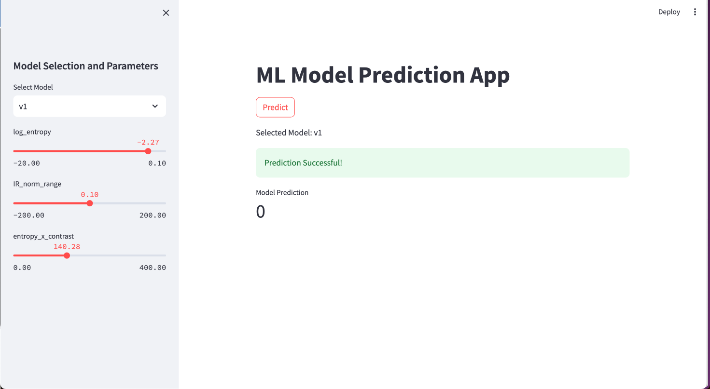
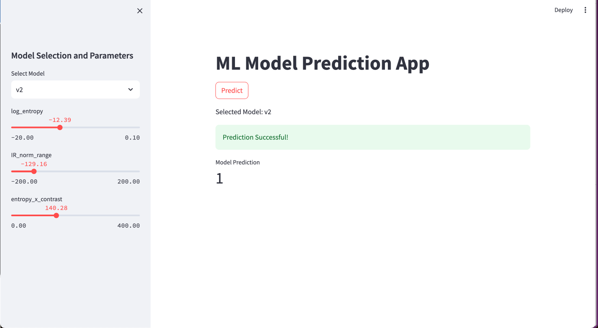

# Cloud APP Deployment

Used a multi-stage dockerfile that can build both testing and production image for the application. Below are the steps to build and run the app.

## Local Setup

1. **Setup Environment File**

   Fill in AWS Access Key and ID in the environment file
   ```sh
   touch .env
   cp env_copy .env
   ```

2. **Build the Image for Testing**:
   ```sh
   docker build -f dockerfiles/Dockerfile -t cloud-service:dev --target dev .
   ```

3. **Run Tests**:
   ```sh
   docker run --rm --env-file $(pwd)/.env cloud-service:dev pytest tests/
   ```

4. **Build the Production Image**:
   ```sh
   docker build -f dockerfiles/Dockerfile -t cloud-service:prod --target prod .
   ```

5. **Run the Streamlit App on Port 80**:
   ```sh
   docker run -p 80:80 --env-file $(pwd)/.env cloud-service:prod
   ```

## Push Image to ECR

I have created an ECR Repo named **"cloud-app"**. Below are the steps to push the docker image to ECR
```bash
chmod +x deploy_to_ecr.sh
sh deploy_to_ecr.sh <AWS_ACCOUNT_NUMBER> cloud-service:prod latest
```

Follow the Video recording for further ECS deployment of the app.

## Results

### Test Case Results



### Application Screenshots

**Using Model v1**



**Using Model v2**

