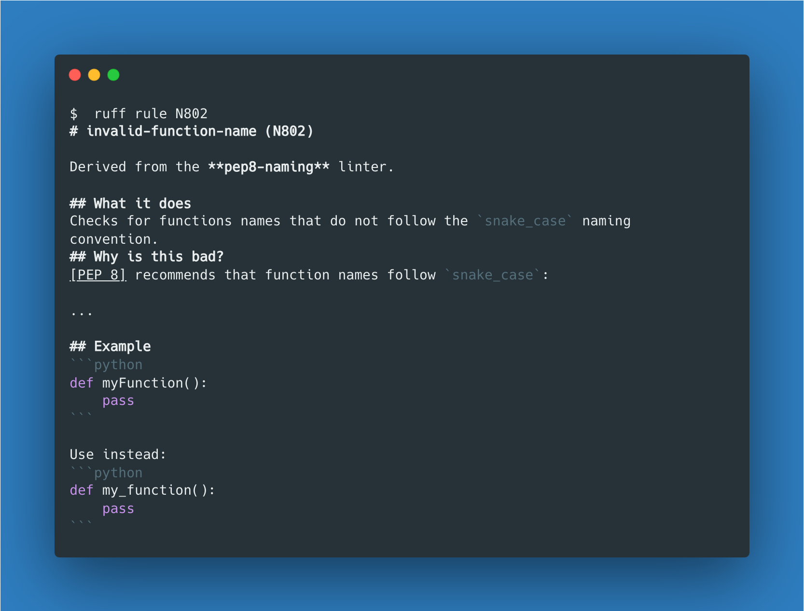

# Linting

Linters are commonly used across all types of software engineering projects and all coding languages to help developers write cleaner, more stylistic code that others can easily read and maintain.

Linters are essentially parsing engines coupled with rule sets that allow for static analysis of your code and alert you to any violations of those rules. The rules mentioned here usually include a default set of style rules (suggestions) made by the language or linter maintainers, as well as any custom rules you want to provide. Almost all linters are highly customizable so that you can supply a config file for a project and ensure that all the contributors are implementing the same consistent style across the project's codebase.

You may ask why it matters if your code is "_stylish_" as long as it runs... but when you have to revisit that code in 6 months or a couple of years, or when you have to hand that code off to a collaborator, or even worse, a recruiter - you'll be very glad that you had a linter to improve your code style.

For more reading, consider RealPython's excellent overview on [code quality and linters](https://realpython.com/python-code-quality/#linters).

## Linters

There are many linters available for Python; some focus on the [official pep8 style guide](https://peps.python.org/pep-0008/), others focus on docstrings ([pep257](https://peps.python.org/pep-0257/)), while others go as far as complexity analysis and type checking. The former are _stylistic_ linters, whereas the latter are _logical_ linters. We'll focus on the stylistic linters for now and introduce a logical linter (`mypy`) for typechecking in the typehints content.

The most popular linters are actually a combination of several low-level linters. You can read more about this on their respective docs pages, but know that the linters discussed below will provide a fairly comprehensive style check against your code but can be configured to be more or less "picky" by ignoring certain "rules".

### Ruff

`ruff` is the cool new kid on the block and will probably become the defacto tool for python code quality! This is because it is blazing fast, combines features from many different existing tools, is highly configurable, and can be used as both a static linter and an auto formatter. The only downside of ruff in my experience is it does not give you a nice comprehensive score along with its evaluation like pylint does (that, and their website uses a pretty shocking purple...).

#### Installing

`ruff` should be installed from `PyPi` with a simple `pip install ruff`.

> You can also use [pipx](https://pypa.github.io/pipx/installation/) to
> install a globally available version of `ruff` that's isolated from your system-level and project-specific virtual
> environments; for more on `pipx`, see the [pipx.md file in this repository](../pipx.md).

#### Running

With ruff installed, simply execute it with `ruff check path/to/code`


One of the great things about ruff is how easy it makes it to understand the rules against which it is checking your code: `ruff rule <rule-code>`



#### Configuring

Ruff can be configured with command-line options when run to control its linting behavior. The same options can be specified in a specific configuration file named `ruff.toml`. However, ruff also supports the `pyproject.toml` format adopted more broadly by the python ecosystem

Example:

```shell
ruff check --line-length=110
```

Read more in the [ruff docs](https://docs.astral.sh/ruff/configuration/)

### pylint

The [intro on the pylint docs page](https://pylint.pycqa.org/en/latest/intro.html) gives a full description on what pylint is and isn't. We'll remain focused on the _how_ in this lab, but you should definitely read more on the _what_ and _why_ on your own time.

#### Installing

Pylint can be easily installed with `pip install pylint`.

The Dockerfile included in this repository will have `pylint` installed to the environment already.

#### Running

With pylint installed, simply execute it with `pylint path/to/code`


#### Configuring

Pylint can be configured with command-line options when run to control its linting behavior. The same options can be specified in a configuration file named `.pylintrc`. To generate a boilerplate config file, run `pylint --generate-rcfile`.

Example:

```shell
pylint --max-line-length=110
```

Read more in the [pylint docs](https://pylint.pycqa.org/en/latest/user_guide/run.html#command-line-options)

### flake8

Flake8 is another logical and stylistic linter that runs a collection of sub-linters.

#### Installing

Flake8 actually recommends that you install it to each project (not globally) so that it will match the exact version of Python being used in your project. Install it with `pip install flake8`

#### Running

With flake8 installed, simply execute it with `flake8 path/to/code`


#### Configuring

Flake8 can be configured with command line options, or from a configuration file named `.flake8` ([example here](./.flake8))

Example:

```shell
flake8 --ignore D203 \
         --exclude .git,__pycache__,old,build,dist \
         --max-complexity 10
```

### Others

[Jedi](https://jedi.readthedocs.io/en/latest/) and [Pylama](https://klen.github.io/pylama/) are two other popular linting packages.

## Formatters

You may think to yourself... if you can write an application that tells me _what's wrong_ with my code, couldn't you write an application to _fix_ my code? Well, kind of...

Formatters are available for Python and offer automatic formatting of code to conform to the more simple style rules. Typically, formatters are able to fix things like line length, whitespace, consistent use of symbols like quotation marks, and other common errors.

### ruff

Ruff can also serve as a formatter! It is fully compatible with `black` which for a long time was the defacto python formatter.

#### Installing

Discussed above in the [linters section](#linters); `pip install ruff`.

#### Running

With `ruff` installed, you can run: `ruff format` to format all the files in your working directory, or `ruff format path/to/file.py` for a specific file or folder. Similarly, you can add the `--diff` or `--check` flags to first see how a file would be modified by the formatter.


#### Configuring

Discussed above in the [linters section](#linters); e.g. `pyproject.toml` or `ruff.toml`.

### black

Black is a highly opinionated formatter for Python that offers very little options for configuration. Its aim is to enforce as much consistency for Python applications across projects and contributors. They encourage you to experiment with the formatter via their [Playground](https://black.vercel.app/?version=stable) and decide if you like the style they enforce as there's not much room for customizing it. The black formatter does have a lot of support and is used across a number of high profile open source projects and organizations; I myself like it, but you are not at all required to use it for your coursework.

#### Installing

Install with `pip` or `pipx install black`

More installation docs [here](https://black.readthedocs.io/en/stable/getting_started.html#installation)

#### Running

With `black` installed, simply run: `black path/to/code`

> NOTE: This will format your files _**in place**_. To preview the output, run `black --diff`, or to see what files would be modified, run `black --check`.


For more complex usage, see the [docs](https://black.readthedocs.io/en/stable/usage_and_configuration/the_basics.html)

#### Configuring

`black` can be configured via a `[tool.black]`section in your `pyproject.toml`; for more information, see the [docs here](https://black.readthedocs.io/en/stable/usage_and_configuration/the_basics.html#configuration-via-a-file).

> NOTE: `pyproject.toml` is a fairly new way of consolidating project metadata and configuration info for Python projects. See [Pep 621](https://peps.python.org/pep-0621/) for more detailed information

### autopep8

Autopep8 is another auto-formatter available for Python.

#### Installing

Install with `pip` or `pipx install autopep8`

See more installation docs [here](https://github.com/hhatto/autopep8#installation).

#### Running

With `autopep8` installed, simply run: `autopep8 path/to/code`.

> NOTE: autopep8 will be default emit the formatted file to stdout. You can format the file in place by passing the `--in-place` flag, or output a diff of the proposed changes by passing the `--diff` flag.


For more complex usage, see the [docs](https://github.com/hhatto/autopep8#usage)

#### Configuring

`autopep8` can be configured via a `[tool.autopep8]` section in your `pyproject.toml`; for more information, see the [docs here](https://github.com/hhatto/autopep8#pyproject-toml).

## Configuring your IDE

Most every IDE features some sort of support for integrating linters (and formatters) so that you can see code errors and style violations as you develop. We will cover a couple common IDE's here, but generally, you can google "<name of IDE> python linter".

### VSCode

If you have installed the `Python` language extension for VSCode and have installed the linters as detailed above, it should be trivial to configure them within your IDE.

Open VSCode and search the extensions marketplace

Additionally, you can configure each of your enabled linters with command-line args, a path to the executable (useful if you install the linter globally; you can find its path with the `which` command in your terminal - e.g. `which pylint`).

#### Run VSCode Linting

You can manually run the linter by opening your **command palette** (`View > Command Palette` from the toolbar or `⌘⇧P`) and typing "Run Linting" - select the `"Python: Run Linting"` command.

To automatically format your document with the configured formatter, run the `"Format Document"` command from the command palette.

Another helpful command is "Sort Imports" (`"Python Refactor: Sort Imports"`); this will ensure that your import statements are properly grouped and sorted (something that `pylint` will check for).

### PyCharm

PyCharm comes pre-configured with its own codestyle checker and auto-formatter. The linters should highlight issues in the editor by default (can also be viewed from the "Problems" tab in the bottom toolbar).

If you want to configure PyCharm to use the linters or formatters that we've discussed above (or any other external tool), you can do so with their "_external tools_" feature (see the [PyCharm docs here](https://www.jetbrains.com/help/pycharm/configuring-third-party-tools.html)). This process is described for pylint in the [pylint user guide](https://pylint.pycqa.org/en/latest/user_guide/ide-integration.html#pylint-in-pycharm)

#### Run PyCharm Linting

The native PyCharm auto-formatter can be run manually from the toolbar `Code > Reformat Code` or via keyboard shortcuts. Alternatively, you can configure PyCharm to reformat files on save with the `Preferences > Tools > Actions on Save` setting.

Additionally, you can organize/optimize your imports by running `Code > Reformat Code` from the toolbar (also runnable via a keyboard shortcut). This will group and order your imports as well as remove any unused imports (all things that `pylint` will check for)

## Included Examples

There are several Python files included int this lab (ordered logically in this listing):

```text
./linting
├── README.md             This file
├
├── bad.py                A poorly constructed, simple Python module (will generate lots of linting output)
├── good.py               The same Python module, rewritten to follow the linter suggestions (will lint successfully)
├
├── messy.py              An example of extremely messy Python code to be auto-formatted
├── clean_autopep8.py     The messy example after being auto-formatted by `autopep8`
├── clean_black.py        The messy example after being auto-formatted by `black`
├
├── images                Collection of images for this lab
├── pyproject.toml        Configuration file for the `black` and `autopep8` auto-formatters
└── requirements.txt      Requirements file to install linters and formatters
```

### Running Examples

### Docker

Alternatively, you can use the included [Dockerfile](../Dockerfile) to run the examples. From the [root of this repository](../):

Build the Docker container:

```shell
docker build -t linting-lab -f ./Dockerfile ./linting
```

Any of the following commands can be run against `bad.py`, `good.py`, or `messy.py` and with any of the command line options discussed above.

```shell
docker run linting-lab -m pylint bad.py

docker run linting-lab -m flake8 bad.py

docker run linting-lab -m autopep8 --diff bad.py
docker run linting-lab -m autopep8 good.py

docker run linting-lab -m black --diff bad.py
```
