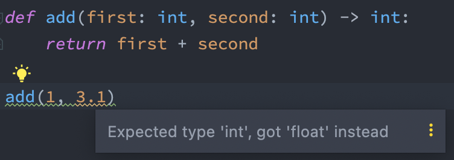
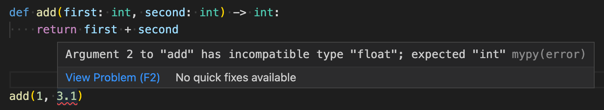
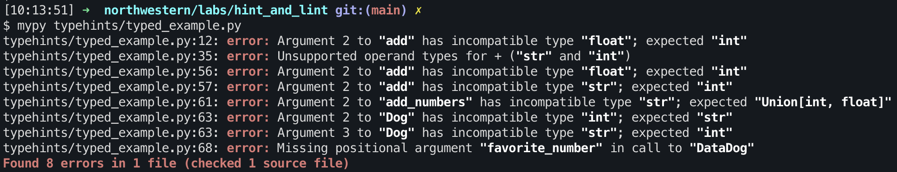

# Type Hints

Python is a _dynamically typed_, _interpreted_ language. This makes it very good at certain tasks (scripting, data
exploration, etc.) and also makes it a very approachable language. However, these same advantages can make building
large, complicated applications or pipelines difficult and error-prone.

To help remedy this, Python introduced **_typehints_** along with version `3.5`.

Typehints do **not** enforce static types at runtime, but they **do** add information to your python code that can be
interpreted by the developer and many third-party tools.

We will discuss the process of annotating your code with typehints later, but first let's review some ways typehints can
help you develop good python code.

## Benefits of Typehints

The most immediate and obvious benefit to typehints is the suggestions your IDE is able to make based on your type
annotations. Most IDEs are already compatible, or provide plugins/extensions for checking python typehints.

### PyCharm

The PyCharm editor from JetBrains comes pre-configured with typechecking. As you add type hints to your code, PyCharm
will highlight any violations of the annotated types and suggest changes where able.



You can also view a list of problems from the `Problems` tab at the bottom of the editor (
or `View > Tool Windows > Problems` from the toolbar).

See the [PyCharm docs](https://www.jetbrains.com/help/pycharm/type-hinting-in-product.html) for more information about
this feature.

### VSCode

VSCode requires you to configure typehint analysis which is supported by several extensions. The simplest way to do this
is by installing
the [official Python support extension from Microsoft](https://marketplace.visualstudio.com/items?itemName=ms-python.python)
and configuring the `Pylance` langauge server to enable typechecking (
setting: `"python.analysis.typeCheckingMode": "basic"`).

Another option is to use the very popular Python type checker library, `mypy`. VSCode includes a set of linters for
Python which can be enabled and configured independently. Among these linters is `mypy` which can be enabled by installing the [mypy extension from the marketplace](https://marketplace.visualstudio.com/items?itemName=ms-python.mypy-type-checker).

See the [Terminal section](#terminal) below on how to install and configure `mypy`



You can also view a list of the problems from the `Problems` tab at the bottom of the editor (or `View > Problems` from
the toolbar).

### Terminal

Regardless of IDE, you can always perform typehint analysis in the terminal via the `mypy` tool which can be installed
and configured globally, or on a per-project basis.

To install the tool, simply run `python3 -m pip install mypy` against the desired python
environment ([pipx](https://pypa.github.io/pipx/installation/) is a great way to install `mypy` as a global executable
without interfering with your system's default environment).

> NOTE: If you're curious, there's more info about pipx included in this repo's [`pipx.md`](../pipx.md)

With `mypy` installed, checking your python code for type errors is as simple as running:

```shell
mypy path/to/file.py

# or to check all files in the current directory:
mypy .
```



For more information on `mypy`, see the [Getting Started](https://mypy.readthedocs.io/en/stable/getting_started.html)
docs.

## Type Annotations

In order for any of the above to be useful, you must first annotate your Python code with valid typehints.

Typehints are most commonly used in function and class definitions to annotate parameters, returns, and attributes.
However, they are just as helpful when used with variables.

> NOTE: There are two example scripts included in this lesson, see the section below on [Included Examples](#included-examples)

Adding typehints is very simple, just add a `: <type>` after a variable declaration; e.g.:

```python
greeting: str = "Hello, World"


def alt_case(string: str):
    for i, c in enumerate(string):
        print(c.lower() if i % 2 == 0 else c.upper(), end="")


alt_case(greeting)
# >>> hElLo, WoRlD
```

You can use any of the primitive Python types for typehints (such as `[int, str, float, bool]`) as well as the
collection types (such as `[list, tuple, dict, set, etc.`]). However, these non-primitives are not very informative
since they can contain any type of variable within them. To allow for more specific typehints, Python provides
the `typing` module within the standard library (see
the [typing docs here](https://docs.python.org/3/library/typing.html)). This library contains many useful types as well
as interfaces for constructing custom types. Some examples are included below:

Simple collections with annotated members

```python
import typing

names: list[str] = ["Alice", "Bob", "Carly"]
favorite_foods: dict[str, str] = {"Alice": "Asparagus", "Bob": "Burgers", "Carly": "Carrots"}
```

> _NOTE_: Python 3.9 and later allows for the standard types to be used such as `names: list[str] = ...`; for earlier versions of Python (3.8 and earlier), you'll need to import these types from the `typing` standard library (e.g. `typing.List[str]`); be sure to check the [appropriate docs page](https://docs.python.org/3.8/library/typing.html)

Annotating class attributes and using flexible types

```python
import typing


class Address:
    def __init__(self, street: str, number: int, unit: typing.Union[str, int]):
        self.street = street
        self.number = number
        self.unit = unit


Address("Piccadilly Lane", 1304, "B")
Address("Main Street", 1017, 12)
```

> _NOTE_: the use of Python's `dataclass` can greatly improve typing in your Python applications and are very easy to use. More info is included in the [dataclass.md](./dataclass.md) primer (this is bonus content just in case you're interested).

Annotating parameters and return values for functions with optional parameters

```python
import typing


def join_strings(strings: typing.Iterable[str], separator: typing.Optional[str] = None) -> str:
    string_builder: str = ""

    for s in strings:
        string_builder += s
        if separator:
            string_builder += separator

    return string_builder
```

Defining custom types for use throughout a module

```python
import typing

Coordinates = typing.Tuple[int, int, int]


def translate(position: Coordinates, shift: Coordinates):
    result = []
    for i in range(3):
        result.append(position[i] + shift[i])
    return tuple(result)


translate((2, 4, 1), (1, -2, 0))
# >>> (3, 2, 1)
```

Typehints for third-party modules like `pandas`

```python
import pandas as pd
import typing


def make_dataframe(
        value_map: dict[str, list[typing.Any]]
) -> pd.DataFrame:
    return pd.DataFrame.from_dict(value_map)
```

> **IMPORTANT NOTE**: Some third-party modules do not include typing information for their custom data types (this is done by library developers via a file called `py.typed`). One very common example is `pandas`. The `mypy` library will not attempt to infer types for libraries like this and instead require that you install a separately maintained "stub", or write your own type definitions (you shouldn't have to do this for popular libraries).  
> There is already a project called [pandas-stubs](https://pypi.org/project/pandas-stubs/) that maintains typing information for pandas;  
> To install typehints for pandas, simply run `pip install pandas-stubs`  
> For more information on third-party typehints, [see the relevant mypy docs](https://mypy.readthedocs.io/en/stable/running_mypy.html#missing-library-stubs-or-py-typed-marker)

## Included Examples

There are two example scripts included with this lesson: [`example.py`](./example.py)
and [`typed_example.py`](./typed_example.py). These are two versions of the same code that defines a couple simple
functions and class, one with vanilla python code, and the other with typehints. Both scripts include a `__main__` block
that if run will generate runtime errors due to invalid data types. Either can be run to show this error.

### Running Examples

To see the benefit of typehints, you can open the `typed_example` in an IDE and inspect the code as detailed above in
the [IDE Section](#benefits-of-typehints).

Alternatively, you can use `mypy` to check the code before executing it with the command `mypy typed_example.py`. You'll
notice that if you use `mypy .` to check the whole module for type errors, it will not find any errors
with `example.py` (even though errors exist) since there are no typehints added to the code.

### Docker

Alternatively, you can use the included [Dockerfile](../Dockerfile) to run the examples. From
the [root of this repository](../):

Build the Docker container:

```shell
docker build -t typehints-lab -f ./Dockerfile ./typehints
```

Run the example script (will generate a `TypeError` at runtime)

```shell
docker run typehints-lab example.py
```

Use `mypy` to check for static type errors

```shell
docker run typehints-lab -m mypy .
```
