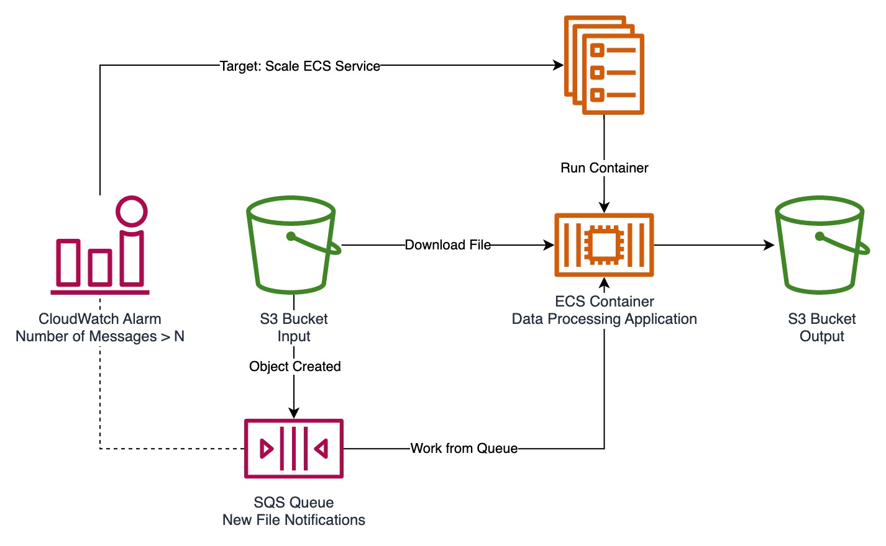

# Event Driven Pipelines

Most of this lab will be interactive and "live" as we work to improve our pipeline for queue-based processing and deploy it to AWS as part of an event-driven architecture.

## Pipeline Updates

You'll find in the [example/pipeline](./example/pipeline/) folder the same pipeline we've used throughout previous labs that trains a simple classifier on the Iris dataset. However, we've made some changes to the orchestration logic to first poll an SQS Queue for messages and then load pipeline configuration from an S3 Bucket as identifies by the SQS Message.

### Main.py

The `main` function in `main.py` has been renamed to `run_pipeline` to better reflect the contained logic. There is a new `main` function that is responsible for polling an SQS Queue and processing messages. This `main` function is actually run by a library called `typer` that allows for easy creation of CLIs (Command Line Interfaces) in python; see more below.

#### Typer

We are not going to cover a new framework in depth, but if you need to build a quick CLI (or turn your python script into something more flexible/user-friendly), `Typer` may be a good way to do that. It is made by the same developer of `FastAPI` and thus shares many design principles (using typehints to define interfaces and lots of built-in documentation). If you are interested more in the framework, you can check out the [Typer Docs](https://typer.tiangolo.com/).

There are plenty of ways to build a CLI in python, including the extremely popular [Click](https://click.palletsprojects.com/), the bare-bones standard library [argparse](https://docs.python.org/3/library/argparse.html), and [many others](https://docs.python-guide.org/scenarios/cli)

### AWS Utils

Additional functions were added to the AWS Utils module to facilitate reading and deleting messages from an SQS Queue. They should be pretty self-explanatory.

## Architecture Options

There are a few ways that we could go about architecting an event-driven pipeline depending on our use case or requirements.

Note, all of these requires an S3 Bucket (configured to deliver event notifications to EventBridge) and SQS Queue with a corresponding EventBridge Rule that matches the desired s3 event and detail (e.g. object created in bucket/prefix)

### One Off

Let's cover the most simple option first: you want to run this pipeline for some static dataset every time a new configuration is uploaded.

In this deployment, we create an EventBridge Rule that matches ObjectCreated events for files in a particular bucket/prefix. This Rule has 2 targets:

- an SQS Queue that receives the metadata for the newly created file
- an ECS Task that deploys our updated pipeline container according to a Task Definition we've already created in ECS

Becuase our consumer will poll the queue a few times before exiting (and since there will be some delay between trigger and the actual container startup), this should safely receive the message even though both targets are invoked simultaneously.

### Queue Length Alarm Service

In some cases, we may not want to start up our consumer on _every_ new notification/message, but instead wait until there is a sufficiently large batch of them to process. This is particularly useful if your datasets are uploaded in pieces (e.g. one record or one type of input at a time). To ensure efficient processing, we will only dispatch our consumer if there are N+ messages in the queue, where `N` is dependent on your use case.

You'll notice that in this deployment, we use an ECS Service instead of a Task. This is beacuse AWS CloudWatch Alarms (the service which allows us to monitor the SQS Queue's "NumberOfMessagesVisible" metric) can only be directly integrated with SNS Topics, or "Scaling Actions" (EC2 ASG or ECS Service).

We will need to configure this alarm to scale up the service when `NumberOfMessages > N`, and scale it back down when `NumberOfMessages < N`.

> NOTE: When you are depending on queue length to start consumer you will need to be careful with MessageRetention and your "N" (queue length trigger threshold) so as to not lose messages (see note in diagram)

### Queue Length Alarm Notification

If you want or need to keep your consumer deployed as an ECS Task, there are a few more steps involved. We will deliver the alarm event to an SNS Topic. We will need to write a small Lambda Function which reads the notification from the SNS Topic, and then makes a call to the `ecs:runTask` API to dispatch our consumer. We will need to subscribe the Lambda Function to the SNS Topic and provide the Function with an IAM Role with the appropriate permissions.

### Cron Worker

Lastly, we could choose to trigger our consumer on a cron schedule if we want to process data on some fixed cadence (e.g. Nightly, Weekly, only Weekdays, etc.). This is a pretty straightforward deployment and one that is quite common.

